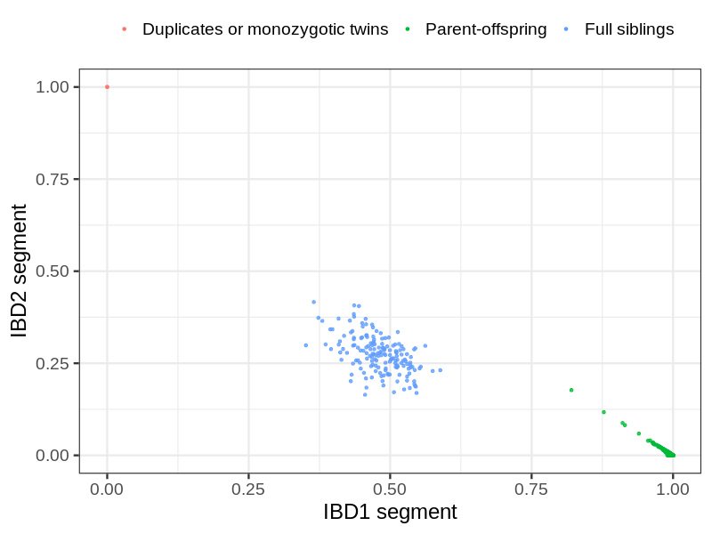
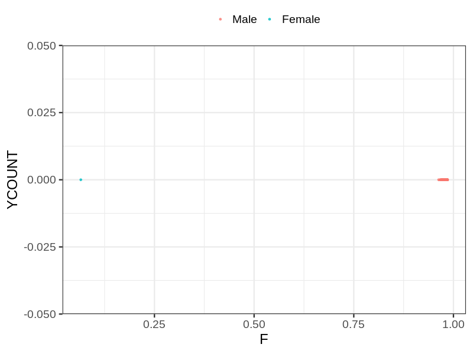
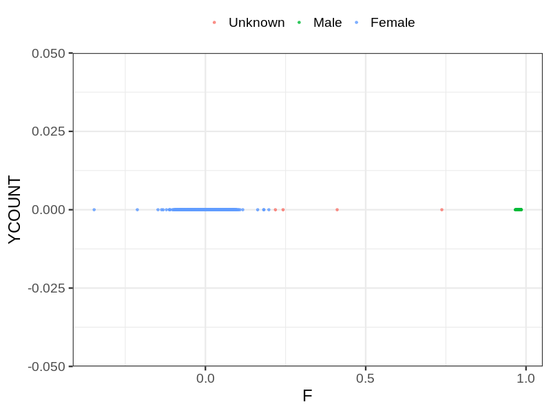

# Fam file reconstruction in snp015a
- Number of samples in the genotyping data: 13408.
## Samples not in Medical Birth Regsitry
41 samples with missing birth year, assumed to be parent in the following.
## Relationship inference
| Relationship |   |
| ------------ | - |
| Duplicates or monozygotic twins| 2 |
| Parent-offspring| 4930 |
| Full siblings| 169 |
| 2nd degree| 0 |
| 3rd degree| 0 |
| 4th degree| 0 |
| Unrelated| 0 |

## Mother sex check
| Inferred sex |   |
| ------------ | - |
| Unknown | 25 |
| Male | 1 |
| Female | 3881 |

## Father sex check
| Inferred sex |   |
| ------------ | - |
| Unknown | 0 |
| Male | 3901 |
| Female | 1 |

## Children sex check
| Inferred sex |   |
| ------------ | - |
| Unknown | 4 |
| Male | 2847 |
| Female | 2748 |

## Parental relationships
41 sentrix IDs missing from ID file. These are not counted as individuals.
###  Individuals
13367 individuals in total. Breakdown excluding multiple same-sex parents:
 -  3236 children
 -  2521 mothers
 -  2286 fathers
 -  2574 mother-child pairs
 -  2345 father-child pairs
 -  1683 mother-father-child trios
 -  5326 unrelated

Multiple same-sex parents (at the individual level):
 -  0 children with more than one mother detected
 -  1 children with more than one father detected
 -  0 children with more than one mother in registry
 -  0 children with more than one father in registry

2586 mother-child relationships expected.
- 2573 (99.5%) recovered by genetic relationships.
- 13 (0.5%) not recovered by genetic relationships.

2360 father-child relationships expected.
- 2343 (99.28%) recovered by genetic relationships.
- 17 (0.72%) not recovered by genetic relationships.

2574 mother-child relationships detected.
- 2573 (99.96%) matched to registry.
- 1 (0.04%) not matched to registry.

2346 father-child relationships detected.
- 2343 (99.87%) matched to registry.
- 3 (0.13%) not matched to registry.

###  Samples
13408 samples in total. Breakdown excluding multiple same-sex parents:
 -  3239 children
 -  2523 mothers
 -  2288 fathers
 -  2576 mother-child pairs
 -  2347 father-child pairs
 -  1684 mother-father-child trios
 -  5361 unrelated

Multiple same-sex parents (at the sample level):
 -  0 children with more than one mother detected
 -  1 children with more than one father detected
 -  3883 children with more than one mother in registry
 -  2490 children with more than one father in registry

2586 mother-child relationships expected.
- 2573 (99.5%) recovered by genetic relationships.
- 13 (0.5%) not recovered by genetic relationships.

2360 father-child relationships expected.
- 2343 (99.28%) recovered by genetic relationships.
- 17 (0.72%) not recovered by genetic relationships.

2576 mother-child relationships detected.
- 2573 (99.88%) matched to registry.
- 3 (0.12%) not matched to registry.

2348 father-child relationships detected.
- 2343 (99.79%) matched to registry.
- 5 (0.21%) not matched to registry.

## Exclusion
- Number of samples excluded: 44
