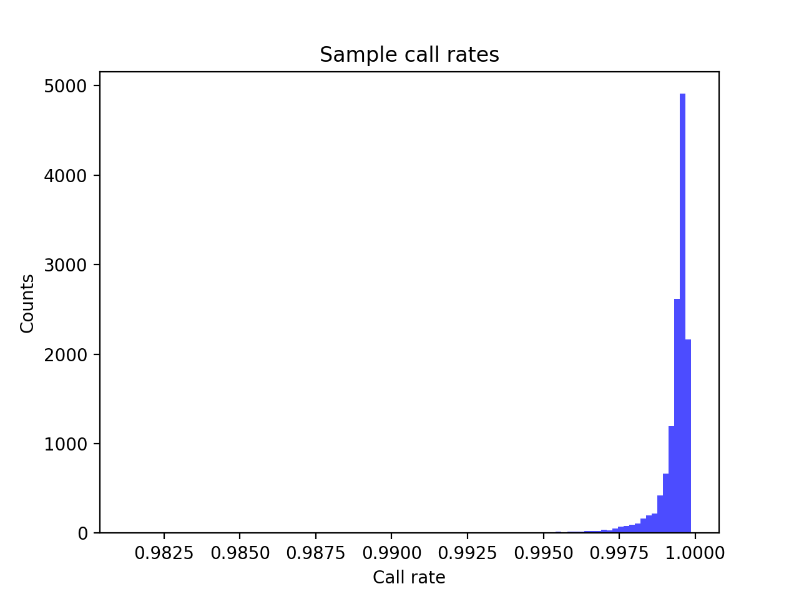
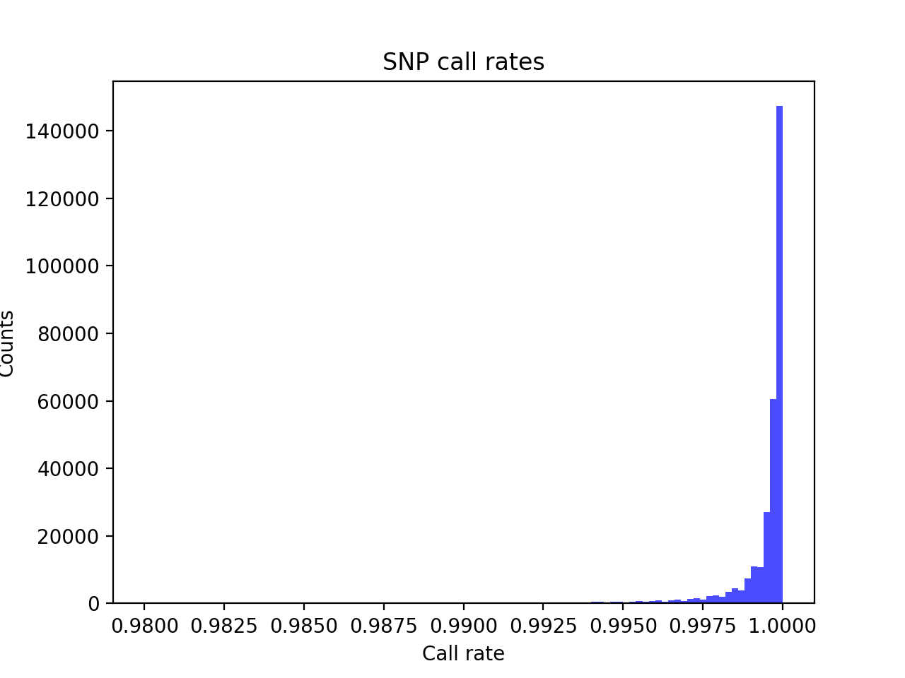
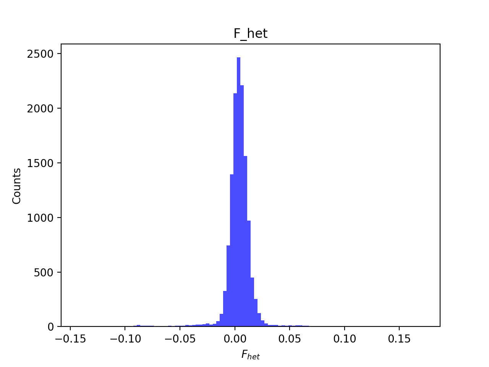
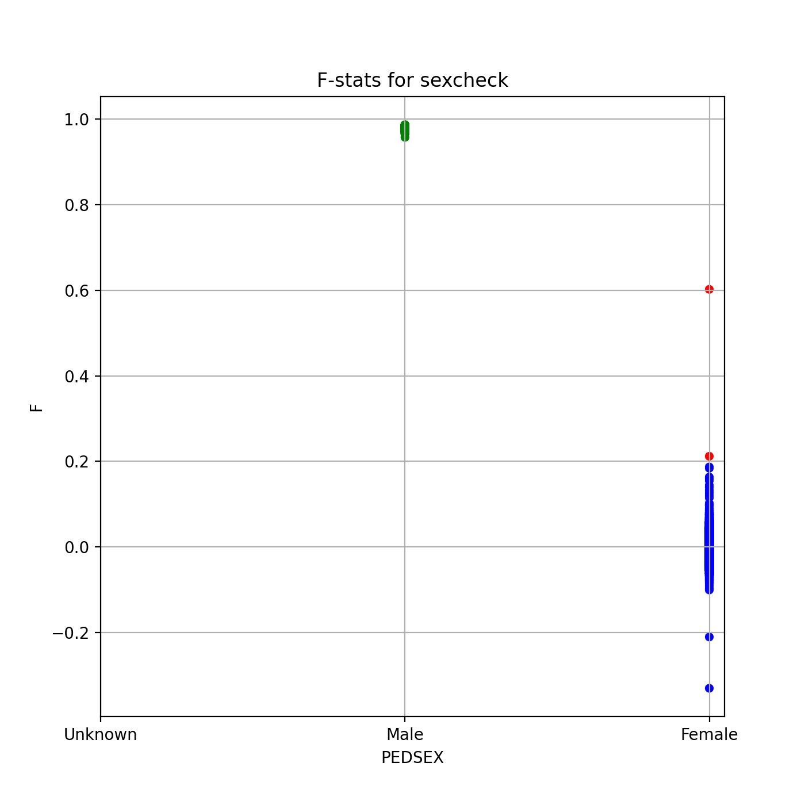
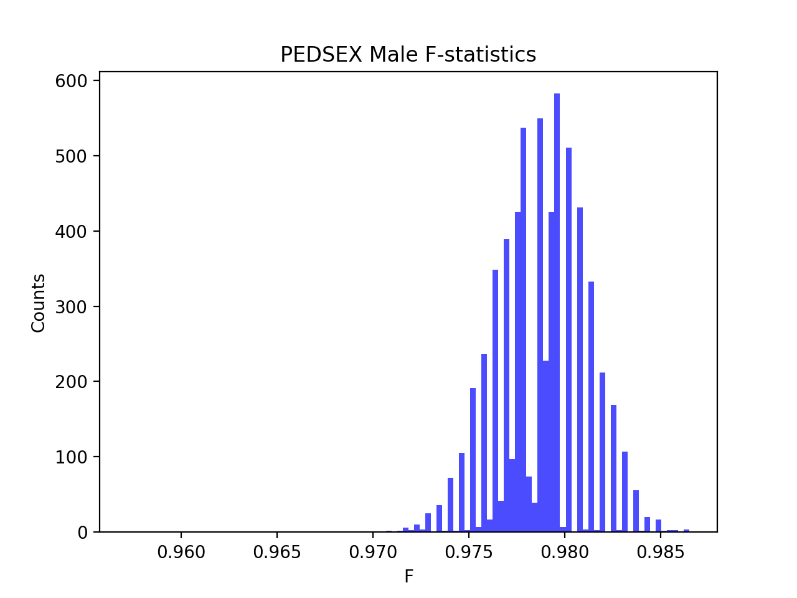

# Batch report for batch snp015a, module mod5-pre-phasing
## Samples overview
13364 samples
 8390 kinship clusters
 2575 offspring with mother ID
 2575 offspring with mother in batch
 2522 mothers with offspring in batch
 0 mothers missing from batch
 2345 offspring with father ID
 2345 offspring with father in batch
 2286 fathers with offspring in batch
 0 fathers missing from batch
## Call rates
### Sample call rates
min: 0.9813139
 max: 0.999861755
 median: 0.99950956 
### SNP call rates
min: 0.980021
 max: 1.0
 median: 0.999775516 
## F_het
min: -0.142551
 max: 0.171434
 median: 0.00394201 
## Hardy-Weinberg P-values
min: 1.00481e-06
 max: 1.0
 median: 0.45708899999999997 
## Sexcheck
12592 out of 13364 OK 
| PEDSEX | Total | SNPSEX Male | SNPSEX Female | SNPSEX Unknown | OK | Problem |
| ------ | ------ | ------ | ------ | ------ | ------ | ------ |
| Male | 6358 | 6358 | 0 | 0 | 6358 | 0 |
| Female | 6236 | 0 | 6234 | 2 | 6234 | 2 |
| Unknown | 0 | 0 | 0 | 0 | 0 | 0 |

### All samples 
### All samples F-statistics
min: -0.33
 max: 0.9865
 median: 0.973 
### PEDSEX Male
### PEDSEX Male F-statistics
min: 0.9572
 max: 0.9865
 median: 0.9786 
### PEDSEX Female
### PEDSEX Female F-statistics
min: -0.33
 max: 0.602
 median: -0.0008801 