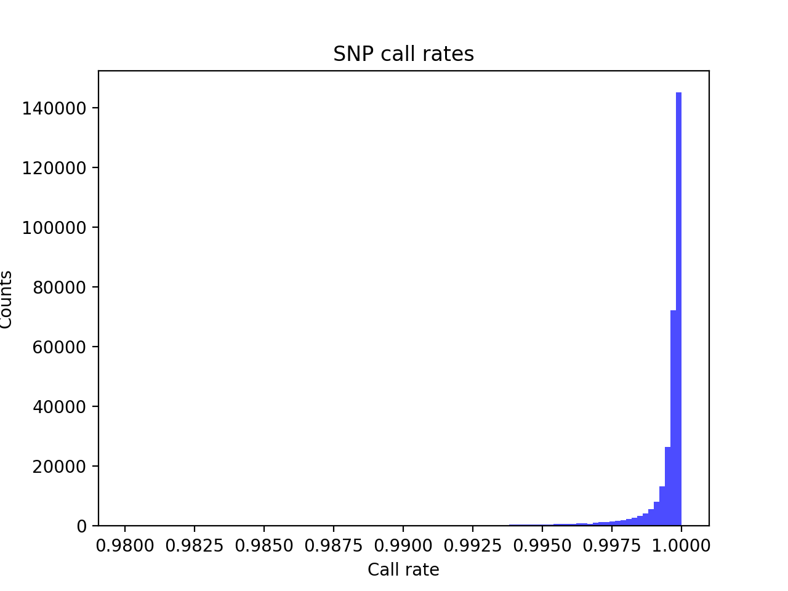
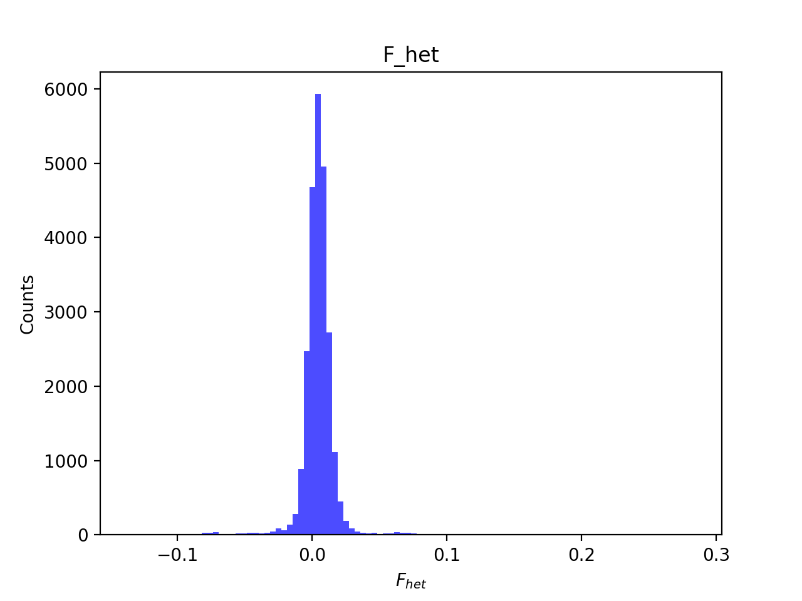
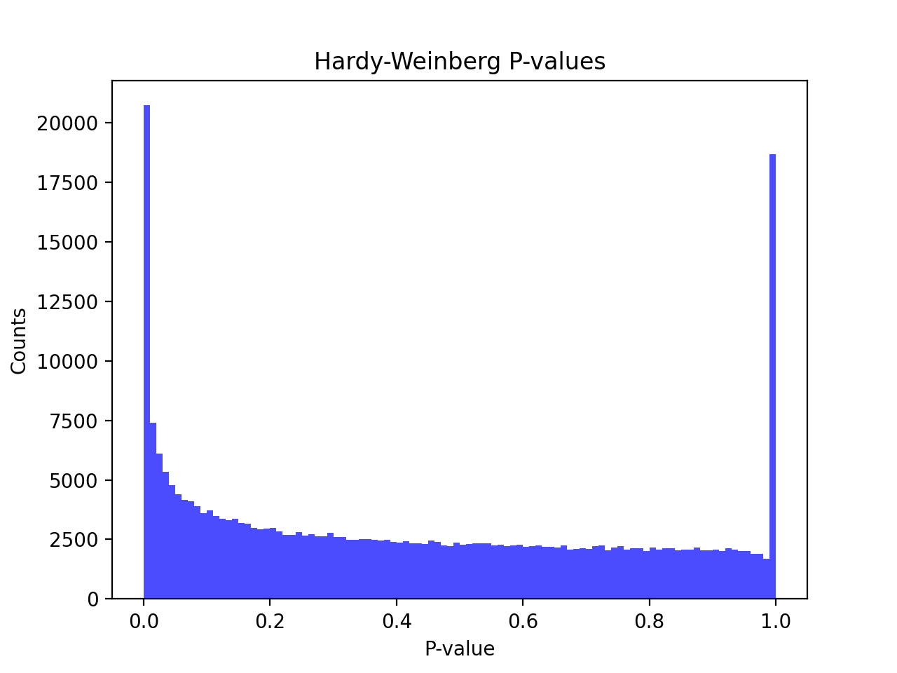
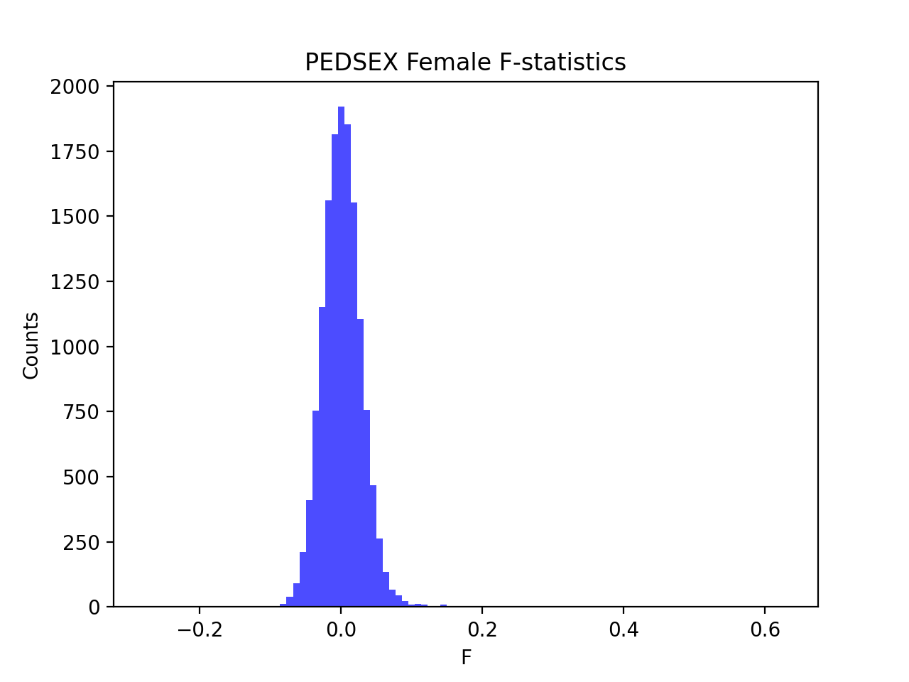

# Batch report for batch snp017a, module mod5-pre-phasing
## Samples overview
24757 samples
 21390 kinship clusters
 2360 offspring with mother ID
 2359 offspring with mother in batch
 2296 mothers with offspring in batch
 1 mothers missing from batch
 742 offspring with father ID
 742 offspring with father in batch
 724 fathers with offspring in batch
 0 fathers missing from batch
## Call rates
### Sample call rates
min: 0.9713637
 max: 0.9999133593
 median: 0.999595677 
### SNP call rates
min: 0.980046
 max: 1.0
 median: 0.999798037 
## F_het
min: -0.136307
 max: 0.283036
 median: 0.00453597 
## Hardy-Weinberg P-values
min: 1.00351e-06
 max: 1.0
 median: 0.394498 
## Sexcheck
23145 out of 24757 OK 
| PEDSEX | Total | SNPSEX Male | SNPSEX Female | SNPSEX Unknown | OK | Problem |
| ------ | ------ | ------ | ------ | ------ | ------ | ------ |
| Male | 8844 | 8844 | 0 | 0 | 8844 | 0 |
| Female | 14313 | 0 | 14301 | 12 | 14301 | 12 |
| Unknown | 2 | 0 | 1 | 1 | 0 | 2 |

### All samples 
### All samples F-statistics
min: -0.2761
 max: 0.9986
 median: 0.02419 
### PEDSEX Male
### PEDSEX Male F-statistics
min: 0.9786
 max: 0.9986
 median: 0.9937 
### PEDSEX Female
### PEDSEX Female F-statistics
min: -0.2761
 max: 0.63
 median: 0.001013 