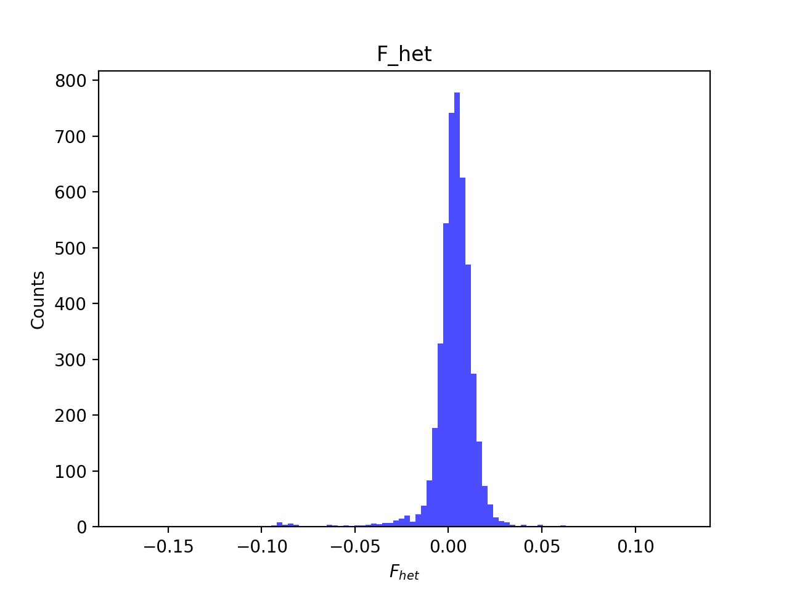
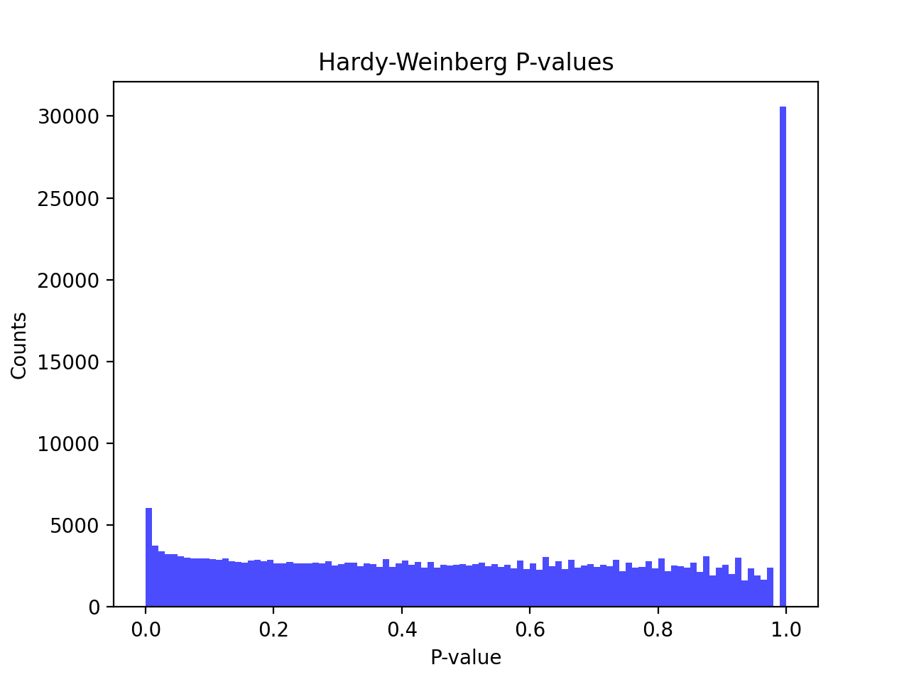
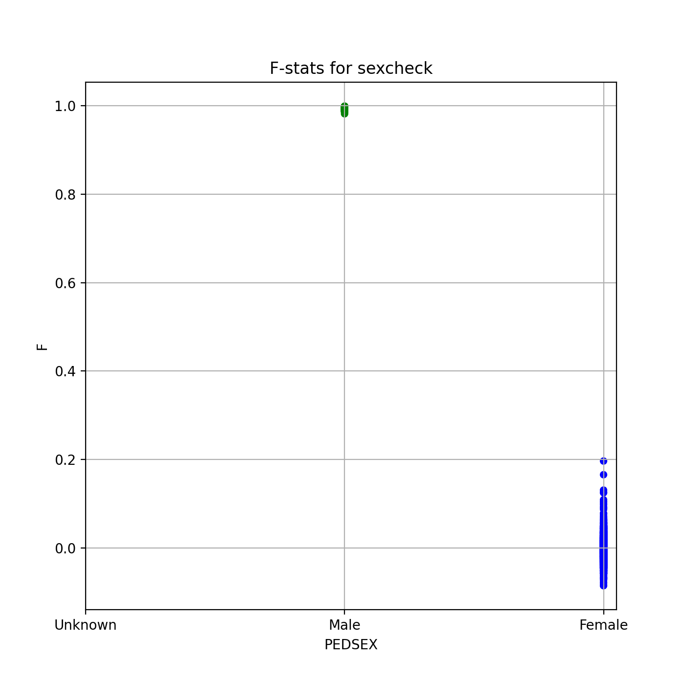
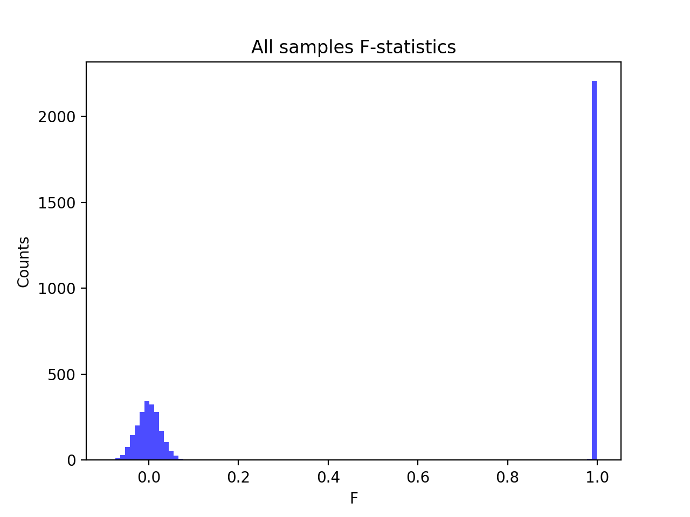

# Batch report for batch snp017e, module mod5-harmonization
## Samples overview
4565 samples
 4272 kinship clusters
 184 offspring with mother ID
 184 offspring with mother in batch
 183 mothers with offspring in batch
 0 mothers missing from batch
 79 offspring with father ID
 79 offspring with father in batch
 78 fathers with offspring in batch
 0 fathers missing from batch
## Call rates
### Sample call rates
min: 0.9648225
 max: 0.9999060464
 median: 0.999627425 
### SNP call rates
min: 0.9800657
 max: 1.0
 median: 0.999780942 
## F_het
min: -0.172242
 max: 0.125137
 median: 0.00397034 
## Hardy-Weinberg P-values
min: 1.01149e-06
 max: 1.0
 median: 0.515235 
## Sexcheck
4298 out of 4565 OK 
| PEDSEX | Total | SNPSEX Male | SNPSEX Female | SNPSEX Unknown | OK | Problem |
| ------ | ------ | ------ | ------ | ------ | ------ | ------ |
| Male | 2213 | 2213 | 0 | 0 | 2213 | 0 |
| Female | 2085 | 0 | 2085 | 0 | 2085 | 0 |
| Unknown | 0 | 0 | 0 | 0 | 0 | 0 |

### All samples 
### All samples F-statistics
min: -0.08497
 max: 0.9986
 median: 0.9913 
### PEDSEX Male
### PEDSEX Male F-statistics
min: 0.9814
 max: 0.9986
 median: 0.9944 
### PEDSEX Female
### PEDSEX Female F-statistics
min: -0.08497
 max: 0.1967
 median: -2.352e-05 