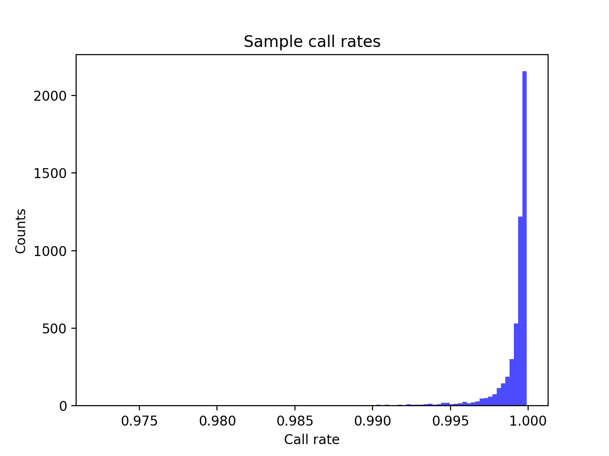
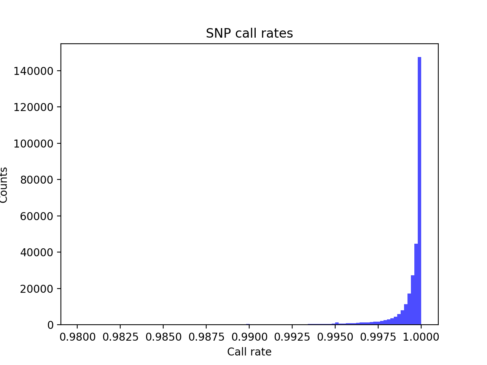
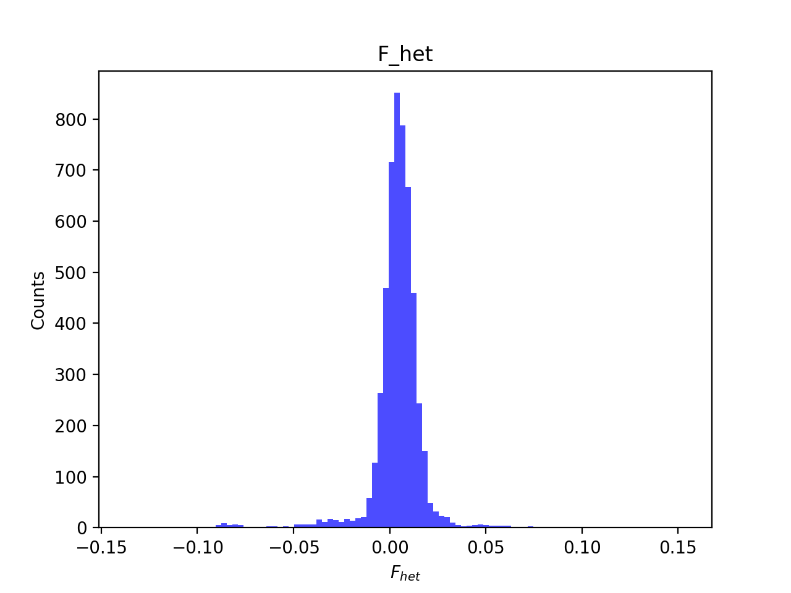
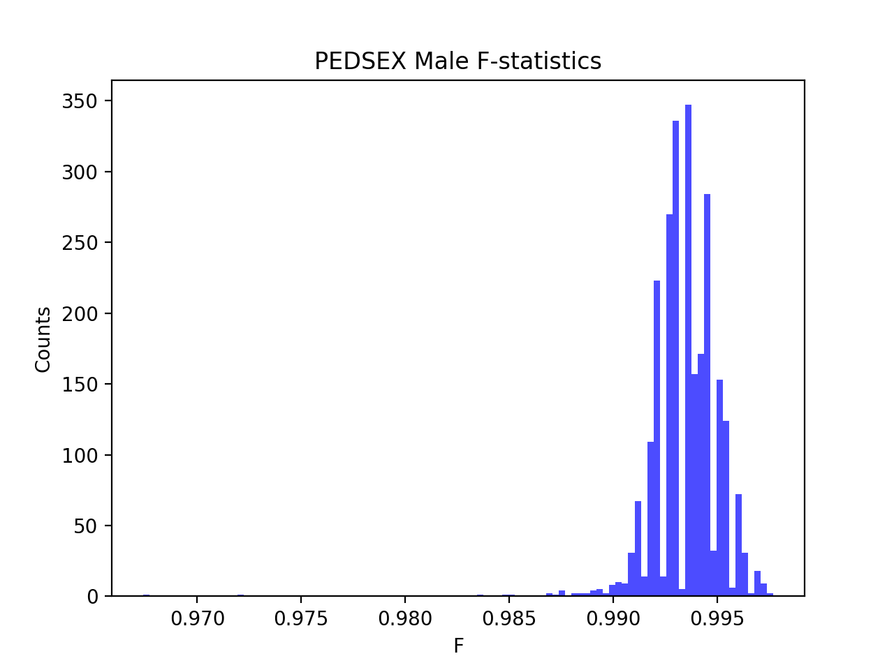
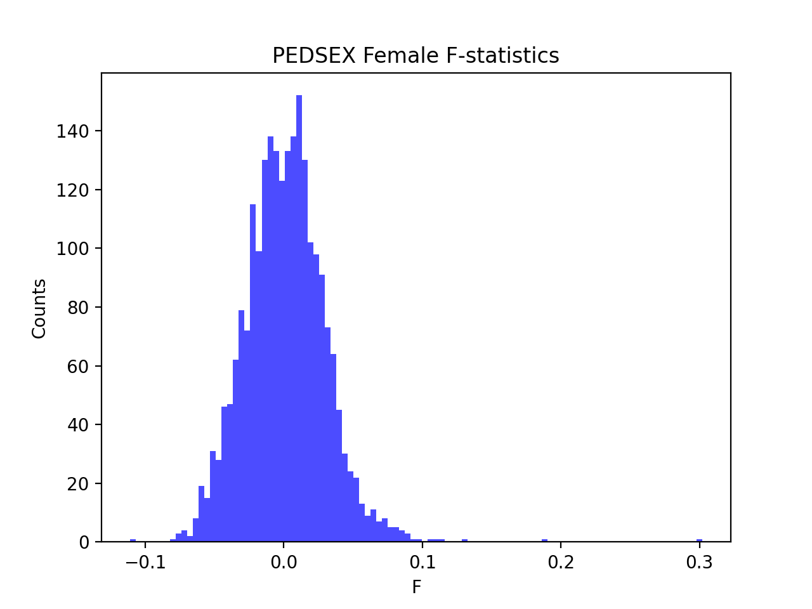

# Batch report for batch snp017f, module mod5-harmonization
## Samples overview
5210 samples
 4970 kinship clusters
 135 offspring with mother ID
 135 offspring with mother in batch
 130 mothers with offspring in batch
 0 mothers missing from batch
 60 offspring with father ID
 60 offspring with father in batch
 59 fathers with offspring in batch
 0 fathers missing from batch
## Call rates
### Sample call rates
min: 0.9723122
 max: 0.9999062199
 median: 0.999560204 
### SNP call rates
min: 0.9800384
 max: 1.0
 median: 0.999616123 
## F_het
min: -0.136758
 max: 0.153048
 median: 0.004922775 
## Hardy-Weinberg P-values
min: 1.00078e-06
 max: 1.0
 median: 0.48734449999999996 
## Sexcheck
4863 out of 5210 OK 
| PEDSEX | Total | SNPSEX Male | SNPSEX Female | SNPSEX Unknown | OK | Problem |
| ------ | ------ | ------ | ------ | ------ | ------ | ------ |
| Male | 2533 | 2533 | 0 | 0 | 2533 | 0 |
| Female | 2331 | 0 | 2330 | 1 | 2330 | 1 |
| Unknown | 1 | 0 | 0 | 1 | 0 | 1 |

### All samples 
### All samples F-statistics
min: -0.1109
 max: 0.9977
 median: 0.9912 
### PEDSEX Male
### PEDSEX Male F-statistics
min: 0.9674
 max: 0.9977
 median: 0.9936 
### PEDSEX Female
### PEDSEX Female F-statistics
min: -0.1109
 max: 0.302
 median: 0.0008287 