Principal component analysis of the MoBa samples merged with the thousand genomes.
| Population code | Description |
| --------------- | ----------- |
| AFR | African |
| AMR | Admixed American |
| EAS | East Asian |
| EUR | European |
| MID | Middle Eastern |
| SAS | South Asian |

| Population | Number of samples |
| ---------- | ----------------- |
| AFR | 661 |
| AMR | 347 |
| EAS | 504 |
| EUR | 503 |
| SAS | 489 |
| MoBa | 5372 |
| Total | 7876 |
### pc2 vs. pc1

### pc3 vs. pc2

### pc4 vs. pc3

### pc5 vs. pc4

### pc6 vs. pc5

### pc7 vs. pc6
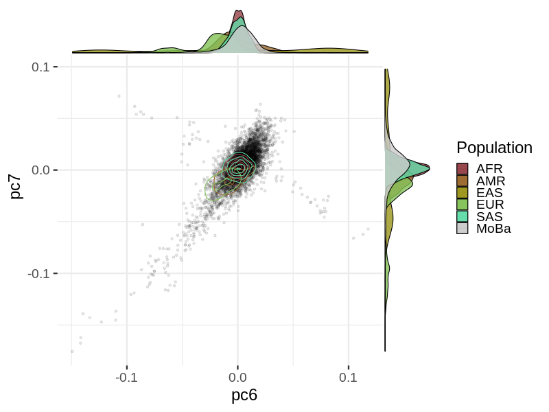
### pc8 vs. pc7
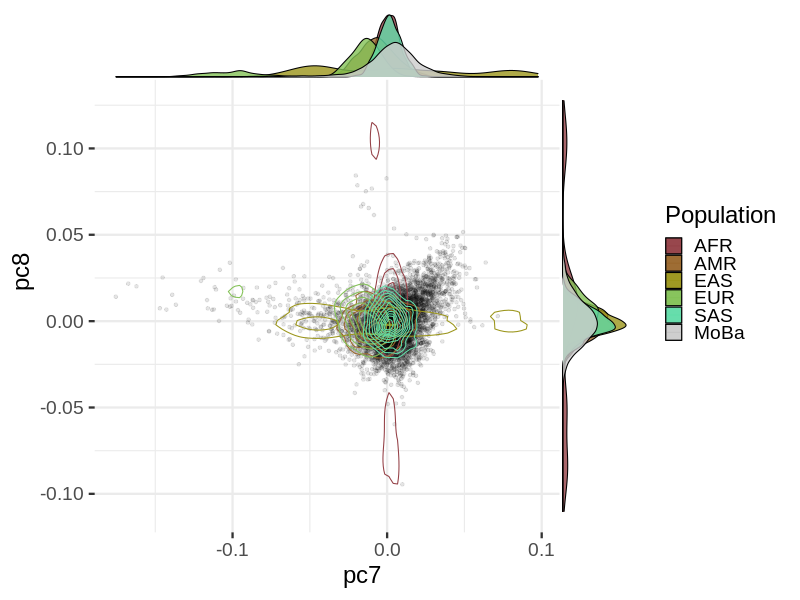
### pc9 vs. pc8
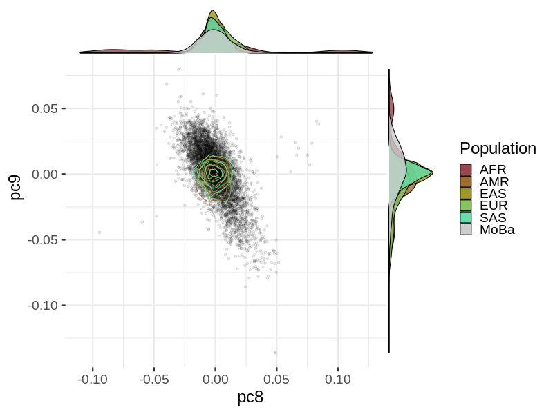
### pc10 vs. pc9

## Midpoint of parents vs actual position of children on the PCs (full trios only)
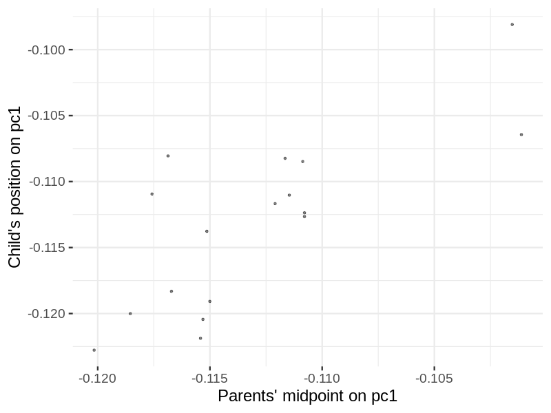

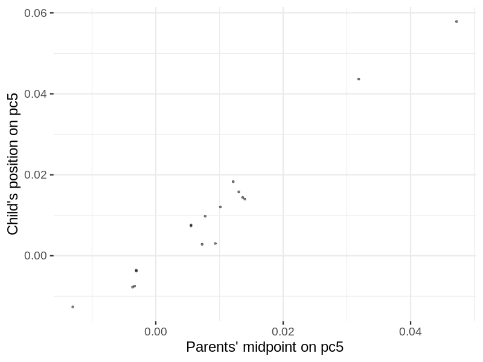
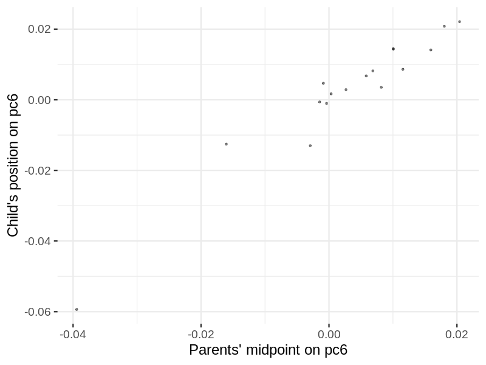

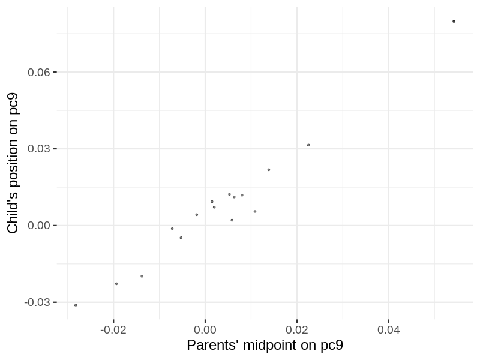
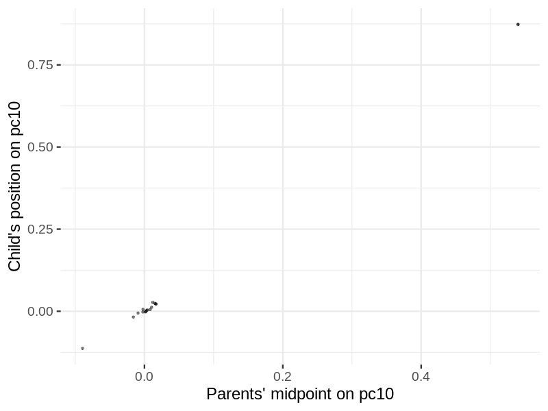
### Clustering in the 1KG
Clustering of the 1KG after an 80-20 split using svm in the top 10 PCs.
| Population | AFR | AMR | EAS | EUR | SAS |
| - | -  |  -  |  -  |  -  |  -  |
| AFR | 526 | 3 | 0 | 0 | 0 |
| AMR | 1 | 269 | 0 | 8 | 0 |
| EAS | 0 | 0 | 403 | 0 | 0 |
| EUR | 0 | 0 | 0 | 402 | 0 |
| SAS | 0 | 0 | 0 | 0 | 391 |

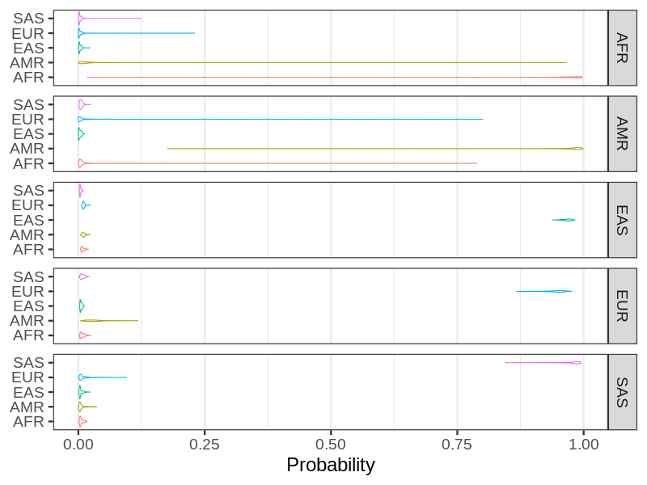
### Clustering in MoBa
Clustering of MoBa participants with svm using the top 10 PCs and 1KG as training.
| Population | AFR | AMR | EAS | EUR | EUR_core | SAS |
| - | -  |  -  |  -  |  -  |  -  |  -  |
| MoBa | 27 | 30 | 50 | 46 | 5182 | 37 |

### Principal components with F statistics
### Principal components with color of the top cluster
### pc2 vs. pc1
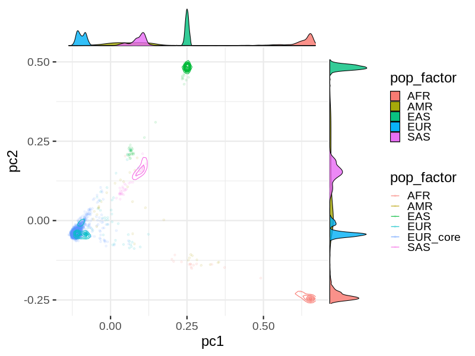
### pc3 vs. pc2

### pc4 vs. pc3

### pc5 vs. pc4

### pc6 vs. pc5

### pc7 vs. pc6

### pc8 vs. pc7

### pc9 vs. pc8

### pc10 vs. pc9
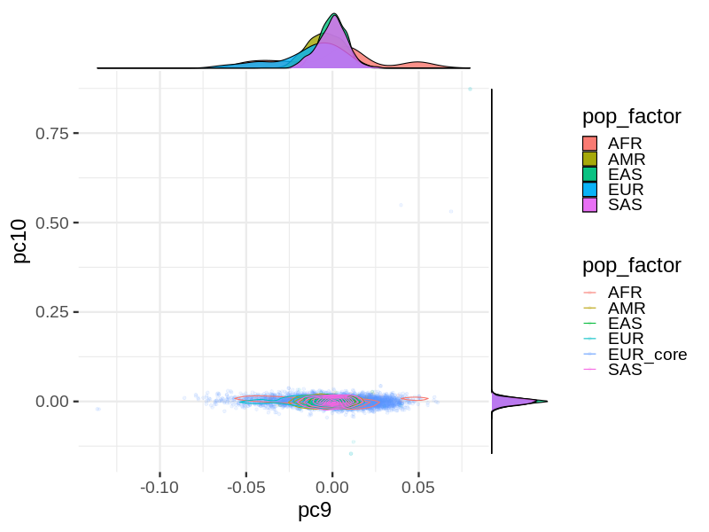
