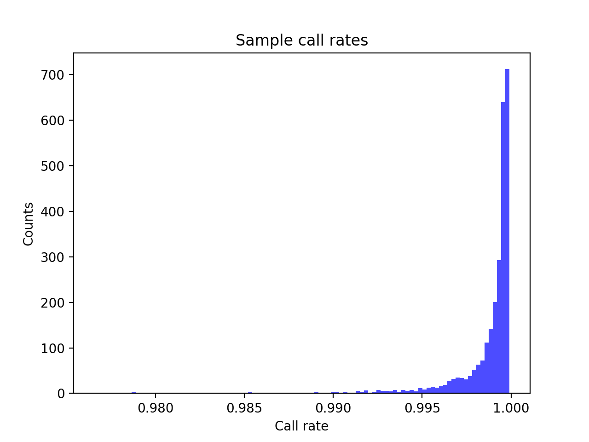
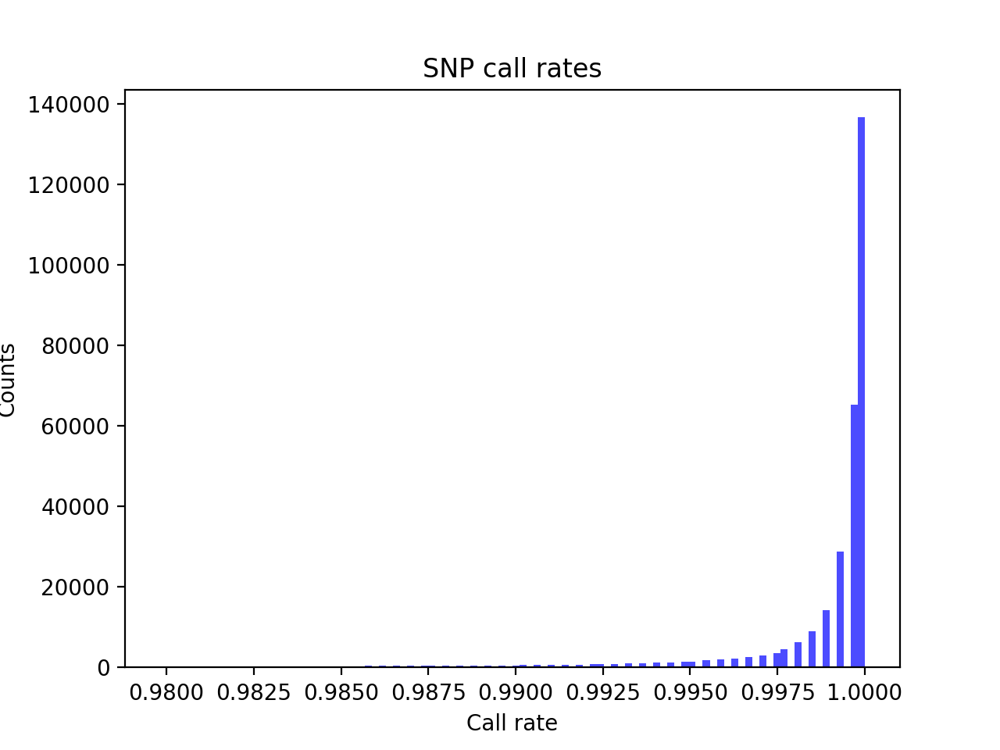
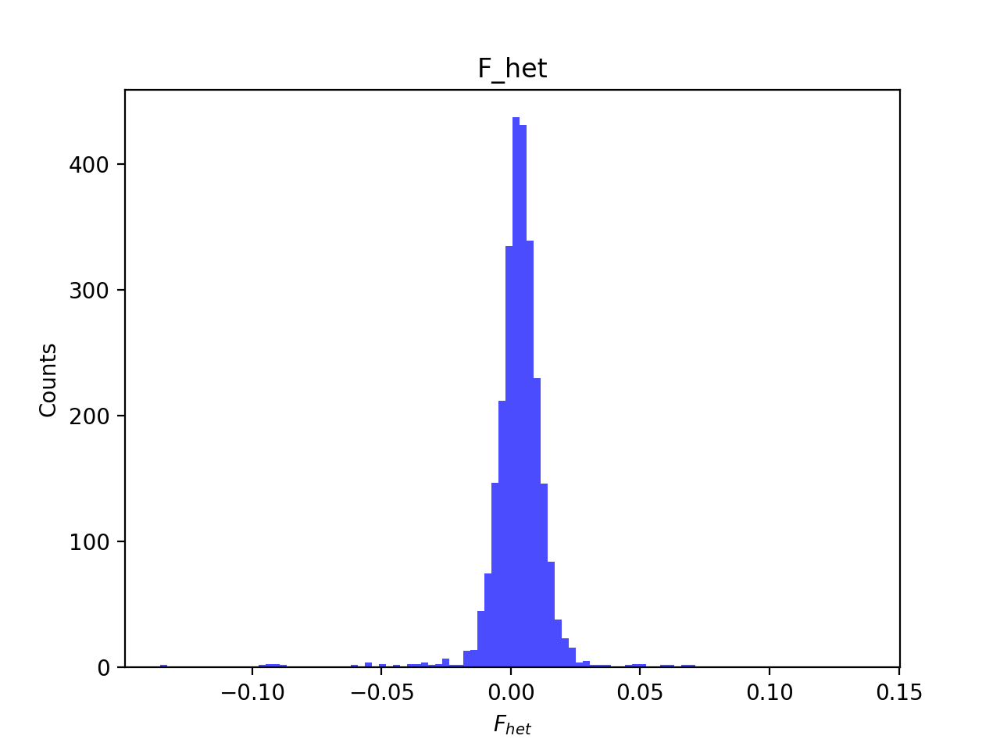
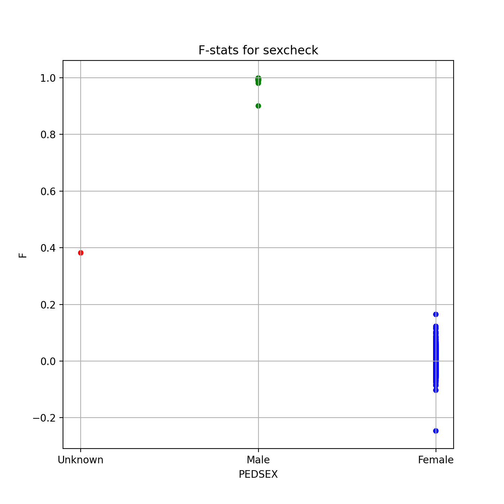

# Batch report for batch snp018b, module mod5-harmonization
## Samples overview
2676 samples
 2211 kinship clusters
 439 offspring with mother ID
 439 offspring with mother in batch
 436 mothers with offspring in batch
 0 mothers missing from batch
 2 offspring with father ID
 2 offspring with father in batch
 2 fathers with offspring in batch
 0 fathers missing from batch
## Call rates
### Sample call rates
min: 0.9765701
 max: 0.9999040844
 median: 0.999444351 
### SNP call rates
min: 0.9798206
 max: 1.0
 median: 0.999626308 
## F_het
min: -0.135489
 max: 0.136836
 median: 0.0034342950000000004 
## Hardy-Weinberg P-values
min: 1.01013e-06
 max: 1.0
 median: 0.534491 
## Sexcheck
2479 out of 2676 OK 
| PEDSEX | Total | SNPSEX Male | SNPSEX Female | SNPSEX Unknown | OK | Problem |
| ------ | ------ | ------ | ------ | ------ | ------ | ------ |
| Male | 791 | 791 | 0 | 0 | 791 | 0 |
| Female | 1688 | 0 | 1688 | 0 | 1688 | 0 |
| Unknown | 1 | 0 | 0 | 1 | 0 | 1 |

### All samples 
### All samples F-statistics
min: -0.2464
 max: 0.9986
 median: 0.016695 
### PEDSEX Male
### PEDSEX Male F-statistics
min: 0.9005
 max: 0.9986
 median: 0.9944 
### PEDSEX Female
### PEDSEX Female F-statistics
min: -0.2464
 max: 0.1648
 median: 0.0008477999999999999 