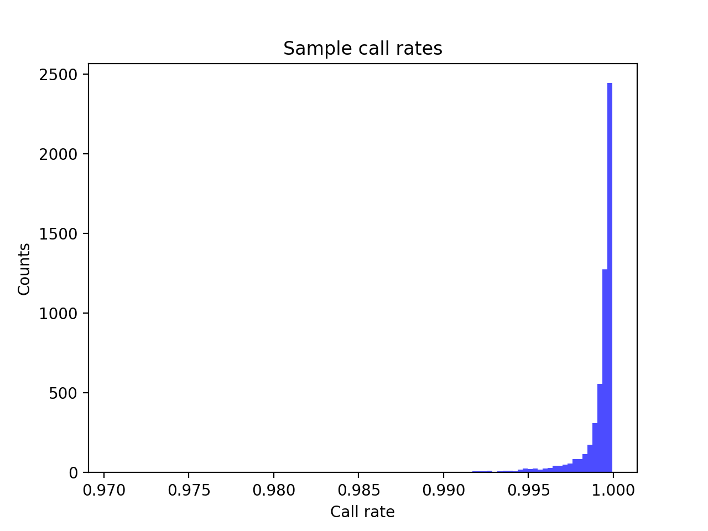
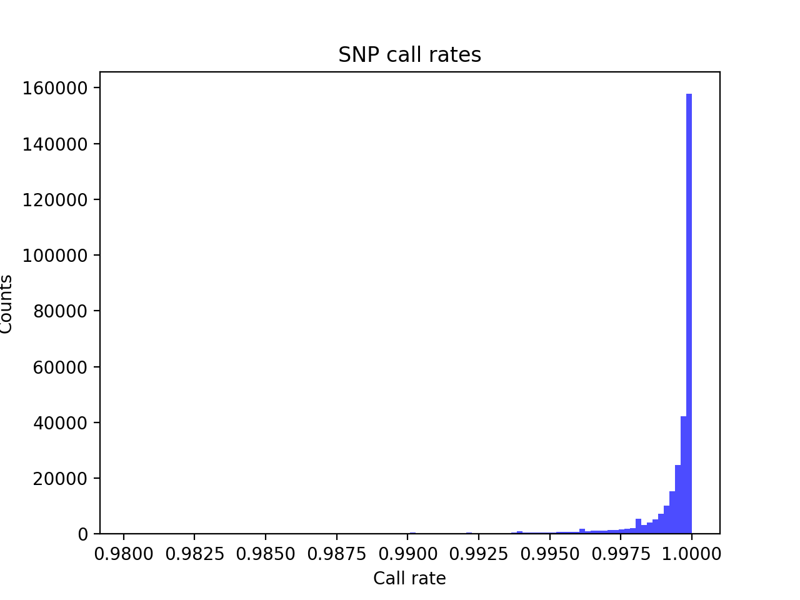
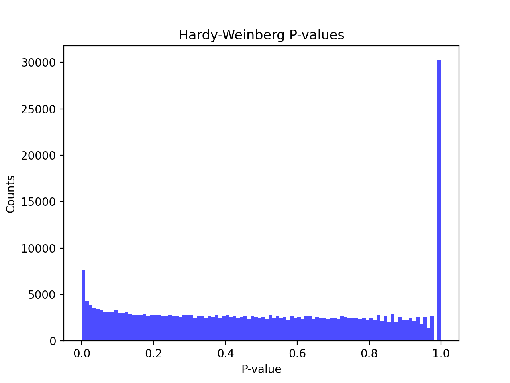
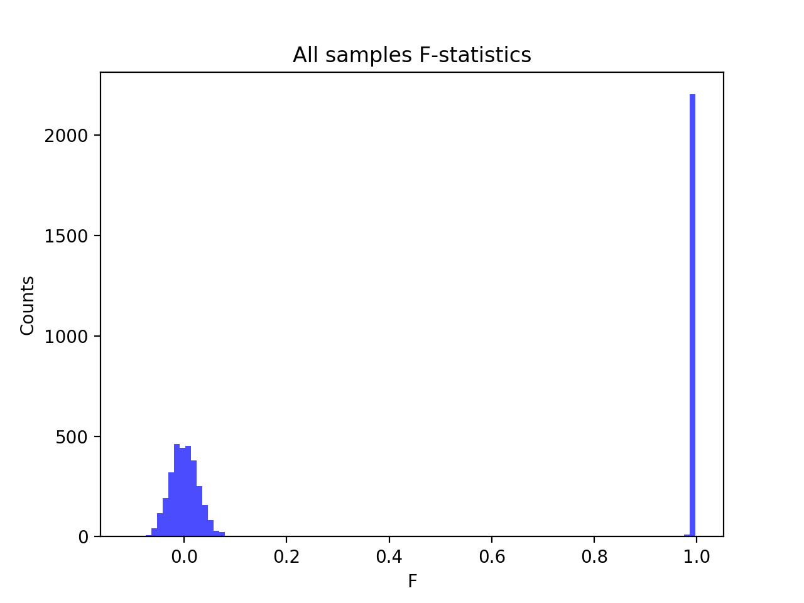
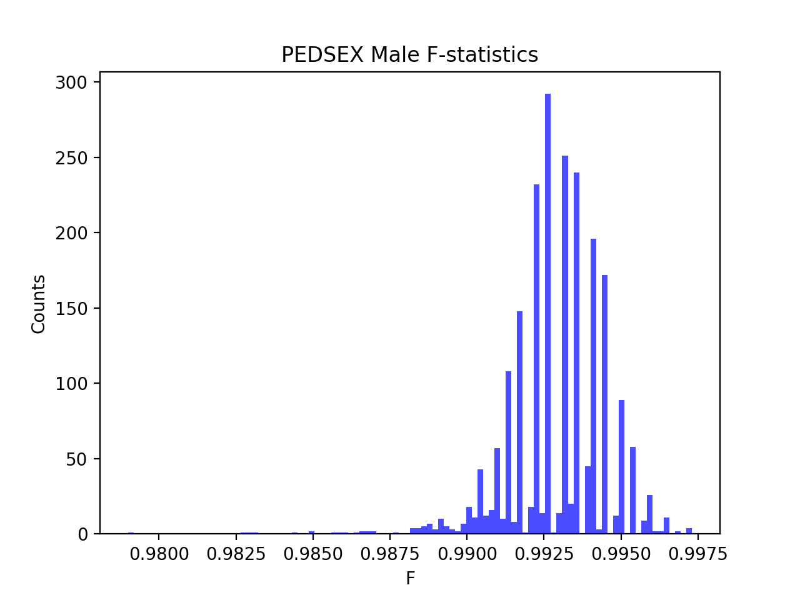

# Batch report for batch snp018c, module mod5-pre-phasing
## Samples overview
5545 samples
 5233 kinship clusters
 196 offspring with mother ID
 196 offspring with mother in batch
 186 mothers with offspring in batch
 0 mothers missing from batch
 39 offspring with father ID
 39 offspring with father in batch
 39 fathers with offspring in batch
 0 fathers missing from batch
## Call rates
### Sample call rates
min: 0.9705615
 max: 0.9999322808
 median: 0.999587235 
### SNP call rates
min: 0.9801623
 max: 1.0
 median: 0.999819657 
## F_het
min: -0.156437
 max: 0.109911
 median: 0.00457695 
## Hardy-Weinberg P-values
min: 1.00121e-06
 max: 1.0
 median: 0.4992335 
## Sexcheck
5197 out of 5545 OK 
| PEDSEX | Total | SNPSEX Male | SNPSEX Female | SNPSEX Unknown | OK | Problem |
| ------ | ------ | ------ | ------ | ------ | ------ | ------ |
| Male | 2213 | 2213 | 0 | 0 | 2213 | 0 |
| Female | 2985 | 0 | 2984 | 1 | 2984 | 1 |
| Unknown | 1 | 0 | 0 | 1 | 0 | 1 |

### All samples 
### All samples F-statistics
min: -0.1079
 max: 0.9973
 median: 0.03178 
### PEDSEX Male
### PEDSEX Male F-statistics
min: 0.979
 max: 0.9973
 median: 0.9931 
### PEDSEX Female
### PEDSEX Female F-statistics
min: -0.1079
 max: 0.3128
 median: 0.0001801 