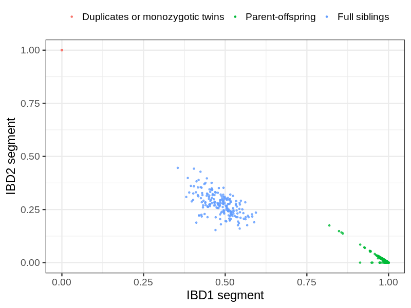
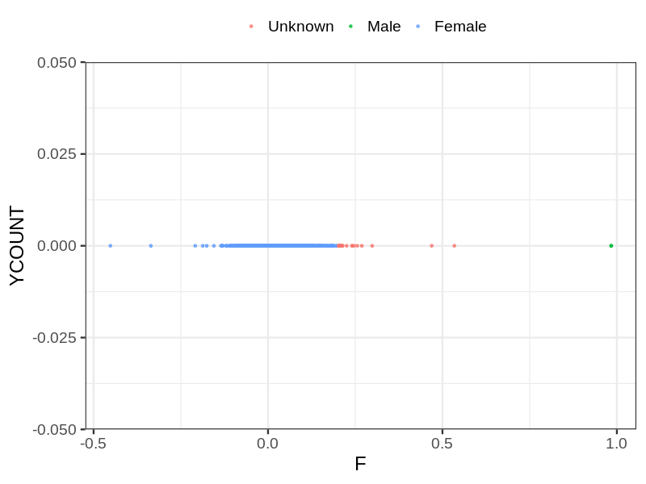
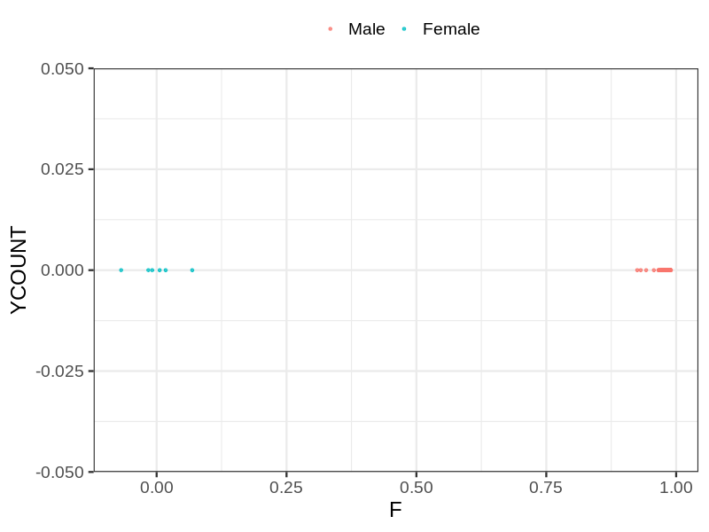
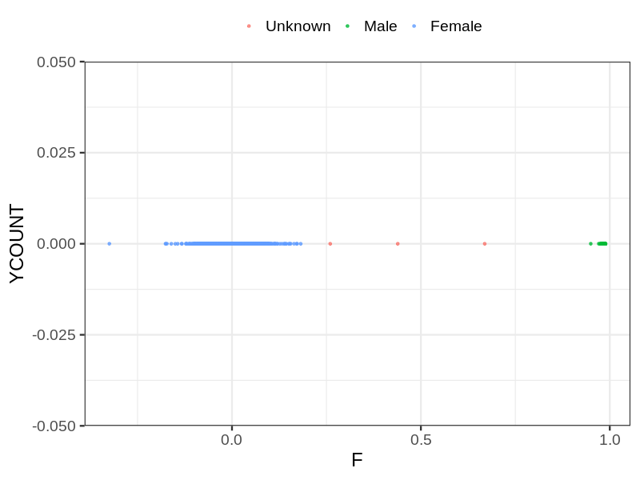

# Fam file reconstruction in snp001
- Number of samples in the genotyping data: 18492.
## Samples not in Medical Birth Regsitry
140 samples with missing birth year, assumed to be parent in the following.
## Relationship inference
| Relationship |   |
| ------------ | - |
| Duplicates or monozygotic twins| 142 |
| Parent-offspring| 11223 |
| Full siblings| 196 |
| 2nd degree| 0 |
| 3rd degree| 0 |
| 4th degree| 0 |
| Unrelated| 0 |

## Mother sex check
| Inferred sex |   |
| ------------ | - |
| Unknown | 20 |
| Male | 2 |
| Female | 6193 |

## Father sex check
| Inferred sex |   |
| ------------ | - |
| Unknown | 0 |
| Male | 6150 |
| Female | 6 |

## Children sex check
| Inferred sex |   |
| ------------ | - |
| Unknown | 3 |
| Male | 3143 |
| Female | 2975 |

## Parental relationships
140 sentrix IDs missing from ID file. These are not counted as individuals.
###  Individuals
18220 individuals in total. Breakdown excluding multiple same-sex parents:
 -  5704 children
 -  5481 mothers
 -  5375 fathers
 -  5530 mother-child pairs
 -  5425 father-child pairs
 -  5251 mother-father-child trios
 -  1660 unrelated

5532 mother-child relationships expected.
- 5530 (99.96%) recovered by genetic relationships.
- 2 (0.04%) not recovered by genetic relationships.

5431 father-child relationships expected.
- 5425 (99.89%) recovered by genetic relationships.
- 6 (0.11%) not recovered by genetic relationships.

5535 mother-child relationships detected.
- 5530 (99.91%) matched to registry.
- 5 (0.09%) not matched to registry.

5430 father-child relationships detected.
- 5425 (99.91%) matched to registry.
- 5 (0.09%) not matched to registry.

###  Samples
18492 samples in total. Breakdown excluding multiple same-sex parents:
 -  5760 children
 -  5520 mothers
 -  5405 fathers
 -  5605 mother-child pairs
 -  5492 father-child pairs
 -  5337 mother-father-child trios
 -  1807 unrelated

5623 mother-child relationships expected.
- 5621 (99.96%) recovered by genetic relationships.
- 2 (0.04%) not recovered by genetic relationships.

5518 father-child relationships expected.
- 5512 (99.89%) recovered by genetic relationships.
- 6 (0.11%) not recovered by genetic relationships.

5666 mother-child relationships detected.
- 5621 (99.21%) matched to registry.
- 45 (0.79%) not matched to registry.

5548 father-child relationships detected.
- 5512 (99.35%) matched to registry.
- 36 (0.65%) not matched to registry.

## Exclusion
- Number of samples excluded: 19
