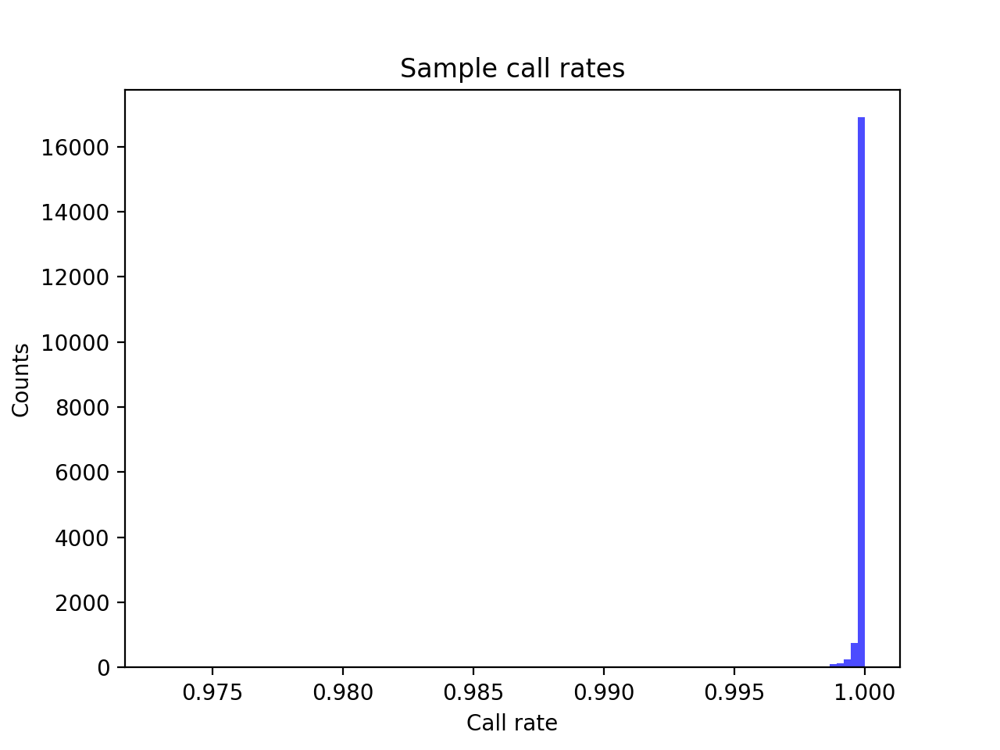
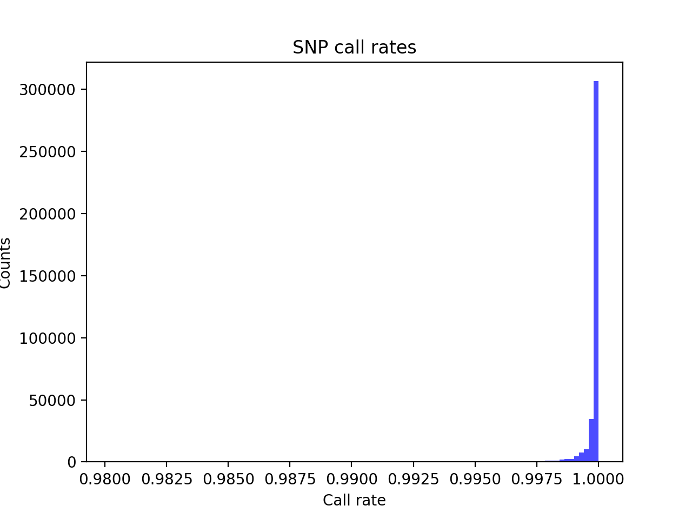
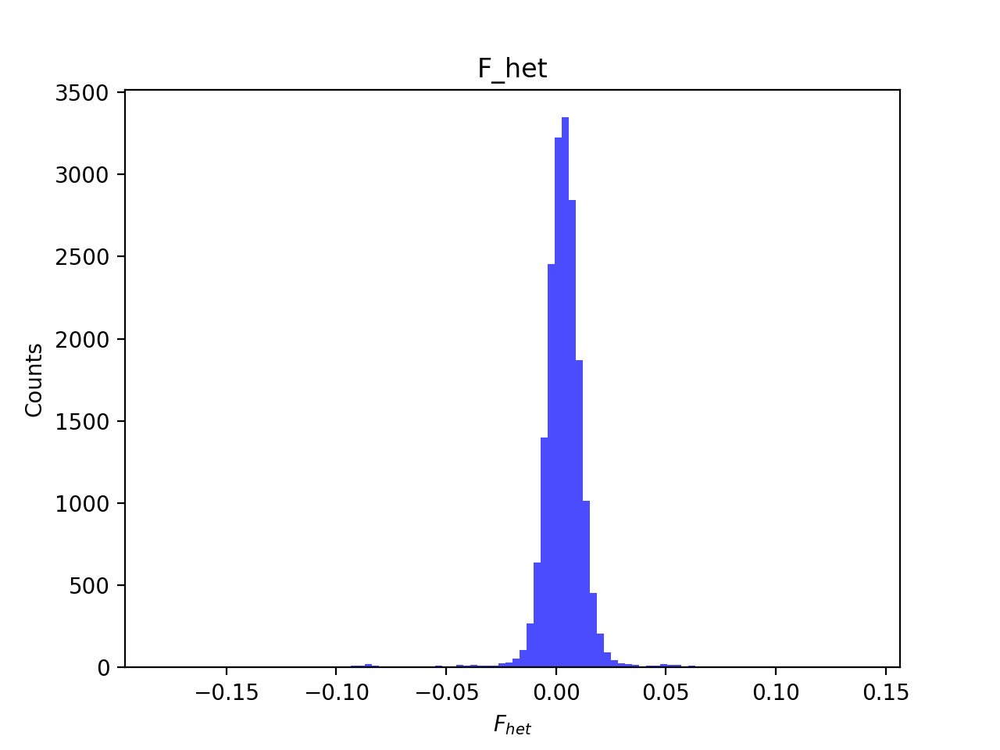
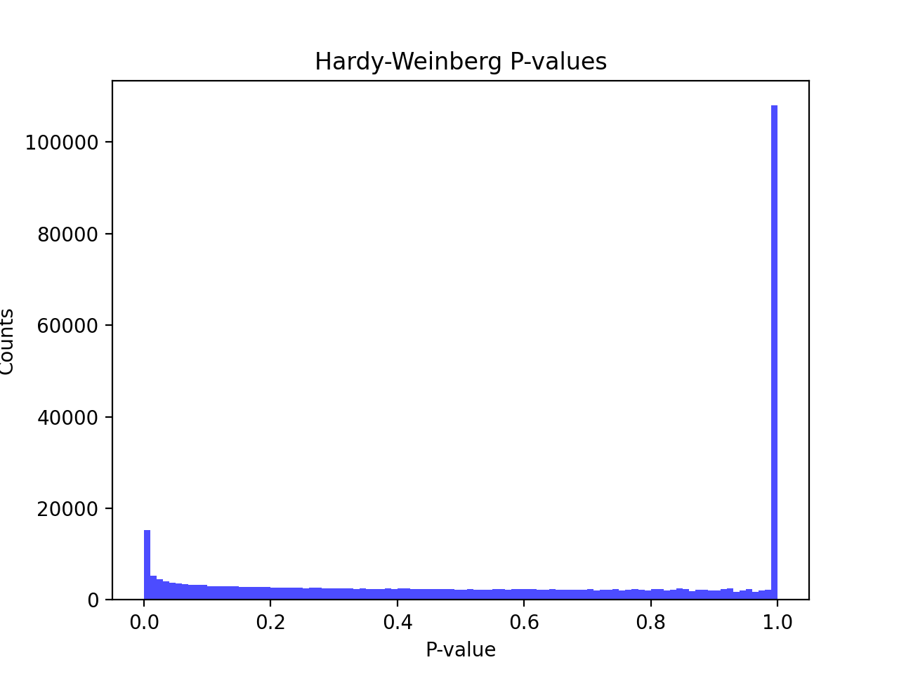
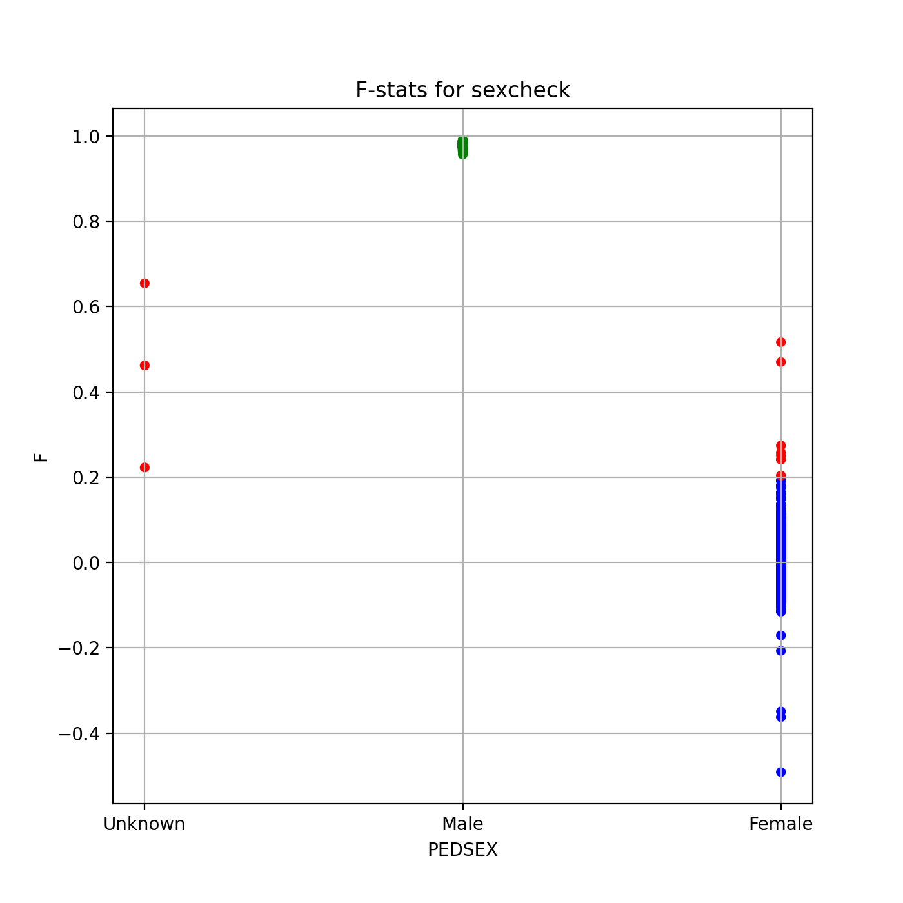
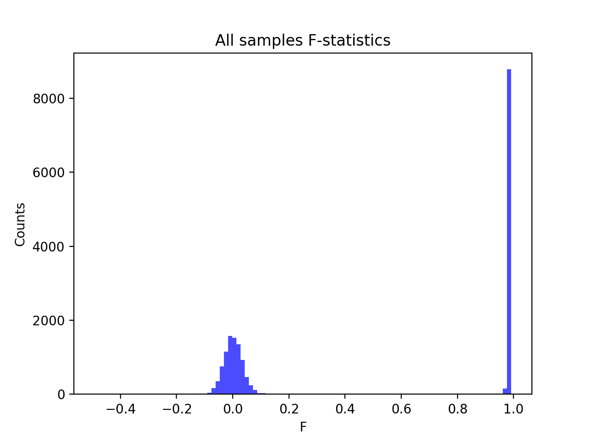
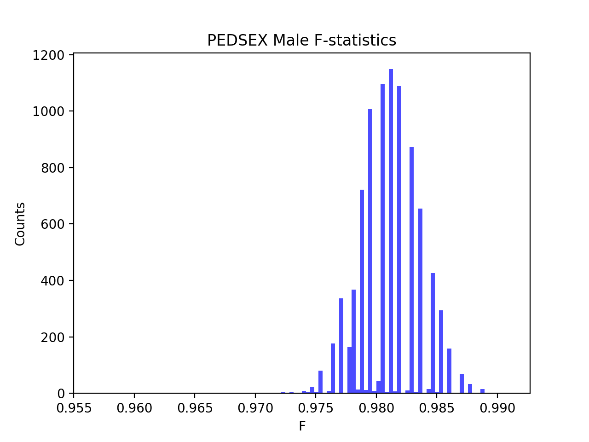
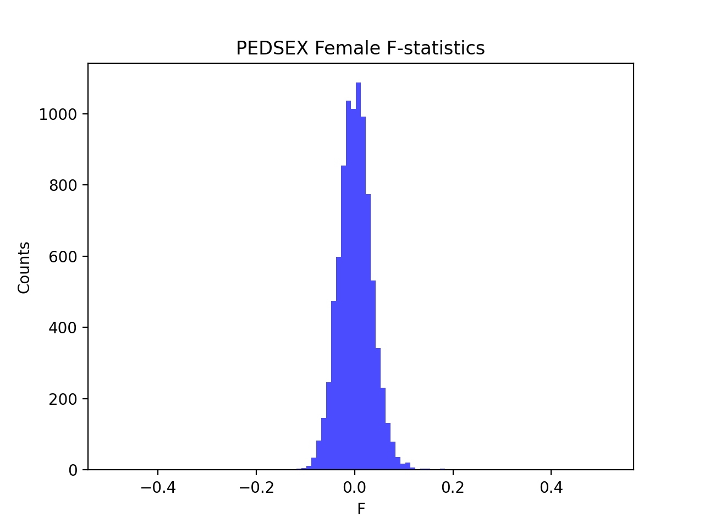

# Batch report for batch snp001, module mod5-harmonization
## Samples overview
18473 samples
 7223 kinship clusters
 5605 offspring with mother ID
 5603 offspring with mother in batch
 5518 mothers with offspring in batch
 2 mothers missing from batch
 5491 offspring with father ID
 5489 offspring with father in batch
 5402 fathers with offspring in batch
 2 fathers missing from batch
## Call rates
### Sample call rates
min: 0.9729913
 max: 0.99999735804
 median: 0.9999180993 
### SNP call rates
min: 0.9802414
 max: 1.0
 median: 0.9999458669 
## F_het
min: -0.180147
 max: 0.140506
 median: 0.00339784 
## Hardy-Weinberg P-values
min: 8.56341e-112
 max: 1.0
 median: 0.6390115000000001 
## Sexcheck
17721 out of 18473 OK 
| PEDSEX | Total | SNPSEX Male | SNPSEX Female | SNPSEX Unknown | OK | Problem |
| ------ | ------ | ------ | ------ | ------ | ------ | ------ |
| Male | 8942 | 8942 | 0 | 0 | 8942 | 0 |
| Female | 8787 | 0 | 8779 | 8 | 8779 | 8 |
| Unknown | 3 | 0 | 0 | 3 | 0 | 3 |

### All samples 
### All samples F-statistics
min: -0.4914
 max: 0.991
 median: 0.97525 
### PEDSEX Male
### PEDSEX Male F-statistics
min: 0.9567
 max: 0.991
 median: 0.9812 
### PEDSEX Female
### PEDSEX Female F-statistics
min: -0.4914
 max: 0.5168
 median: 0.001339 