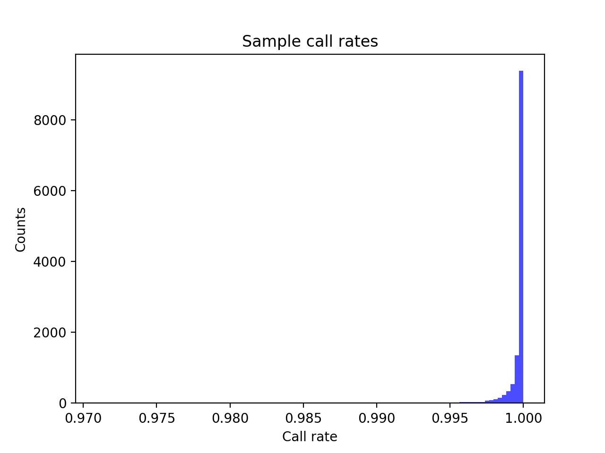
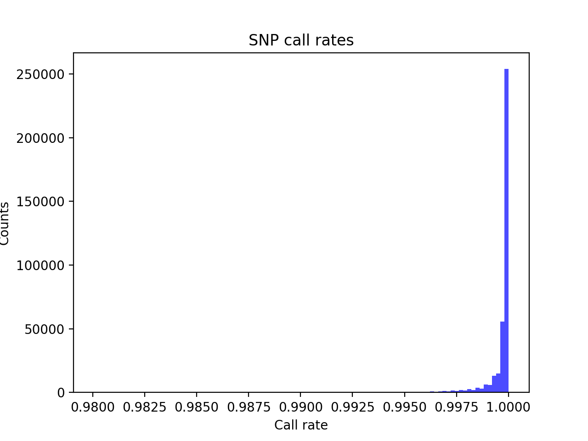
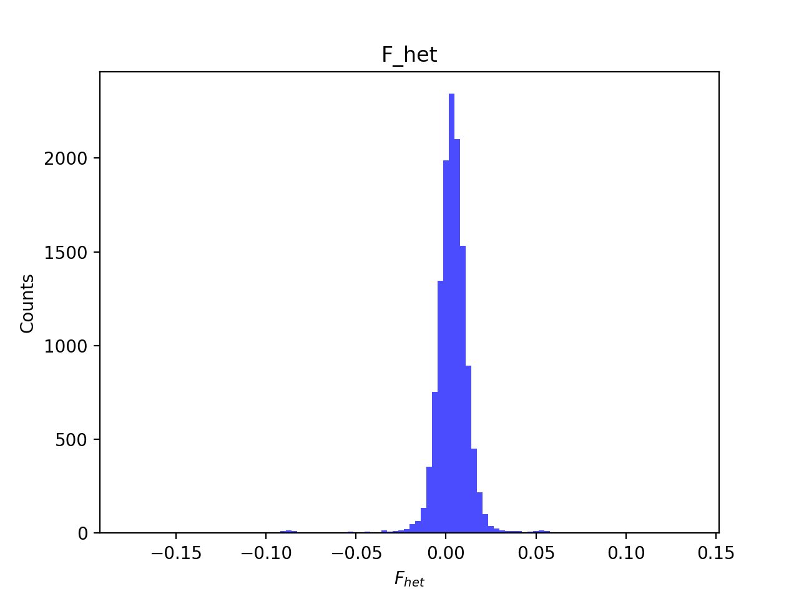
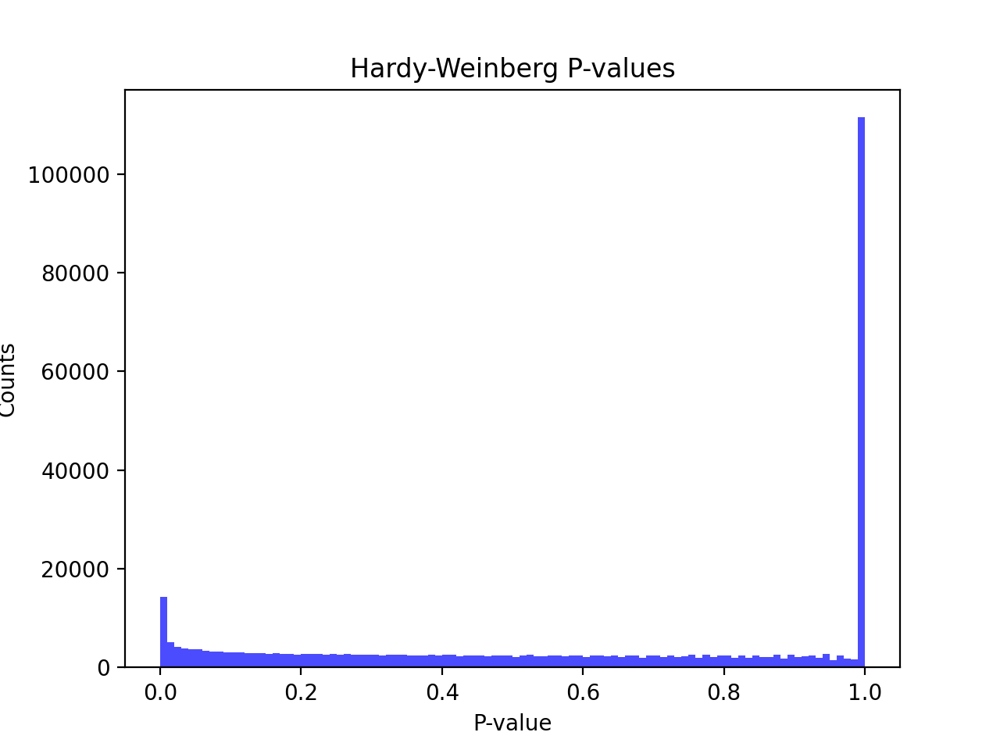
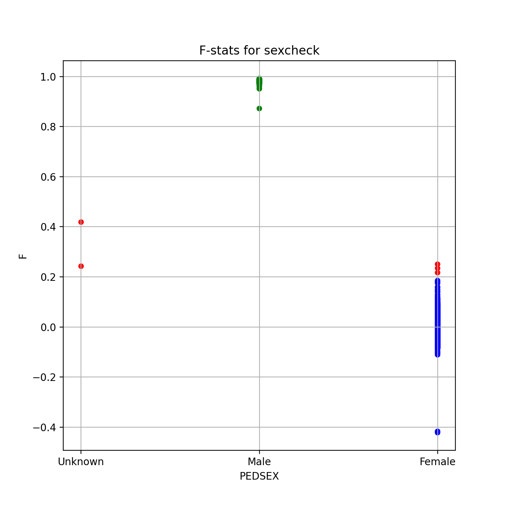
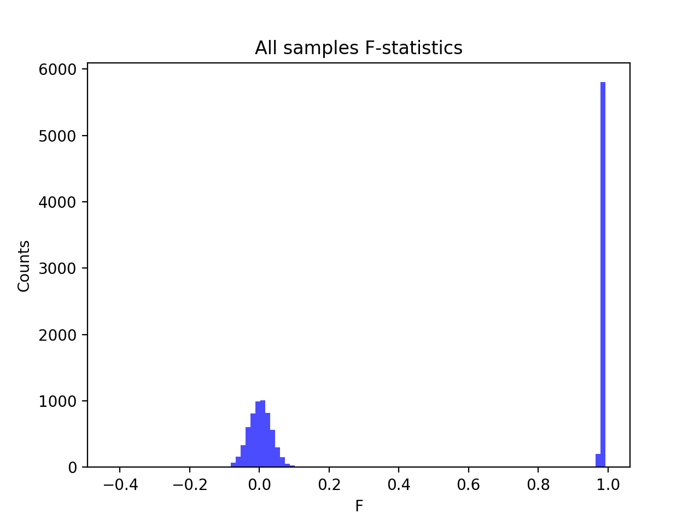
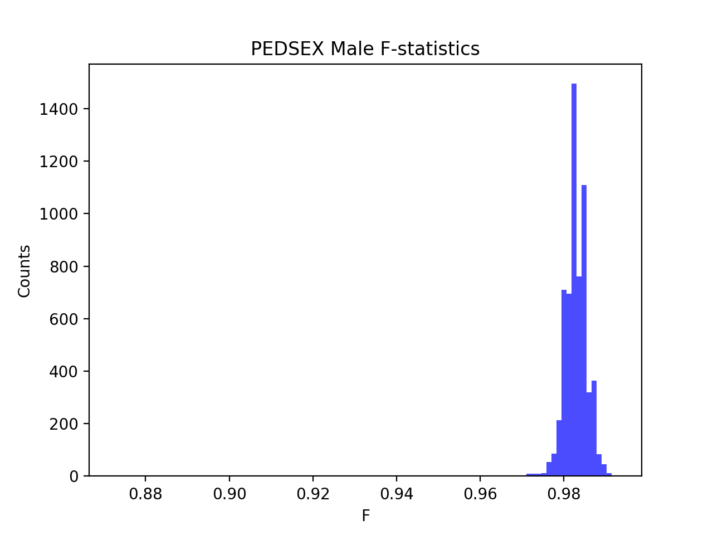
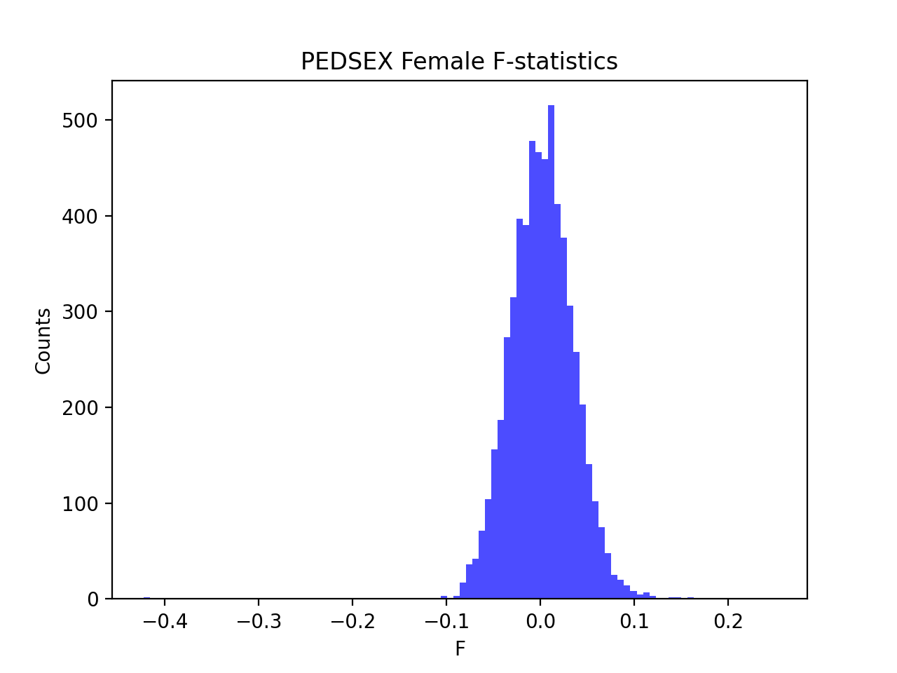

# Batch report for batch snp003, module mod5-harmonization
## Samples overview
12698 samples
 4312 kinship clusters
 4276 offspring with mother ID
 4276 offspring with mother in batch
 4007 mothers with offspring in batch
 0 mothers missing from batch
 4238 offspring with father ID
 4238 offspring with father in batch
 3971 fathers with offspring in batch
 0 fathers missing from batch
## Call rates
### Sample call rates
min: 0.9709291
 max: 0.9999843368
 median: 0.999856421 
### SNP call rates
min: 0.9800756
 max: 1.0
 median: 0.9999212474 
## F_het
min: -0.176534
 max: 0.136032
 median: 0.00365598 
## Hardy-Weinberg P-values
min: 1.06968e-90
 max: 1.0
 median: 0.647711 
## Sexcheck
11941 out of 12698 OK 
| PEDSEX | Total | SNPSEX Male | SNPSEX Female | SNPSEX Unknown | OK | Problem |
| ------ | ------ | ------ | ------ | ------ | ------ | ------ |
| Male | 6010 | 6010 | 0 | 0 | 6010 | 0 |
| Female | 5934 | 0 | 5931 | 3 | 5931 | 3 |
| Unknown | 2 | 0 | 0 | 2 | 0 | 2 |

### All samples 
### All samples F-statistics
min: -0.4223
 max: 0.9926
 median: 0.9733 
### PEDSEX Male
### PEDSEX Male F-statistics
min: 0.8725
 max: 0.9926
 median: 0.9827 
### PEDSEX Female
### PEDSEX Female F-statistics
min: -0.4223
 max: 0.2505
 median: 0.0019125000000000001 