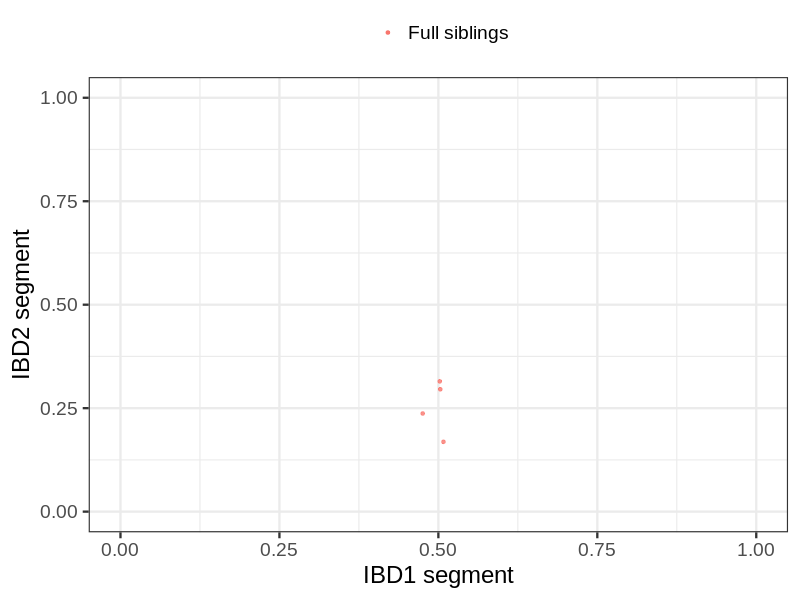
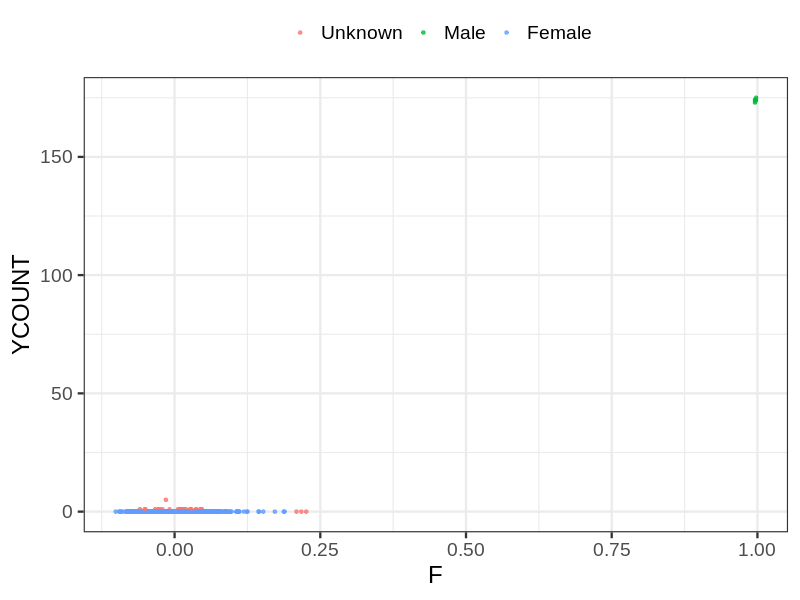
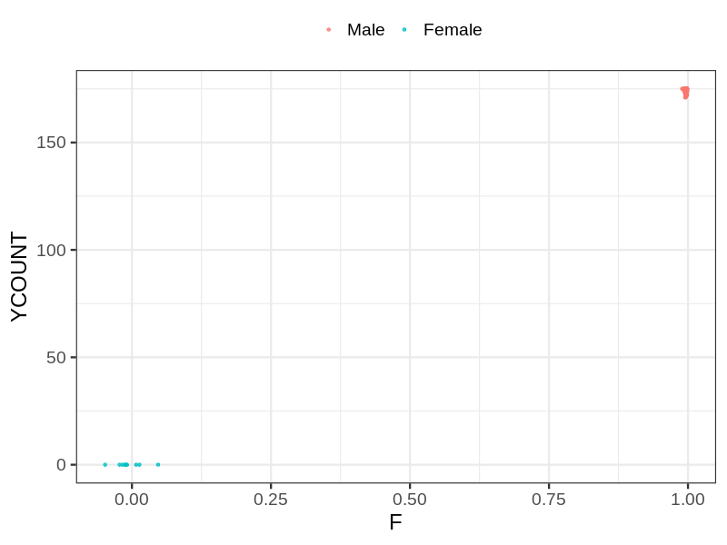
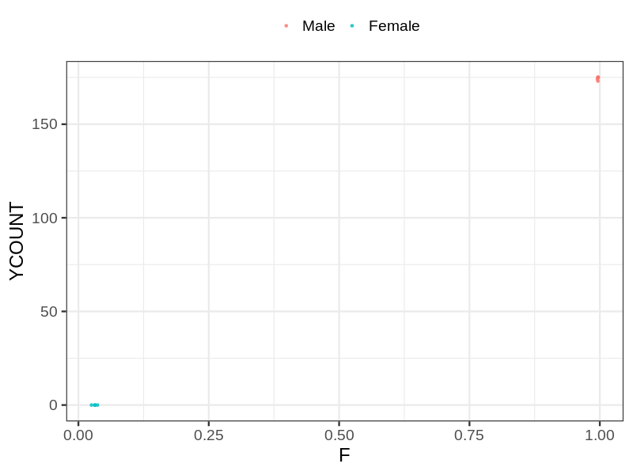

# Fam file reconstruction in snp007
- Number of samples in the genotyping data: 2978.
## Samples not in Medical Birth Regsitry
10 samples with missing birth year, assumed to be parent in the following.
## Relationship inference
| Relationship |   |
| ------------ | - |
| Duplicates or monozygotic twins| 0 |
| Parent-offspring| 0 |
| Full siblings| 4 |
| 2nd degree| 0 |
| 3rd degree| 0 |
| 4th degree| 0 |
| Unrelated| 0 |

## Mother sex check
| Inferred sex |   |
| ------------ | - |
| Unknown | 25 |
| Male | 8 |
| Female | 1481 |

## Father sex check
| Inferred sex |   |
| ------------ | - |
| Unknown | 0 |
| Male | 1445 |
| Female | 9 |

## Children sex check
| Inferred sex |   |
| ------------ | - |
| Unknown | 0 |
| Male | 6 |
| Female | 4 |

## Parental relationships
10 sentrix IDs missing from ID file. These are not counted as individuals.
###  Individuals
2968 individuals in total. Breakdown excluding multiple same-sex parents:
 -  0 children
 -  0 mothers
 -  0 fathers
 -  0 mother-child pairs
 -  0 father-child pairs
 -  0 mother-father-child trios
 -  2968 unrelated

0 mother-child relationships expected.
- 0 (NaN%) recovered by genetic relationships.
- 0 (NaN%) not recovered by genetic relationships.

0 father-child relationships expected.
- 0 (NaN%) recovered by genetic relationships.
- 0 (NaN%) not recovered by genetic relationships.

0 mother-child relationships detected.
- 0 (NaN%) matched to registry.
- 0 (NaN%) not matched to registry.

0 father-child relationships detected.
- 0 (NaN%) matched to registry.
- 0 (NaN%) not matched to registry.

###  Samples
2978 samples in total. Breakdown excluding multiple same-sex parents:
 -  0 children
 -  0 mothers
 -  0 fathers
 -  0 mother-child pairs
 -  0 father-child pairs
 -  0 mother-father-child trios
 -  2978 unrelated

0 mother-child relationships expected.
- 0 (NaN%) recovered by genetic relationships.
- 0 (NaN%) not recovered by genetic relationships.

0 father-child relationships expected.
- 0 (NaN%) recovered by genetic relationships.
- 0 (NaN%) not recovered by genetic relationships.

0 mother-child relationships detected.
- 0 (NaN%) matched to registry.
- 0 (NaN%) not matched to registry.

0 father-child relationships detected.
- 0 (NaN%) matched to registry.
- 0 (NaN%) not matched to registry.

## Exclusion
- Number of samples excluded: 8
