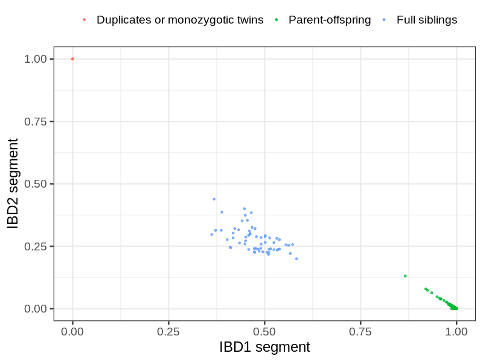
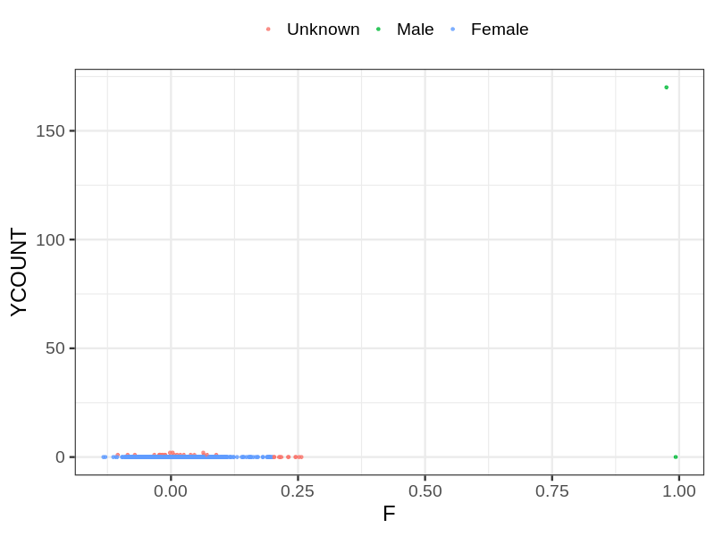
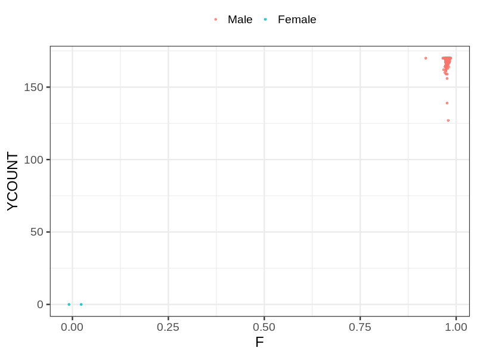
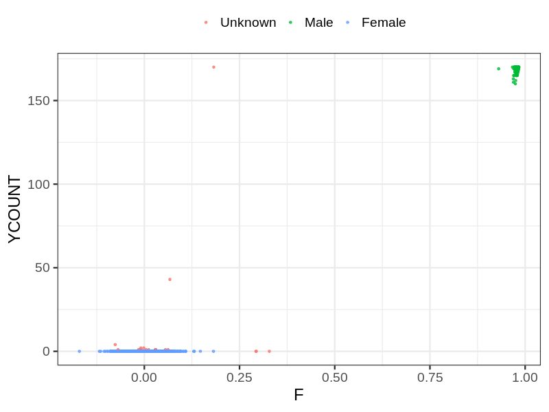

# Fam file reconstruction in snp010
- Number of samples in the genotyping data: 9590.
## Samples not in Medical Birth Regsitry
56 samples with missing birth year, assumed to be parent in the following.
## Relationship inference
| Relationship |   |
| ------------ | - |
| Duplicates or monozygotic twins| 5 |
| Parent-offspring| 3473 |
| Full siblings| 60 |
| 2nd degree| 0 |
| 3rd degree| 0 |
| 4th degree| 0 |
| Unrelated| 0 |

## Mother sex check
| Inferred sex |   |
| ------------ | - |
| Unknown | 35 |
| Male | 2 |
| Female | 3309 |

## Father sex check
| Inferred sex |   |
| ------------ | - |
| Unknown | 0 |
| Male | 3133 |
| Female | 2 |

## Children sex check
| Inferred sex |   |
| ------------ | - |
| Unknown | 21 |
| Male | 1572 |
| Female | 1516 |

## Parental relationships
56 sentrix IDs missing from ID file. These are not counted as individuals.
###  Individuals
9534 individuals in total. Breakdown excluding multiple same-sex parents:
 -  2116 children
 -  1897 mothers
 -  1542 fathers
 -  1912 mother-child pairs
 -  1557 father-child pairs
 -  1353 mother-father-child trios
 -  3980 unrelated

1917 mother-child relationships expected.
- 1911 (99.69%) recovered by genetic relationships.
- 6 (0.31%) not recovered by genetic relationships.

1563 father-child relationships expected.
- 1556 (99.55%) recovered by genetic relationships.
- 7 (0.45%) not recovered by genetic relationships.

1913 mother-child relationships detected.
- 1911 (99.9%) matched to registry.
- 2 (0.1%) not matched to registry.

1557 father-child relationships detected.
- 1556 (99.94%) matched to registry.
- 1 (0.06%) not matched to registry.

###  Samples
9590 samples in total. Breakdown excluding multiple same-sex parents:
 -  2116 children
 -  1897 mothers
 -  1542 fathers
 -  1912 mother-child pairs
 -  1557 father-child pairs
 -  1353 mother-father-child trios
 -  4036 unrelated

1917 mother-child relationships expected.
- 1911 (99.69%) recovered by genetic relationships.
- 6 (0.31%) not recovered by genetic relationships.

1563 father-child relationships expected.
- 1556 (99.55%) recovered by genetic relationships.
- 7 (0.45%) not recovered by genetic relationships.

1913 mother-child relationships detected.
- 1911 (99.9%) matched to registry.
- 2 (0.1%) not matched to registry.

1557 father-child relationships detected.
- 1556 (99.94%) matched to registry.
- 1 (0.06%) not matched to registry.

## Exclusion
- Number of samples excluded: 22
