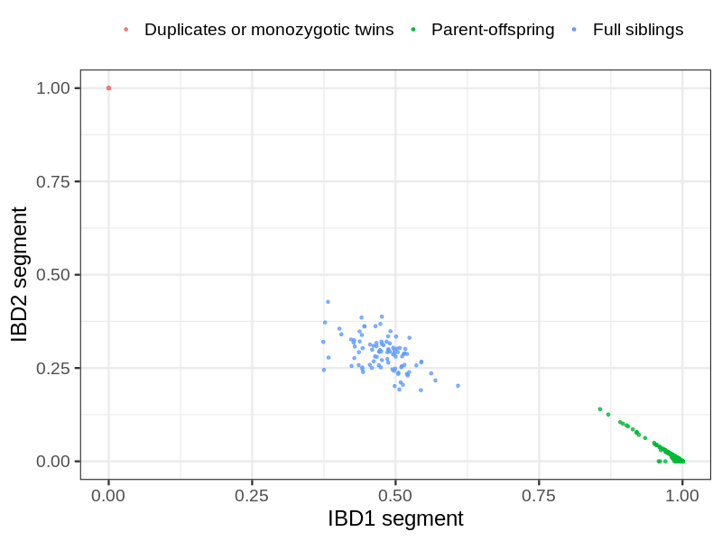
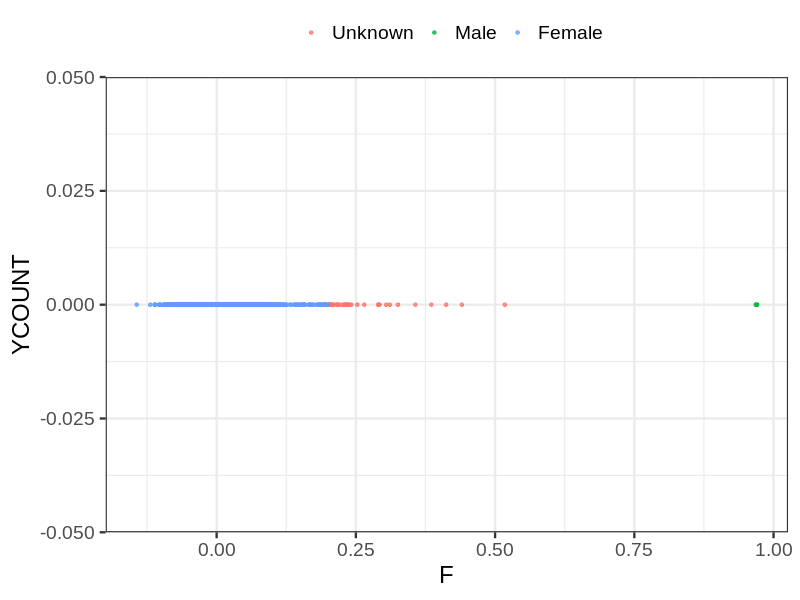
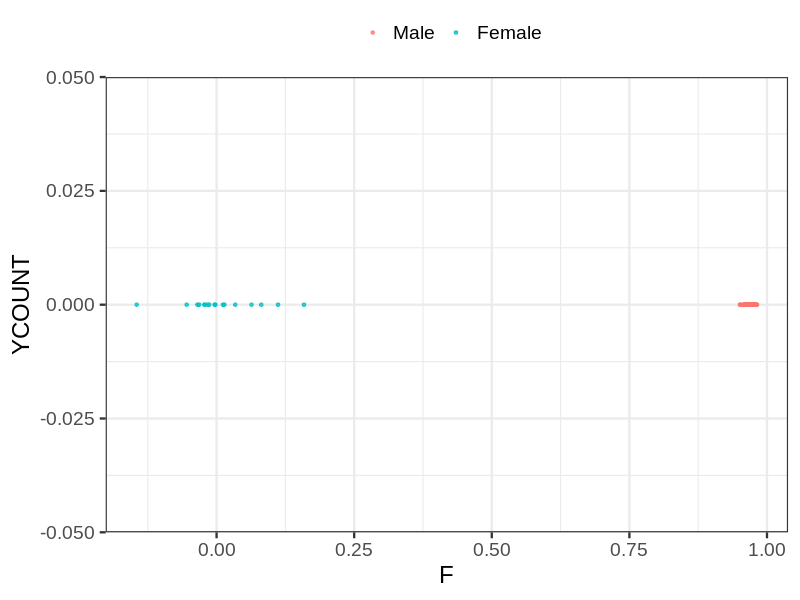
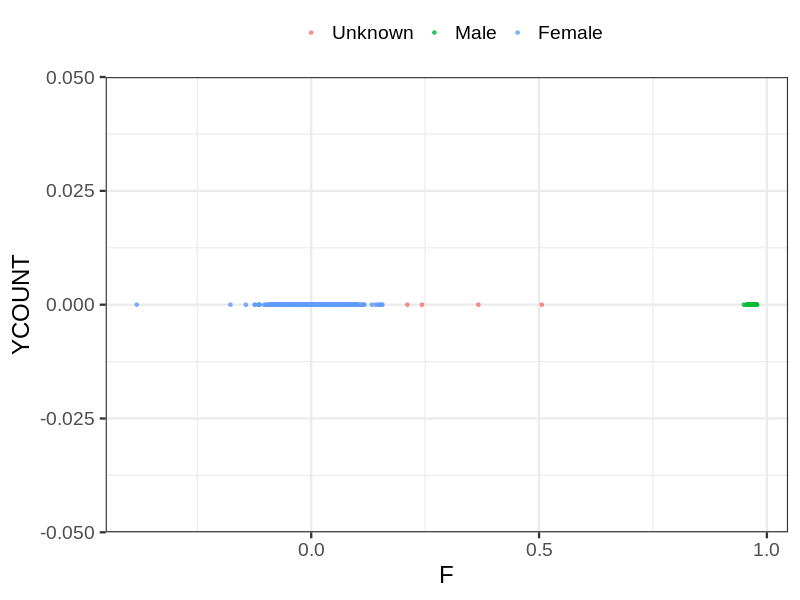

# Fam file reconstruction in snp012
- Number of samples in the genotyping data: 17688.
## Samples not in Medical Birth Regsitry
37 samples with missing birth year, assumed to be parent in the following.
## Relationship inference
| Relationship |   |
| ------------ | - |
| Duplicates or monozygotic twins| 37 |
| Parent-offspring| 11524 |
| Full siblings| 95 |
| 2nd degree| 0 |
| 3rd degree| 0 |
| 4th degree| 0 |
| Unrelated| 0 |

## Mother sex check
| Inferred sex |   |
| ------------ | - |
| Unknown | 36 |
| Male | 3 |
| Female | 5864 |

## Father sex check
| Inferred sex |   |
| ------------ | - |
| Unknown | 0 |
| Male | 5858 |
| Female | 17 |

## Children sex check
| Inferred sex |   |
| ------------ | - |
| Unknown | 4 |
| Male | 2957 |
| Female | 2949 |

## Parental relationships
37 sentrix IDs missing from ID file. These are not counted as individuals.
###  Individuals
17651 individuals in total. Breakdown excluding multiple same-sex parents:
 -  5834 children
 -  5766 mothers
 -  5717 fathers
 -  5767 mother-child pairs
 -  5718 father-child pairs
 -  5651 mother-father-child trios
 -  334 unrelated

5798 mother-child relationships expected.
- 5764 (99.41%) recovered by genetic relationships.
- 34 (0.59%) not recovered by genetic relationships.

5769 father-child relationships expected.
- 5712 (99.01%) recovered by genetic relationships.
- 57 (0.99%) not recovered by genetic relationships.

5787 mother-child relationships detected.
- 5764 (99.6%) matched to registry.
- 23 (0.4%) not matched to registry.

5726 father-child relationships detected.
- 5712 (99.76%) matched to registry.
- 14 (0.24%) not matched to registry.

###  Samples
17688 samples in total. Breakdown excluding multiple same-sex parents:
 -  5834 children
 -  5767 mothers
 -  5719 fathers
 -  5768 mother-child pairs
 -  5720 father-child pairs
 -  5654 mother-father-child trios
 -  368 unrelated

5798 mother-child relationships expected.
- 5764 (99.41%) recovered by genetic relationships.
- 34 (0.59%) not recovered by genetic relationships.

5769 father-child relationships expected.
- 5712 (99.01%) recovered by genetic relationships.
- 57 (0.99%) not recovered by genetic relationships.

5788 mother-child relationships detected.
- 5764 (99.59%) matched to registry.
- 24 (0.41%) not matched to registry.

5728 father-child relationships detected.
- 5712 (99.72%) matched to registry.
- 16 (0.28%) not matched to registry.

## Exclusion
- Number of samples excluded: 106
