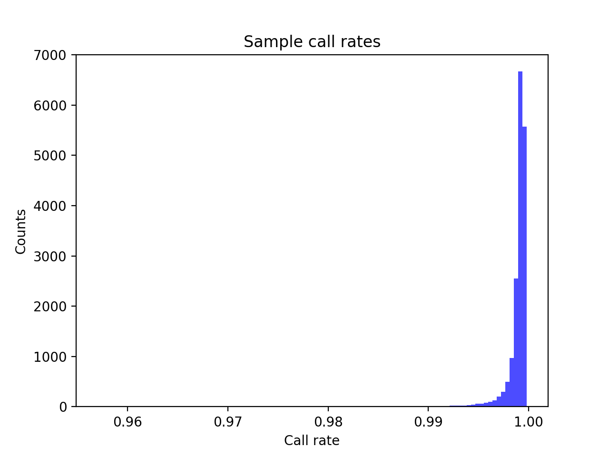
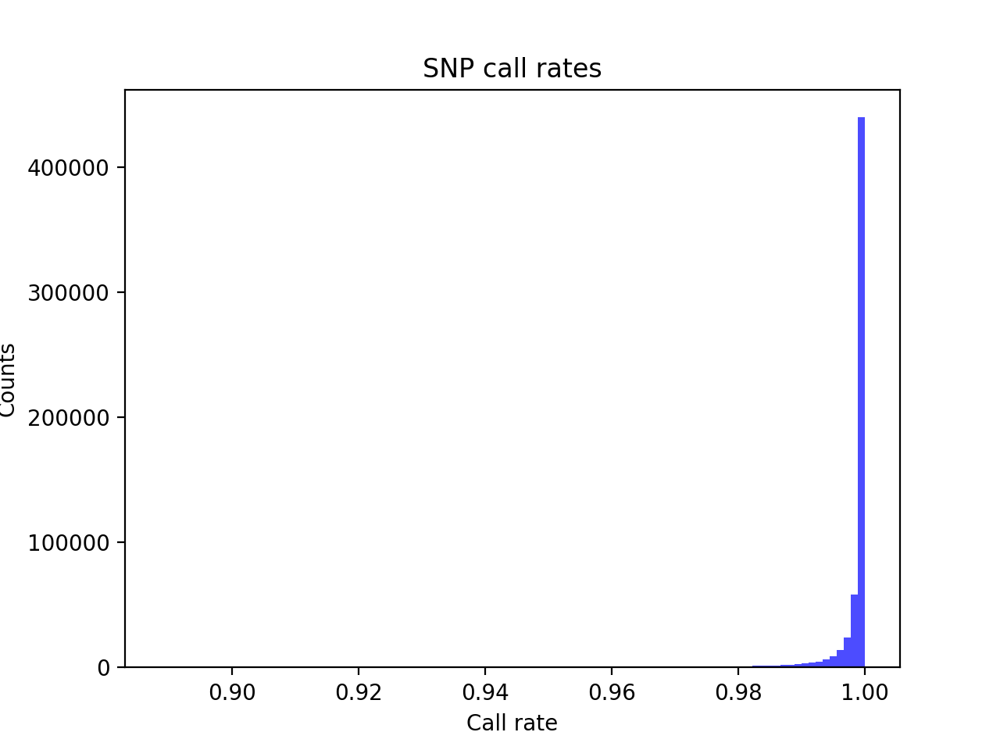
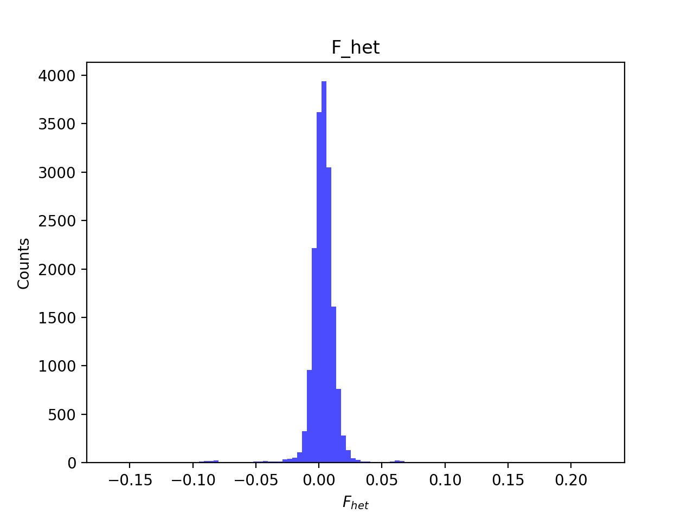
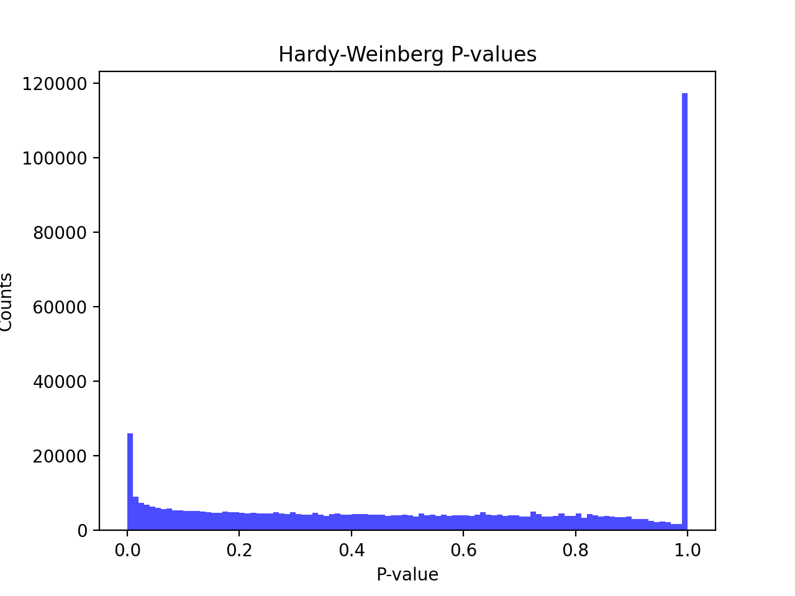
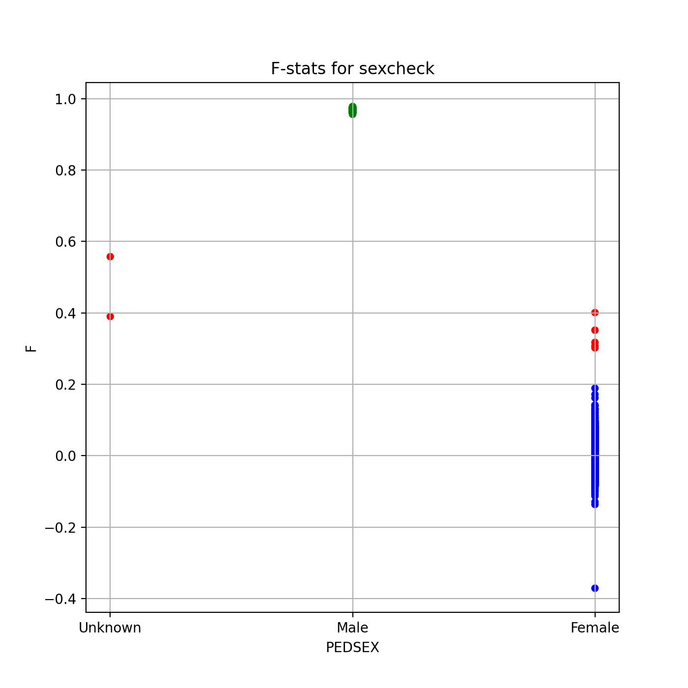
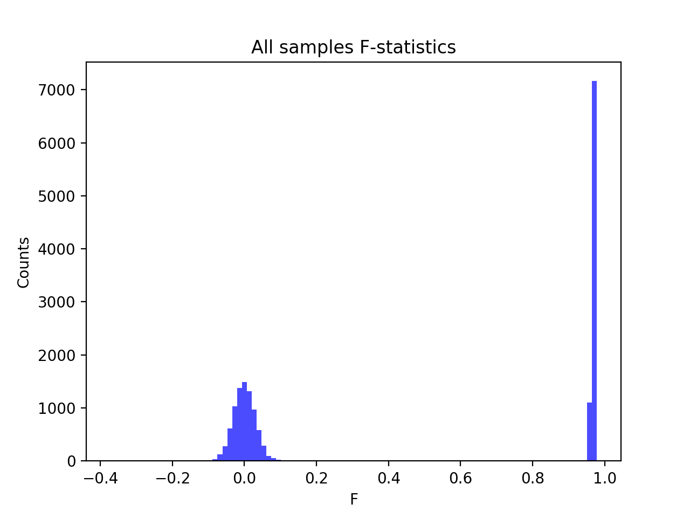
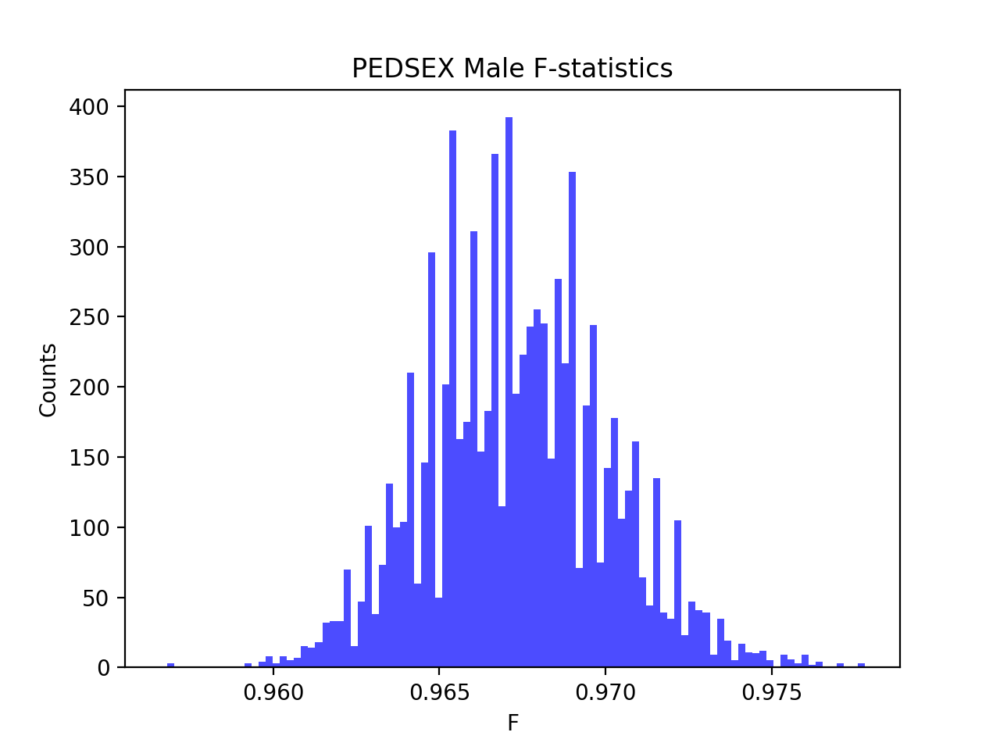
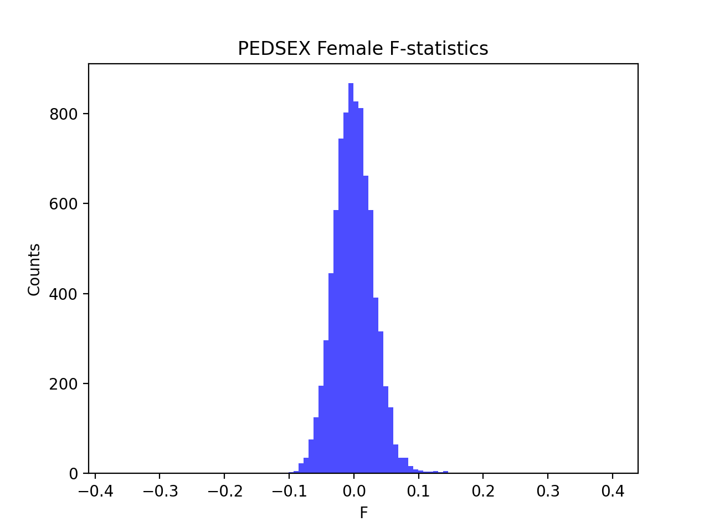

# Batch report for batch snp012, module mod5-harmonization
## Samples overview
17582 samples
 5996 kinship clusters
 5764 offspring with mother ID
 5759 offspring with mother in batch
 5759 mothers with offspring in batch
 5 mothers missing from batch
 5710 offspring with father ID
 5706 offspring with father in batch
 5706 fathers with offspring in batch
 4 fathers missing from batch
## Call rates
### Sample call rates
min: 0.9569986
 max: 0.999813135
 median: 0.999214476 
### SNP call rates
min: 0.888693
 max: 1.0
 median: 0.999658742 
## F_het
min: -0.164765
 max: 0.223063
 median: 0.0031282799999999998 
## Hardy-Weinberg P-values
min: 4.1339799999999996e-91
 max: 1.0
 median: 0.542274 
## Sexcheck
16594 out of 17582 OK 
| PEDSEX | Total | SNPSEX Male | SNPSEX Female | SNPSEX Unknown | OK | Problem |
| ------ | ------ | ------ | ------ | ------ | ------ | ------ |
| Male | 8259 | 8259 | 0 | 0 | 8259 | 0 |
| Female | 8340 | 0 | 8335 | 5 | 8335 | 5 |
| Unknown | 2 | 0 | 0 | 2 | 0 | 2 |

### All samples 
### All samples F-statistics
min: -0.3714
 max: 0.9778
 median: 0.09726 
### PEDSEX Male
### PEDSEX Male F-statistics
min: 0.9566
 max: 0.9778
 median: 0.9673 
### PEDSEX Female
### PEDSEX Female F-statistics
min: -0.3714
 max: 0.4009
 median: -0.001042 