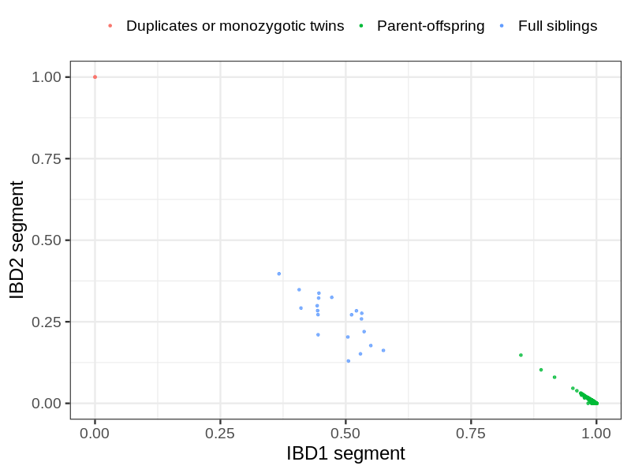
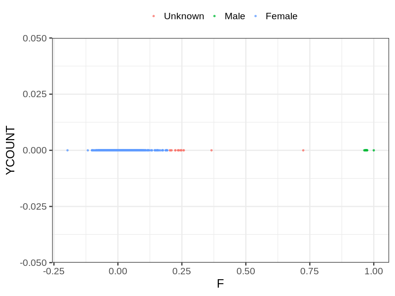
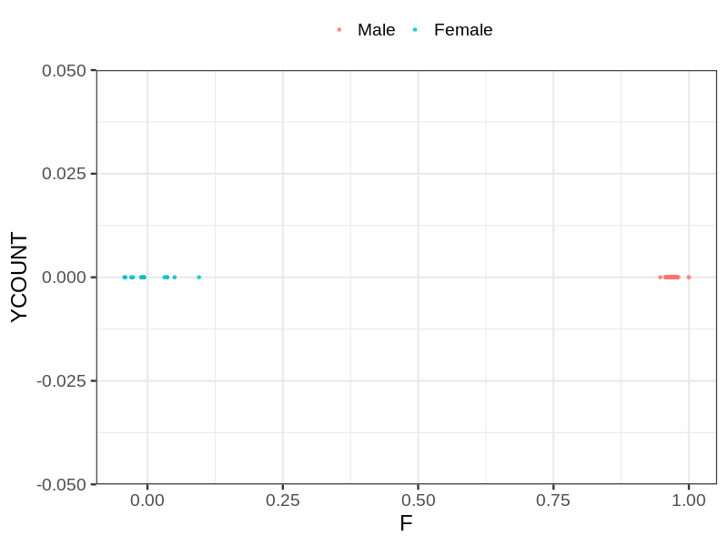
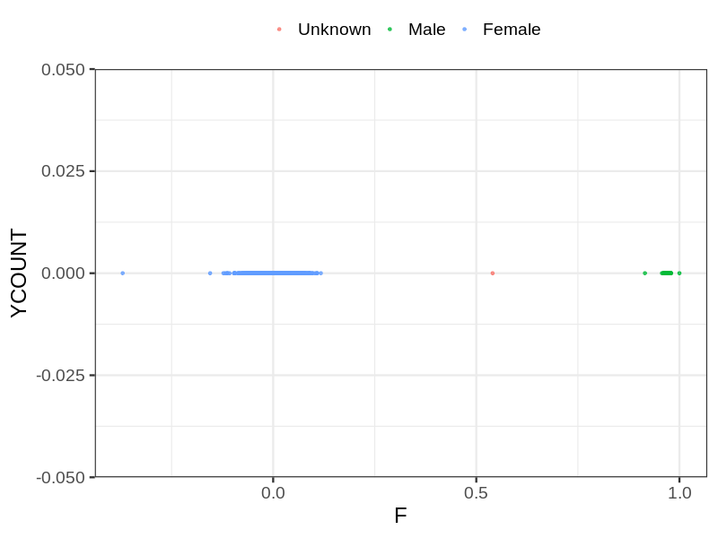

# Fam file reconstruction in snp014
- Number of samples in the genotyping data: 8919.
## Samples not in Medical Birth Regsitry
18 samples with missing birth year, assumed to be parent in the following.
## Relationship inference
| Relationship |   |
| ------------ | - |
| Duplicates or monozygotic twins| 3 |
| Parent-offspring| 5810 |
| Full siblings| 20 |
| 2nd degree| 0 |
| 3rd degree| 0 |
| 4th degree| 0 |
| Unrelated| 0 |

## Mother sex check
| Inferred sex |   |
| ------------ | - |
| Unknown | 15 |
| Male | 13 |
| Female | 2957 |

## Father sex check
| Inferred sex |   |
| ------------ | - |
| Unknown | 0 |
| Male | 2943 |
| Female | 14 |

## Children sex check
| Inferred sex |   |
| ------------ | - |
| Unknown | 1 |
| Male | 1534 |
| Female | 1442 |

## Parental relationships
18 sentrix IDs missing from ID file. These are not counted as individuals.
###  Individuals
8901 individuals in total. Breakdown excluding multiple same-sex parents:
 -  2926 children
 -  2905 mothers
 -  2883 fathers
 -  2905 mother-child pairs
 -  2883 father-child pairs
 -  2862 mother-father-child trios
 -  187 unrelated

2930 mother-child relationships expected.
- 2882 (98.36%) recovered by genetic relationships.
- 48 (1.64%) not recovered by genetic relationships.

2919 father-child relationships expected.
- 2866 (98.18%) recovered by genetic relationships.
- 53 (1.82%) not recovered by genetic relationships.

2905 mother-child relationships detected.
- 2882 (99.21%) matched to registry.
- 23 (0.79%) not matched to registry.

2884 father-child relationships detected.
- 2866 (99.38%) matched to registry.
- 18 (0.62%) not matched to registry.

###  Samples
8919 samples in total. Breakdown excluding multiple same-sex parents:
 -  2926 children
 -  2905 mothers
 -  2883 fathers
 -  2905 mother-child pairs
 -  2883 father-child pairs
 -  2862 mother-father-child trios
 -  205 unrelated

2930 mother-child relationships expected.
- 2882 (98.36%) recovered by genetic relationships.
- 48 (1.64%) not recovered by genetic relationships.

2919 father-child relationships expected.
- 2866 (98.18%) recovered by genetic relationships.
- 53 (1.82%) not recovered by genetic relationships.

2905 mother-child relationships detected.
- 2882 (99.21%) matched to registry.
- 23 (0.79%) not matched to registry.

2884 father-child relationships detected.
- 2866 (99.38%) matched to registry.
- 18 (0.62%) not matched to registry.

## Exclusion
- Number of samples excluded: 141
