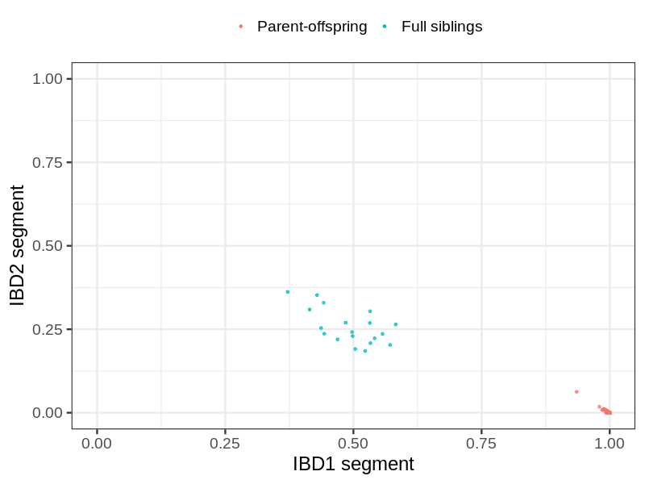
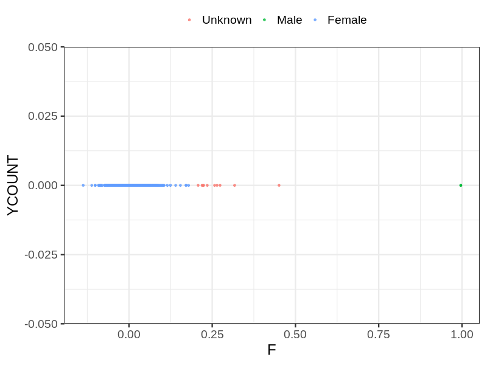
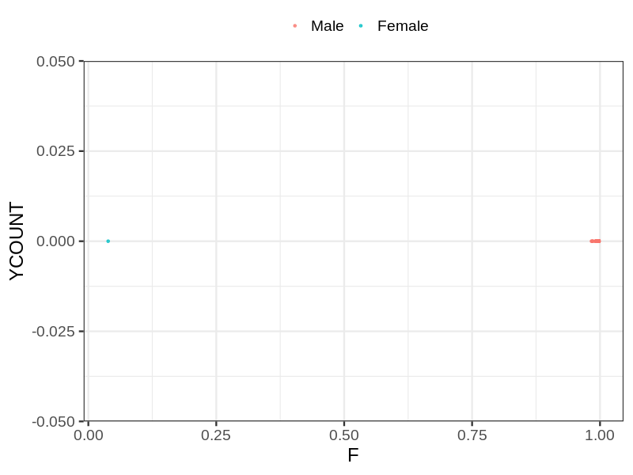
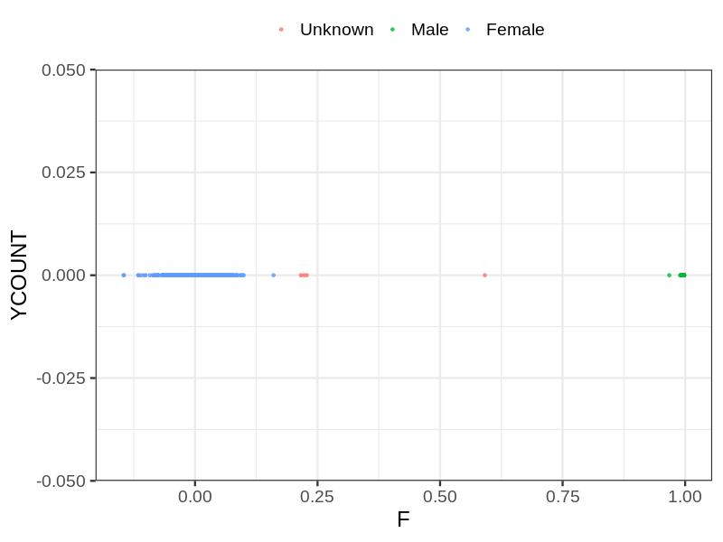

# Fam file reconstruction in snp015b
- Number of samples in the genotyping data: 4371.
## Samples not in Medical Birth Regsitry
16 samples with missing birth year, assumed to be parent in the following.
## Relationship inference
| Relationship |   |
| ------------ | - |
| Duplicates or monozygotic twins| 0 |
| Parent-offspring| 584 |
| Full siblings| 19 |
| 2nd degree| 0 |
| 3rd degree| 0 |
| 4th degree| 0 |
| Unrelated| 0 |

## Mother sex check
| Inferred sex |   |
| ------------ | - |
| Unknown | 10 |
| Male | 2 |
| Female | 1223 |

## Father sex check
| Inferred sex |   |
| ------------ | - |
| Unknown | 0 |
| Male | 1248 |
| Female | 1 |

## Children sex check
| Inferred sex |   |
| ------------ | - |
| Unknown | 4 |
| Male | 954 |
| Female | 929 |

## Parental relationships
16 sentrix IDs missing from ID file. These are not counted as individuals.
###  Individuals
4355 individuals in total. Breakdown excluding multiple same-sex parents:
 -  477 children
 -  333 mothers
 -  243 fathers
 -  336 mother-child pairs
 -  246 father-child pairs
 -  105 mother-father-child trios
 -  3302 unrelated

338 mother-child relationships expected.
- 335 (99.11%) recovered by genetic relationships.
- 3 (0.89%) not recovered by genetic relationships.

247 father-child relationships expected.
- 246 (99.6%) recovered by genetic relationships.
- 1 (0.4%) not recovered by genetic relationships.

336 mother-child relationships detected.
- 335 (99.7%) matched to registry.
- 1 (0.3%) not matched to registry.

246 father-child relationships detected.
- 246 (100%) matched to registry.
- 0 (0%) not matched to registry.

###  Samples
4371 samples in total. Breakdown excluding multiple same-sex parents:
 -  479 children
 -  333 mothers
 -  245 fathers
 -  336 mother-child pairs
 -  248 father-child pairs
 -  105 mother-father-child trios
 -  3314 unrelated

338 mother-child relationships expected.
- 335 (99.11%) recovered by genetic relationships.
- 3 (0.89%) not recovered by genetic relationships.

247 father-child relationships expected.
- 246 (99.6%) recovered by genetic relationships.
- 1 (0.4%) not recovered by genetic relationships.

336 mother-child relationships detected.
- 335 (99.7%) matched to registry.
- 1 (0.3%) not matched to registry.

248 father-child relationships detected.
- 246 (99.19%) matched to registry.
- 2 (0.81%) not matched to registry.

## Exclusion
- Number of samples excluded: 8
