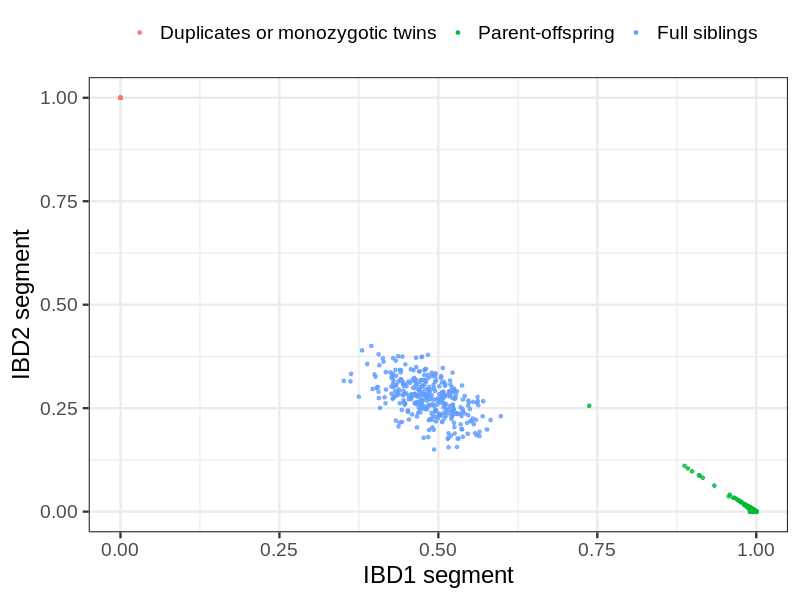
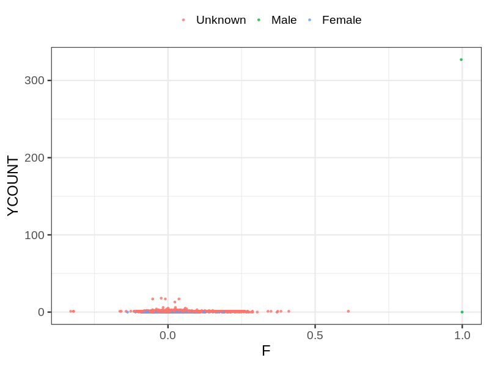
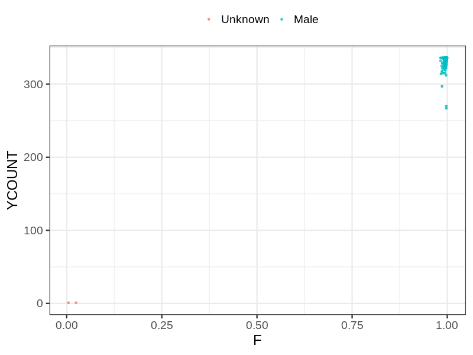
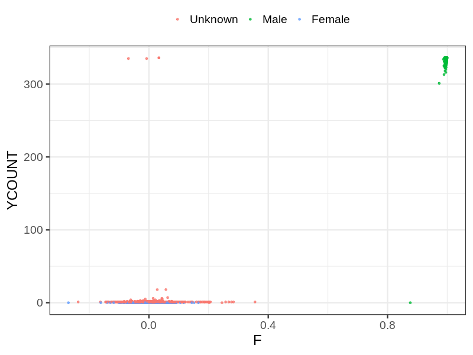

# Fam file reconstruction in snp016b
- Number of samples in the genotyping data: 24770.
## Samples not in Medical Birth Regsitry
78 samples with missing birth year, assumed to be parent in the following.
## Relationship inference
| Relationship |   |
| ------------ | - |
| Duplicates or monozygotic twins| 23 |
| Parent-offspring| 2857 |
| Full siblings| 341 |
| 2nd degree| 0 |
| 3rd degree| 0 |
| 4th degree| 0 |
| Unrelated| 0 |

## Mother sex check
| Inferred sex |   |
| ------------ | - |
| Unknown | 8207 |
| Male | 2 |
| Female | 2530 |

## Father sex check
| Inferred sex |   |
| ------------ | - |
| Unknown | 2 |
| Male | 5102 |
| Female | 0 |

## Children sex check
| Inferred sex |   |
| ------------ | - |
| Unknown | 3445 |
| Male | 4447 |
| Female | 1035 |

## Parental relationships
78 sentrix IDs missing from ID file. These are not counted as individuals.
###  Individuals
24692 individuals in total. Breakdown excluding multiple same-sex parents:
 -  2551 children
 -  2165 mothers
 -  606 fathers
 -  2222 mother-child pairs
 -  632 father-child pairs
 -  303 mother-father-child trios
 -  19370 unrelated

2225 mother-child relationships expected.
- 2218 (99.69%) recovered by genetic relationships.
- 7 (0.31%) not recovered by genetic relationships.

601 father-child relationships expected.
- 599 (99.67%) recovered by genetic relationships.
- 2 (0.33%) not recovered by genetic relationships.

2222 mother-child relationships detected.
- 2218 (99.82%) matched to registry.
- 4 (0.18%) not matched to registry.

632 father-child relationships detected.
- 599 (94.78%) matched to registry.
- 33 (5.22%) not matched to registry.

###  Samples
24770 samples in total. Breakdown excluding multiple same-sex parents:
 -  2551 children
 -  2165 mothers
 -  606 fathers
 -  2222 mother-child pairs
 -  632 father-child pairs
 -  303 mother-father-child trios
 -  19448 unrelated

2225 mother-child relationships expected.
- 2218 (99.69%) recovered by genetic relationships.
- 7 (0.31%) not recovered by genetic relationships.

601 father-child relationships expected.
- 599 (99.67%) recovered by genetic relationships.
- 2 (0.33%) not recovered by genetic relationships.

2222 mother-child relationships detected.
- 2218 (99.82%) matched to registry.
- 4 (0.18%) not matched to registry.

632 father-child relationships detected.
- 599 (94.78%) matched to registry.
- 33 (5.22%) not matched to registry.

## Exclusion
- Number of samples excluded: 21
