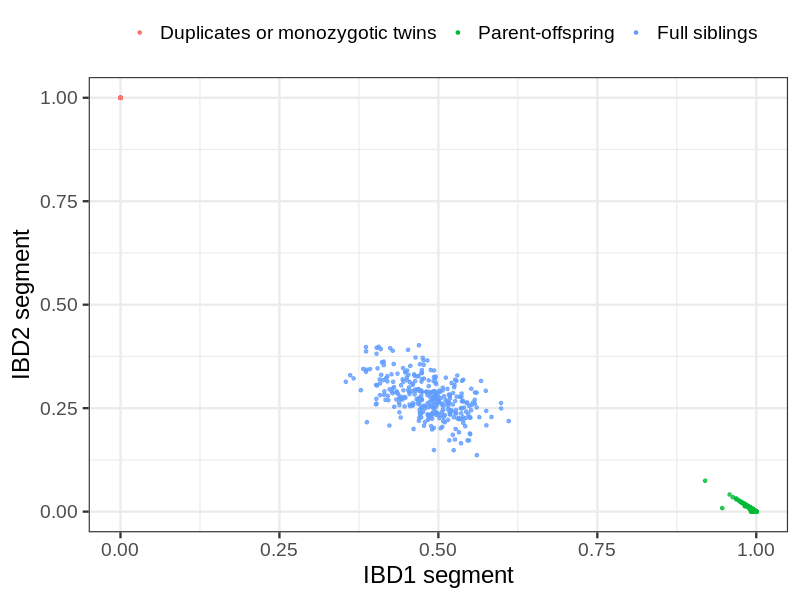
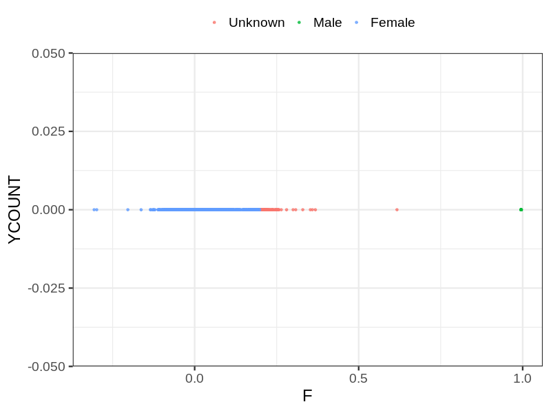
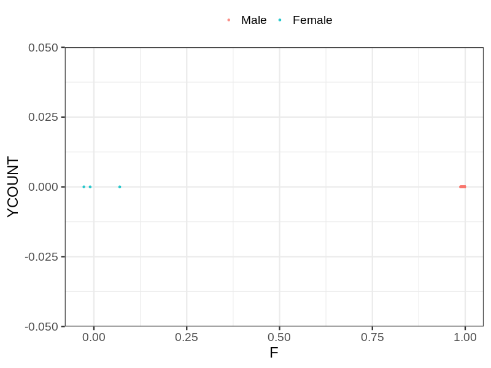
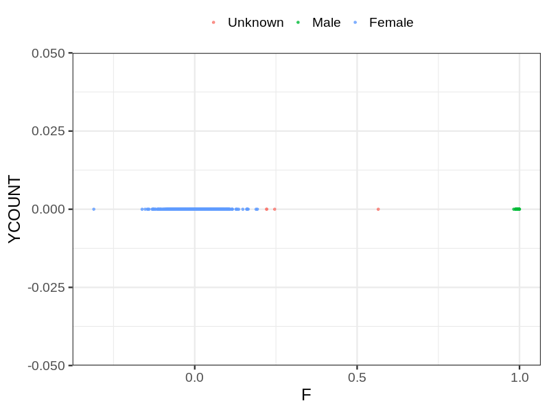

# Fam file reconstruction in snp017a
- Number of samples in the genotyping data: 24786.
## Samples not in Medical Birth Regsitry
91 samples with missing birth year, assumed to be parent in the following.
## Relationship inference
| Relationship |   |
| ------------ | - |
| Duplicates or monozygotic twins| 26 |
| Parent-offspring| 3109 |
| Full siblings| 322 |
| 2nd degree| 0 |
| 3rd degree| 0 |
| 4th degree| 0 |
| Unrelated| 0 |

## Mother sex check
| Inferred sex |   |
| ------------ | - |
| Unknown | 78 |
| Male | 10 |
| Female | 11193 |

## Father sex check
| Inferred sex |   |
| ------------ | - |
| Unknown | 0 |
| Male | 5216 |
| Female | 3 |

## Children sex check
| Inferred sex |   |
| ------------ | - |
| Unknown | 4 |
| Male | 4178 |
| Female | 4104 |

## Parental relationships
91 sentrix IDs missing from ID file. These are not counted as individuals.
###  Individuals
24695 individuals in total. Breakdown excluding multiple same-sex parents:
 -  2734 children
 -  2298 mothers
 -  725 fathers
 -  2361 mother-child pairs
 -  743 father-child pairs
 -  370 mother-father-child trios
 -  18940 unrelated

2358 mother-child relationships expected.
- 2351 (99.7%) recovered by genetic relationships.
- 7 (0.3%) not recovered by genetic relationships.

711 father-child relationships expected.
- 703 (98.87%) recovered by genetic relationships.
- 8 (1.13%) not recovered by genetic relationships.

2364 mother-child relationships detected.
- 2351 (99.45%) matched to registry.
- 13 (0.55%) not matched to registry.

743 father-child relationships detected.
- 703 (94.62%) matched to registry.
- 40 (5.38%) not matched to registry.

###  Samples
24786 samples in total. Breakdown excluding multiple same-sex parents:
 -  2734 children
 -  2298 mothers
 -  725 fathers
 -  2361 mother-child pairs
 -  743 father-child pairs
 -  370 mother-father-child trios
 -  19031 unrelated

2358 mother-child relationships expected.
- 2351 (99.7%) recovered by genetic relationships.
- 7 (0.3%) not recovered by genetic relationships.

711 father-child relationships expected.
- 703 (98.87%) recovered by genetic relationships.
- 8 (1.13%) not recovered by genetic relationships.

2364 mother-child relationships detected.
- 2351 (99.45%) matched to registry.
- 13 (0.55%) not matched to registry.

743 father-child relationships detected.
- 703 (94.62%) matched to registry.
- 40 (5.38%) not matched to registry.

## Exclusion
- Number of samples excluded: 29
