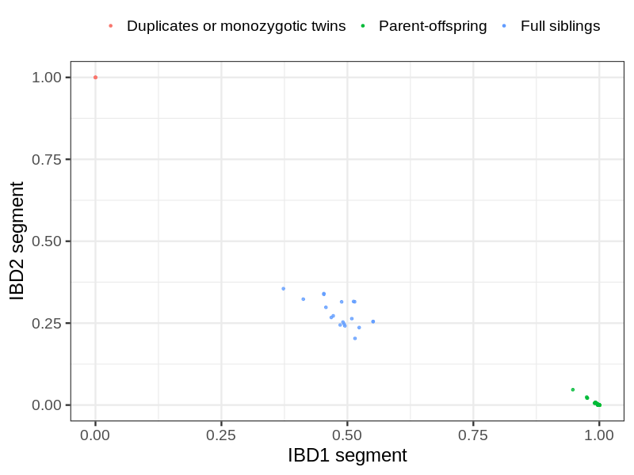
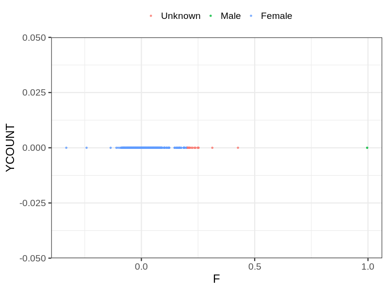
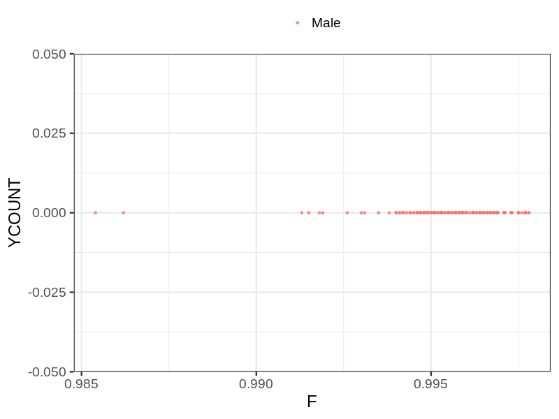
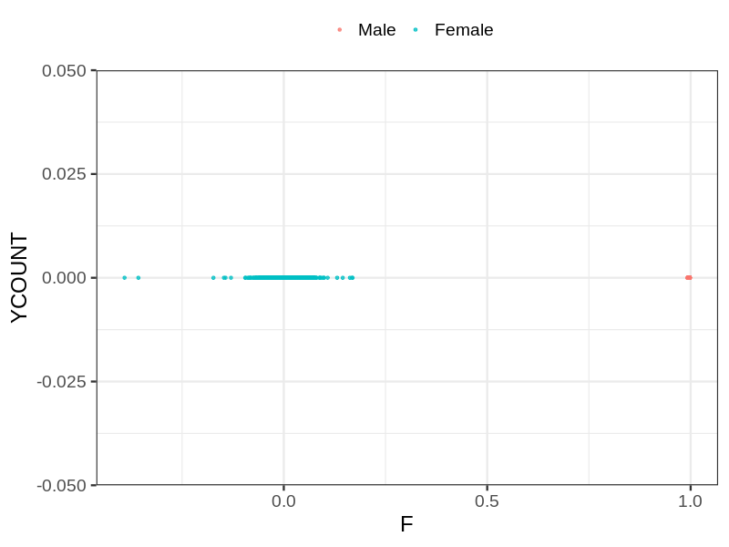

# Fam file reconstruction in snp017c
- Number of samples in the genotyping data: 4743.
## Samples not in Medical Birth Regsitry
16 samples with missing birth year, assumed to be parent in the following.
## Relationship inference
| Relationship |   |
| ------------ | - |
| Duplicates or monozygotic twins| 4 |
| Parent-offspring| 216 |
| Full siblings| 19 |
| 2nd degree| 0 |
| 3rd degree| 0 |
| 4th degree| 0 |
| Unrelated| 0 |

## Mother sex check
| Inferred sex |   |
| ------------ | - |
| Unknown | 17 |
| Male | 1 |
| Female | 2107 |

## Father sex check
| Inferred sex |   |
| ------------ | - |
| Unknown | 0 |
| Male | 862 |
| Female | 0 |

## Children sex check
| Inferred sex |   |
| ------------ | - |
| Unknown | 0 |
| Male | 895 |
| Female | 861 |

## Parental relationships
16 sentrix IDs missing from ID file. These are not counted as individuals.
###  Individuals
4727 individuals in total. Breakdown excluding multiple same-sex parents:
 -  208 children
 -  192 mothers
 -  20 fathers
 -  195 mother-child pairs
 -  20 father-child pairs
 -  7 mother-father-child trios
 -  4307 unrelated

195 mother-child relationships expected.
- 195 (100%) recovered by genetic relationships.
- 0 (0%) not recovered by genetic relationships.

20 father-child relationships expected.
- 20 (100%) recovered by genetic relationships.
- 0 (0%) not recovered by genetic relationships.

195 mother-child relationships detected.
- 195 (100%) matched to registry.
- 0 (0%) not matched to registry.

20 father-child relationships detected.
- 20 (100%) matched to registry.
- 0 (0%) not matched to registry.

###  Samples
4743 samples in total. Breakdown excluding multiple same-sex parents:
 -  209 children
 -  193 mothers
 -  20 fathers
 -  196 mother-child pairs
 -  20 father-child pairs
 -  7 mother-father-child trios
 -  4321 unrelated

195 mother-child relationships expected.
- 195 (100%) recovered by genetic relationships.
- 0 (0%) not recovered by genetic relationships.

20 father-child relationships expected.
- 20 (100%) recovered by genetic relationships.
- 0 (0%) not recovered by genetic relationships.

196 mother-child relationships detected.
- 195 (99.49%) matched to registry.
- 1 (0.51%) not matched to registry.

20 father-child relationships detected.
- 20 (100%) matched to registry.
- 0 (0%) not matched to registry.

## Exclusion
- Number of samples excluded: 1
