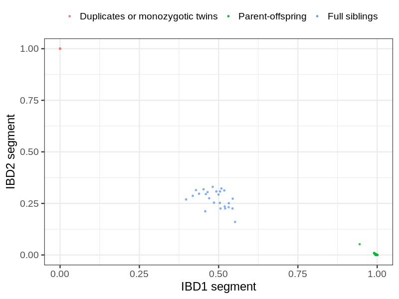
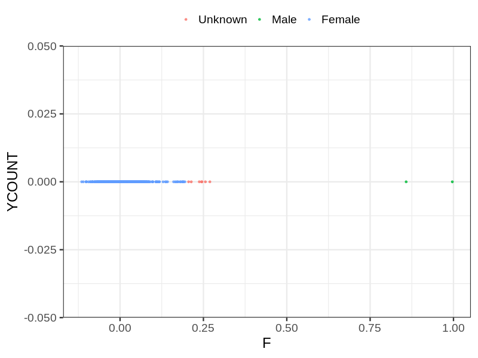
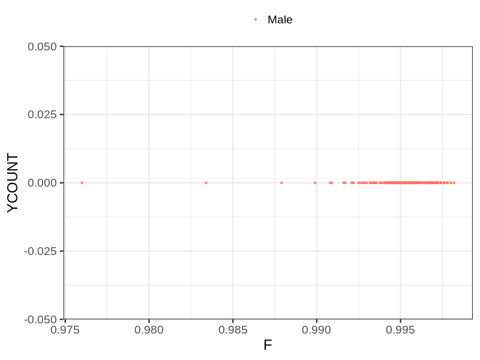
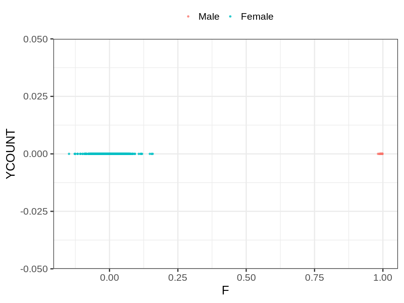

# Fam file reconstruction in snp017e
- Number of samples in the genotyping data: 4568.
## Samples not in Medical Birth Regsitry
5 samples with missing birth year, assumed to be parent in the following.
## Relationship inference
| Relationship |   |
| ------------ | - |
| Duplicates or monozygotic twins| 8 |
| Parent-offspring| 264 |
| Full siblings| 25 |
| 2nd degree| 0 |
| 3rd degree| 0 |
| 4th degree| 0 |
| Unrelated| 0 |

## Mother sex check
| Inferred sex |   |
| ------------ | - |
| Unknown | 7 |
| Male | 2 |
| Female | 1291 |

## Father sex check
| Inferred sex |   |
| ------------ | - |
| Unknown | 0 |
| Male | 1263 |
| Female | 0 |

## Children sex check
| Inferred sex |   |
| ------------ | - |
| Unknown | 0 |
| Male | 1061 |
| Female | 944 |

## Parental relationships
5 sentrix IDs missing from ID file. These are not counted as individuals.
###  Individuals
4563 individuals in total. Breakdown excluding multiple same-sex parents:
 -  232 children
 -  183 mothers
 -  79 fathers
 -  184 mother-child pairs
 -  80 father-child pairs
 -  32 mother-father-child trios
 -  4069 unrelated

185 mother-child relationships expected.
- 184 (99.46%) recovered by genetic relationships.
- 1 (0.54%) not recovered by genetic relationships.

80 father-child relationships expected.
- 80 (100%) recovered by genetic relationships.
- 0 (0%) not recovered by genetic relationships.

184 mother-child relationships detected.
- 184 (100%) matched to registry.
- 0 (0%) not matched to registry.

80 father-child relationships detected.
- 80 (100%) matched to registry.
- 0 (0%) not matched to registry.

###  Samples
4568 samples in total. Breakdown excluding multiple same-sex parents:
 -  232 children
 -  183 mothers
 -  79 fathers
 -  184 mother-child pairs
 -  80 father-child pairs
 -  32 mother-father-child trios
 -  4074 unrelated

185 mother-child relationships expected.
- 184 (99.46%) recovered by genetic relationships.
- 1 (0.54%) not recovered by genetic relationships.

80 father-child relationships expected.
- 80 (100%) recovered by genetic relationships.
- 0 (0%) not recovered by genetic relationships.

184 mother-child relationships detected.
- 184 (100%) matched to registry.
- 0 (0%) not matched to registry.

80 father-child relationships detected.
- 80 (100%) matched to registry.
- 0 (0%) not matched to registry.

## Exclusion
- Number of samples excluded: 3
