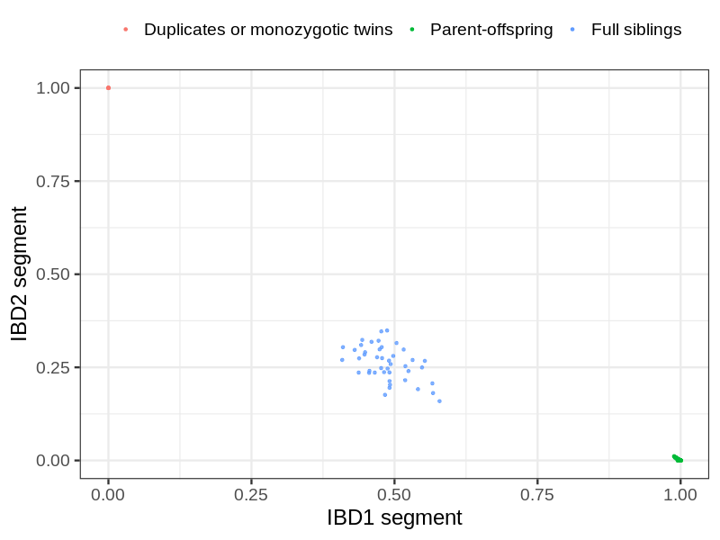
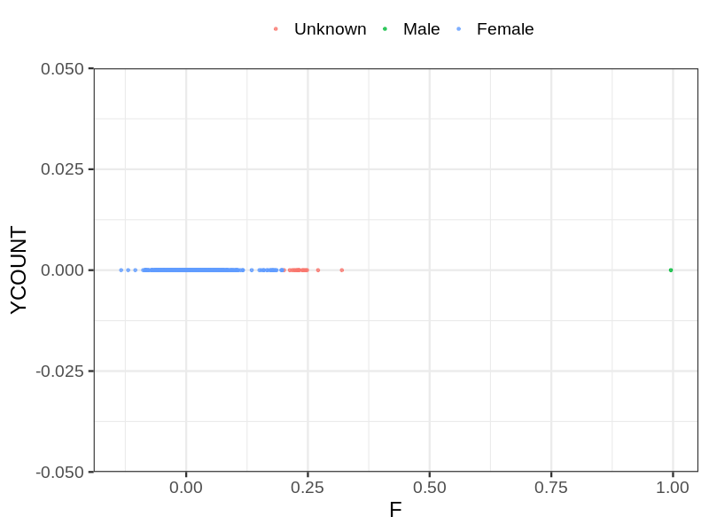
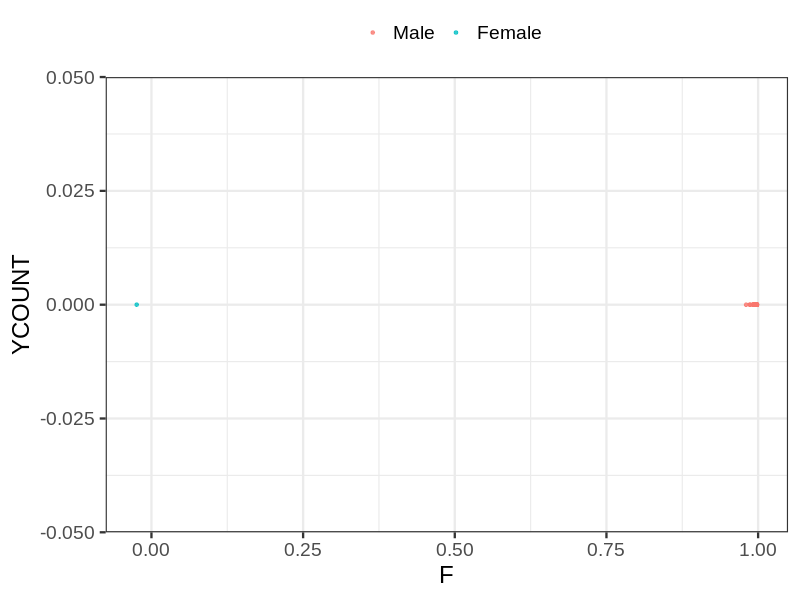

# Fam file reconstruction in snp017f
- Number of samples in the genotyping data: 5211.
## Samples not in Medical Birth Regsitry
13 samples with missing birth year, assumed to be parent in the following.
## Relationship inference
| Relationship |   |
| ------------ | - |
| Duplicates or monozygotic twins| 8 |
| Parent-offspring| 195 |
| Full siblings| 43 |
| 2nd degree| 0 |
| 3rd degree| 0 |
| 4th degree| 0 |
| Unrelated| 0 |

## Mother sex check
| Inferred sex |   |
| ------------ | - |
| Unknown | 17 |
| Male | 1 |
| Female | 1156 |

## Father sex check
| Inferred sex |   |
| ------------ | - |
| Unknown | 0 |
| Male | 1367 |
| Female | 1 |

## Children sex check
| Inferred sex |   |
| ------------ | - |
| Unknown | 3 |
| Male | 1315 |
| Female | 1351 |

## Parental relationships
13 sentrix IDs missing from ID file. These are not counted as individuals.
###  Individuals
5198 individuals in total. Breakdown excluding multiple same-sex parents:
 -  179 children
 -  130 mothers
 -  59 fathers
 -  135 mother-child pairs
 -  60 father-child pairs
 -  16 mother-father-child trios
 -  4830 unrelated

135 mother-child relationships expected.
- 135 (100%) recovered by genetic relationships.
- 0 (0%) not recovered by genetic relationships.

58 father-child relationships expected.
- 58 (100%) recovered by genetic relationships.
- 0 (0%) not recovered by genetic relationships.

135 mother-child relationships detected.
- 135 (100%) matched to registry.
- 0 (0%) not matched to registry.

60 father-child relationships detected.
- 58 (96.67%) matched to registry.
- 2 (3.33%) not matched to registry.

###  Samples
5211 samples in total. Breakdown excluding multiple same-sex parents:
 -  179 children
 -  130 mothers
 -  59 fathers
 -  135 mother-child pairs
 -  60 father-child pairs
 -  16 mother-father-child trios
 -  4843 unrelated

135 mother-child relationships expected.
- 135 (100%) recovered by genetic relationships.
- 0 (0%) not recovered by genetic relationships.

58 father-child relationships expected.
- 58 (100%) recovered by genetic relationships.
- 0 (0%) not recovered by genetic relationships.

135 mother-child relationships detected.
- 135 (100%) matched to registry.
- 0 (0%) not matched to registry.

60 father-child relationships detected.
- 58 (96.67%) matched to registry.
- 2 (3.33%) not matched to registry.

## Exclusion
- Number of samples excluded: 1
