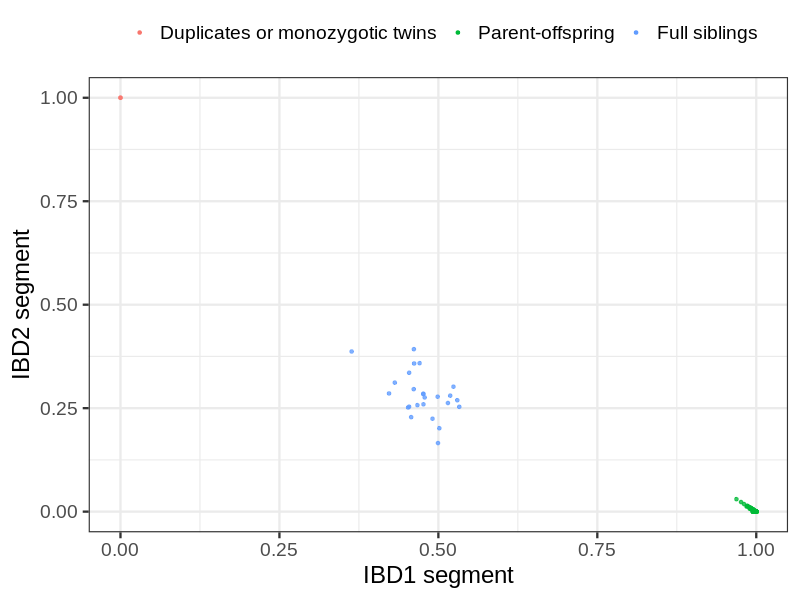
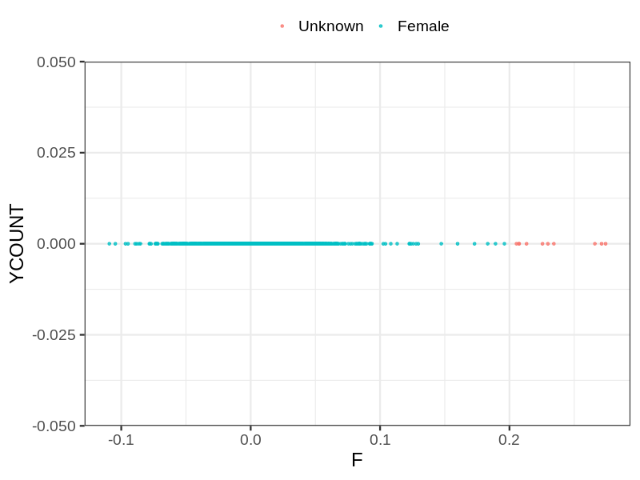
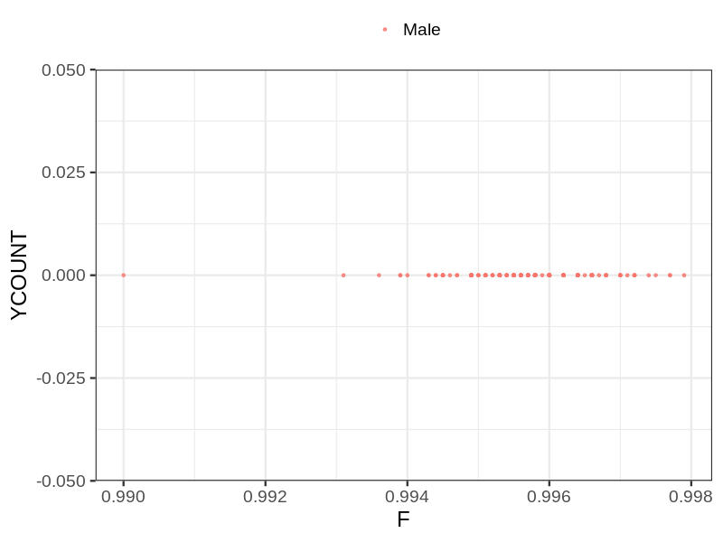
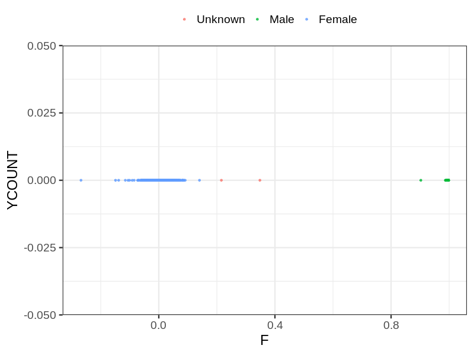

# Fam file reconstruction in snp018b
- Number of samples in the genotyping data: 2678.
## Samples not in Medical Birth Regsitry
17 samples with missing birth year, assumed to be parent in the following.
## Relationship inference
| Relationship |   |
| ------------ | - |
| Duplicates or monozygotic twins| 2 |
| Parent-offspring| 442 |
| Full siblings| 25 |
| 2nd degree| 0 |
| 3rd degree| 0 |
| 4th degree| 0 |
| Unrelated| 0 |

## Mother sex check
| Inferred sex |   |
| ------------ | - |
| Unknown | 10 |
| Male | 0 |
| Female | 1163 |

## Father sex check
| Inferred sex |   |
| ------------ | - |
| Unknown | 0 |
| Male | 183 |
| Female | 0 |

## Children sex check
| Inferred sex |   |
| ------------ | - |
| Unknown | 2 |
| Male | 673 |
| Female | 647 |

## Parental relationships
17 sentrix IDs missing from ID file. These are not counted as individuals.
###  Individuals
2661 individuals in total. Breakdown excluding multiple same-sex parents:
 -  440 children
 -  436 mothers
 -  2 fathers
 -  439 mother-child pairs
 -  2 father-child pairs
 -  1 mother-father-child trios
 -  1783 unrelated

438 mother-child relationships expected.
- 438 (100%) recovered by genetic relationships.
- 0 (0%) not recovered by genetic relationships.

2 father-child relationships expected.
- 2 (100%) recovered by genetic relationships.
- 0 (0%) not recovered by genetic relationships.

439 mother-child relationships detected.
- 438 (99.77%) matched to registry.
- 1 (0.23%) not matched to registry.

2 father-child relationships detected.
- 2 (100%) matched to registry.
- 0 (0%) not matched to registry.

###  Samples
2678 samples in total. Breakdown excluding multiple same-sex parents:
 -  440 children
 -  436 mothers
 -  2 fathers
 -  439 mother-child pairs
 -  2 father-child pairs
 -  1 mother-father-child trios
 -  1800 unrelated

438 mother-child relationships expected.
- 438 (100%) recovered by genetic relationships.
- 0 (0%) not recovered by genetic relationships.

2 father-child relationships expected.
- 2 (100%) recovered by genetic relationships.
- 0 (0%) not recovered by genetic relationships.

439 mother-child relationships detected.
- 438 (99.77%) matched to registry.
- 1 (0.23%) not matched to registry.

2 father-child relationships detected.
- 2 (100%) matched to registry.
- 0 (0%) not matched to registry.

## Exclusion
- Number of samples excluded: 2
