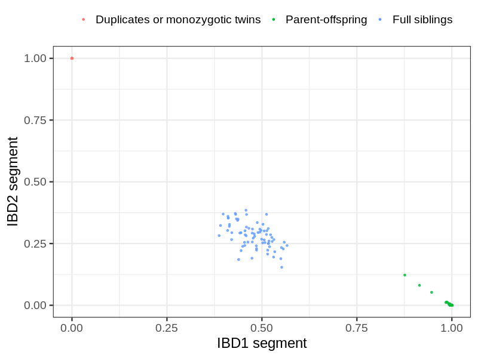
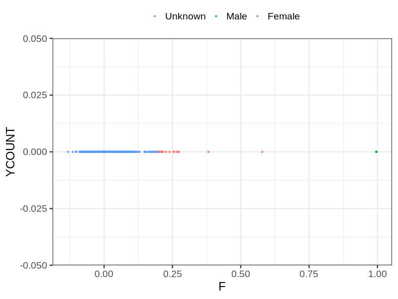
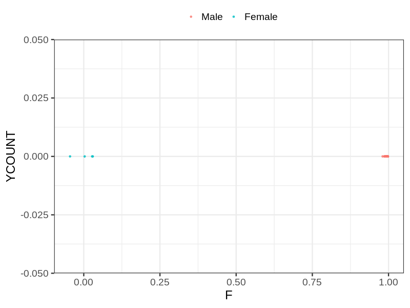
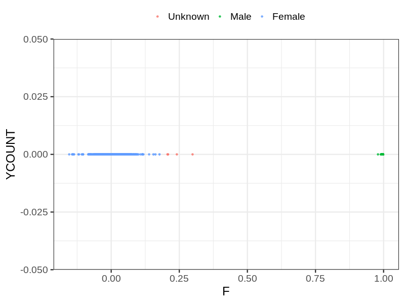

# Fam file reconstruction in snp018c
- Number of samples in the genotyping data: 5548.
## Samples not in Medical Birth Regsitry
21 samples with missing birth year, assumed to be parent in the following.
## Relationship inference
| Relationship |   |
| ------------ | - |
| Duplicates or monozygotic twins| 15 |
| Parent-offspring| 235 |
| Full siblings| 74 |
| 2nd degree| 0 |
| 3rd degree| 0 |
| 4th degree| 0 |
| Unrelated| 0 |

## Mother sex check
| Inferred sex |   |
| ------------ | - |
| Unknown | 19 |
| Male | 3 |
| Female | 1872 |

## Father sex check
| Inferred sex |   |
| ------------ | - |
| Unknown | 0 |
| Male | 1052 |
| Female | 4 |

## Children sex check
| Inferred sex |   |
| ------------ | - |
| Unknown | 4 |
| Male | 1300 |
| Female | 1294 |

## Parental relationships
21 sentrix IDs missing from ID file. These are not counted as individuals.
###  Individuals
5527 individuals in total. Breakdown excluding multiple same-sex parents:
 -  227 children
 -  186 mothers
 -  39 fathers
 -  196 mother-child pairs
 -  39 father-child pairs
 -  8 mother-father-child trios
 -  5075 unrelated

194 mother-child relationships expected.
- 194 (100%) recovered by genetic relationships.
- 0 (0%) not recovered by genetic relationships.

38 father-child relationships expected.
- 38 (100%) recovered by genetic relationships.
- 0 (0%) not recovered by genetic relationships.

196 mother-child relationships detected.
- 194 (98.98%) matched to registry.
- 2 (1.02%) not matched to registry.

39 father-child relationships detected.
- 38 (97.44%) matched to registry.
- 1 (2.56%) not matched to registry.

###  Samples
5548 samples in total. Breakdown excluding multiple same-sex parents:
 -  227 children
 -  186 mothers
 -  39 fathers
 -  196 mother-child pairs
 -  39 father-child pairs
 -  8 mother-father-child trios
 -  5096 unrelated

194 mother-child relationships expected.
- 194 (100%) recovered by genetic relationships.
- 0 (0%) not recovered by genetic relationships.

38 father-child relationships expected.
- 38 (100%) recovered by genetic relationships.
- 0 (0%) not recovered by genetic relationships.

196 mother-child relationships detected.
- 194 (98.98%) matched to registry.
- 2 (1.02%) not matched to registry.

39 father-child relationships detected.
- 38 (97.44%) matched to registry.
- 1 (2.56%) not matched to registry.

## Exclusion
- Number of samples excluded: 3
