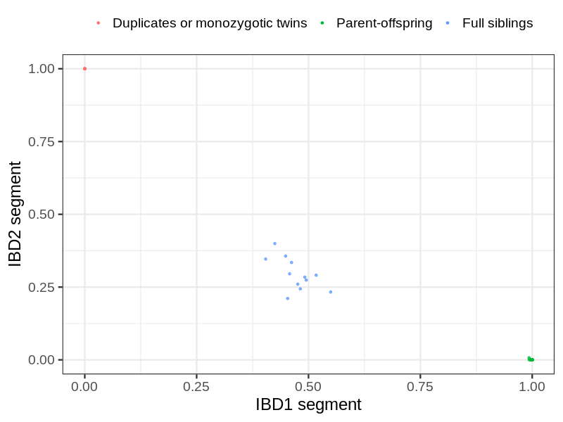
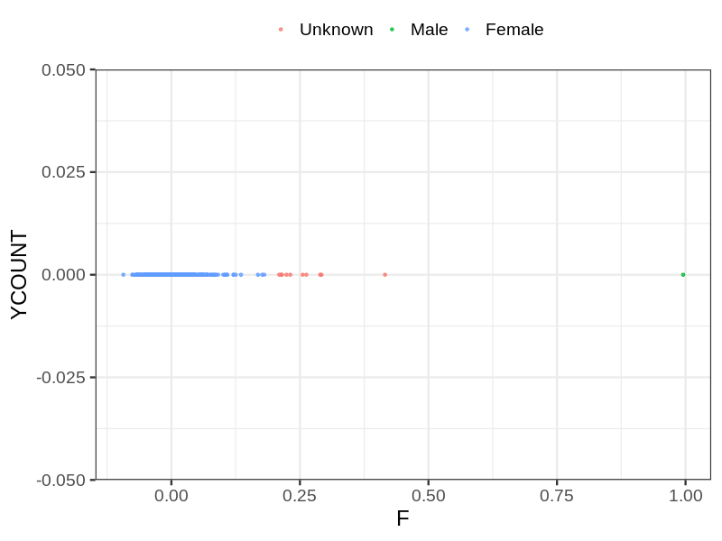
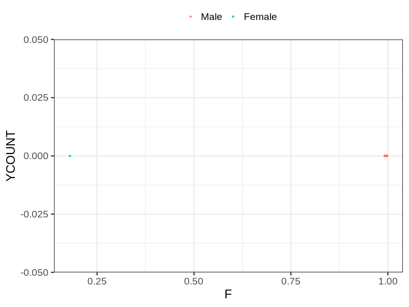
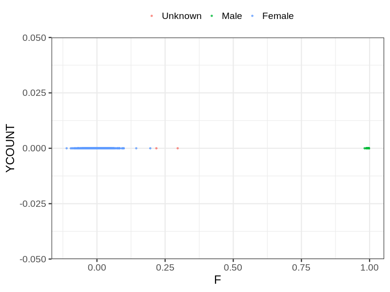

# Fam file reconstruction in snp018de
- Number of samples in the genotyping data: 2163.
## Samples not in Medical Birth Regsitry
8 samples with missing birth year, assumed to be parent in the following.
## Relationship inference
| Relationship |   |
| ------------ | - |
| Duplicates or monozygotic twins| 6 |
| Parent-offspring| 25 |
| Full siblings| 12 |
| 2nd degree| 0 |
| 3rd degree| 0 |
| 4th degree| 0 |
| Unrelated| 0 |

## Mother sex check
| Inferred sex |   |
| ------------ | - |
| Unknown | 10 |
| Male | 1 |
| Female | 510 |

## Father sex check
| Inferred sex |   |
| ------------ | - |
| Unknown | 0 |
| Male | 645 |
| Female | 1 |

## Children sex check
| Inferred sex |   |
| ------------ | - |
| Unknown | 2 |
| Male | 507 |
| Female | 487 |

## Parental relationships
8 sentrix IDs missing from ID file. These are not counted as individuals.
###  Individuals
2155 individuals in total. Breakdown excluding multiple same-sex parents:
 -  24 children
 -  16 mothers
 -  7 fathers
 -  16 mother-child pairs
 -  8 father-child pairs
 -  0 mother-father-child trios
 -  2108 unrelated

16 mother-child relationships expected.
- 16 (100%) recovered by genetic relationships.
- 0 (0%) not recovered by genetic relationships.

8 father-child relationships expected.
- 8 (100%) recovered by genetic relationships.
- 0 (0%) not recovered by genetic relationships.

16 mother-child relationships detected.
- 16 (100%) matched to registry.
- 0 (0%) not matched to registry.

8 father-child relationships detected.
- 8 (100%) matched to registry.
- 0 (0%) not matched to registry.

###  Samples
2163 samples in total. Breakdown excluding multiple same-sex parents:
 -  24 children
 -  16 mothers
 -  7 fathers
 -  16 mother-child pairs
 -  8 father-child pairs
 -  0 mother-father-child trios
 -  2116 unrelated

16 mother-child relationships expected.
- 16 (100%) recovered by genetic relationships.
- 0 (0%) not recovered by genetic relationships.

8 father-child relationships expected.
- 8 (100%) recovered by genetic relationships.
- 0 (0%) not recovered by genetic relationships.

16 mother-child relationships detected.
- 16 (100%) matched to registry.
- 0 (0%) not matched to registry.

8 father-child relationships detected.
- 8 (100%) matched to registry.
- 0 (0%) not matched to registry.

## Exclusion
- Number of samples excluded: 3
