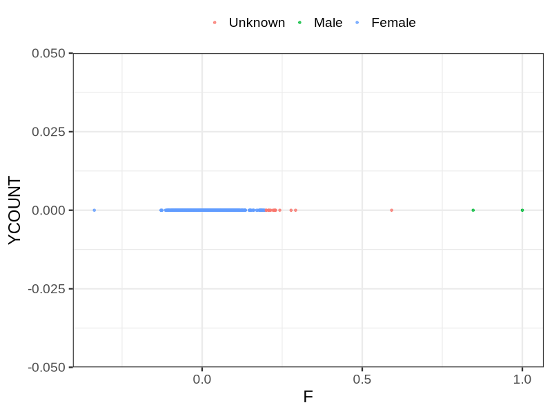
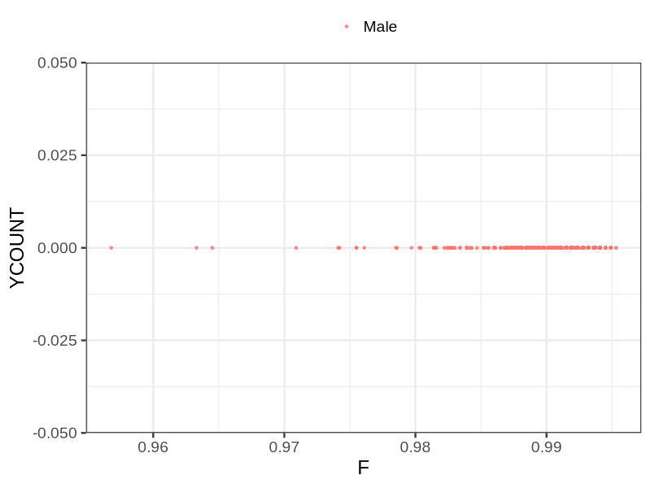

# Fam file reconstruction in snp003
## Samples not in Medical Birth Regsitry
63 samples with missing birth year, will be assumed to be parent.
## Relationship inference
| Relationship |   |
| ------------ | - |
| Duplicates or monozygotic twins| 138 |
| Parent-offspring| 8641 |
| Full siblings| 277 |
| 2nd degree| 0 |
| 3rd degree| 0 |
| 4th degree| 0 |
| Unrelated| 0 |

## Mother sex check
| Inferred sex |   |
| ------------ | - |
| Unknown | 14 |
| Male | 2 |
| Female | 4112 |

## Father sex check
| Inferred sex |   |
| ------------ | - |
| Unknown | 0 |
| Male | 4053 |
| Female | 0 |

## Parental relationship
4799 mother-child relationships expected.
- 4799 (100%) recovered by genetic relationships.
- 0 (0%) not recovered by genetic relationships.
4793 father-child relationships expected.
- 4793 (100%) recovered by genetic relationships.
- 0 (0%) not recovered by genetic relationships.
9601 parent-offspring relationships detected
- 9592 (99.91%) match to registry.
- 9 (0.09%) do not match to registry.
## Exclusion
- Number of samples excluded: 16
