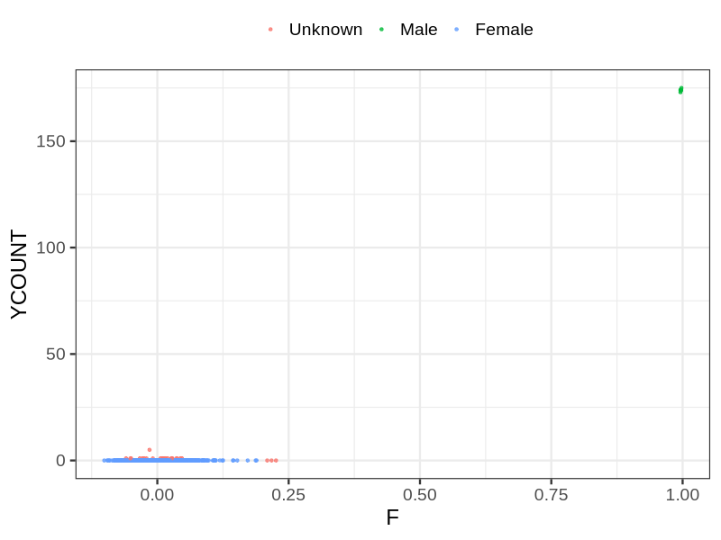
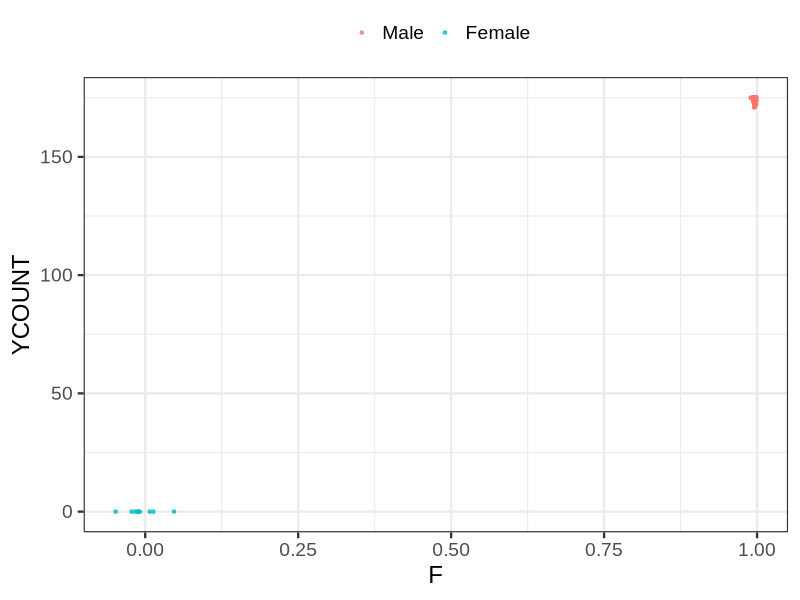

# Fam file reconstruction in snp007
## Samples not in Medical Birth Regsitry
8 samples with missing birth year, will be assumed to be parent.
## Relationship inference
| Relationship |   |
| ------------ | - |
| Duplicates or monozygotic twins| 0 |
| Parent-offspring| 0 |
| Full siblings| 4 |
| 2nd degree| 0 |
| 3rd degree| 0 |
| 4th degree| 0 |
| Unrelated| 0 |

## Mother sex check
| Inferred sex |   |
| ------------ | - |
| Unknown | 25 |
| Male | 8 |
| Female | 1483 |

## Father sex check
| Inferred sex |   |
| ------------ | - |
| Unknown | 0 |
| Male | 1445 |
| Female | 9 |

## Parental relationship
0 mother-child relationships expected.
- 0 (NaN%) recovered by genetic relationships.
- 0 (NaN%) not recovered by genetic relationships.
0 father-child relationships expected.
- 0 (NaN%) recovered by genetic relationships.
- 0 (NaN%) not recovered by genetic relationships.
0 parent-offspring relationships detected
- 0 (NaN%) match to registry.
- 0 (NaN%) do not match to registry.
## Exclusion
- Number of samples excluded: 8
