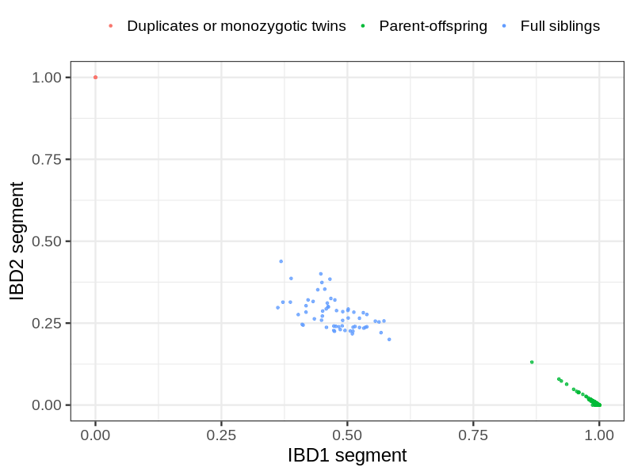
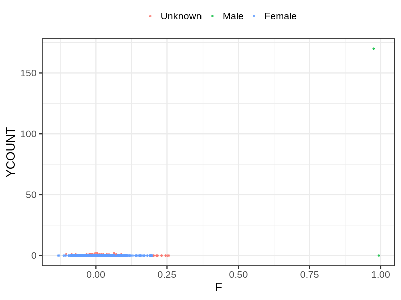
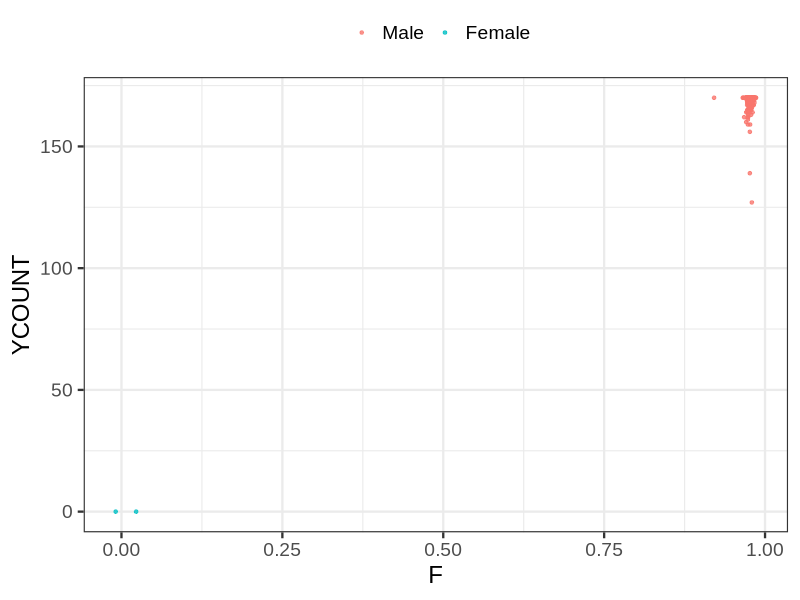

# Fam file reconstruction in snp010
## Samples not in Medical Birth Regsitry
56 samples with missing birth year, will be assumed to be parent.
## Relationship inference
| Relationship |   |
| ------------ | - |
| Duplicates or monozygotic twins| 5 |
| Parent-offspring| 3473 |
| Full siblings| 60 |
| 2nd degree| 0 |
| 3rd degree| 0 |
| 4th degree| 0 |
| Unrelated| 0 |

## Mother sex check
| Inferred sex |   |
| ------------ | - |
| Unknown | 35 |
| Male | 2 |
| Female | 3309 |

## Father sex check
| Inferred sex |   |
| ------------ | - |
| Unknown | 0 |
| Male | 3133 |
| Female | 2 |

## Parental relationship
1919 mother-child relationships expected.
- 1913 (99.69%) recovered by genetic relationships.
- 6 (0.31%) not recovered by genetic relationships.
1580 father-child relationships expected.
- 1574 (99.62%) recovered by genetic relationships.
- 6 (0.38%) not recovered by genetic relationships.
3492 parent-offspring relationships detected
- 3487 (99.86%) match to registry.
- 5 (0.14%) do not match to registry.
## Exclusion
- Number of samples excluded: 23
