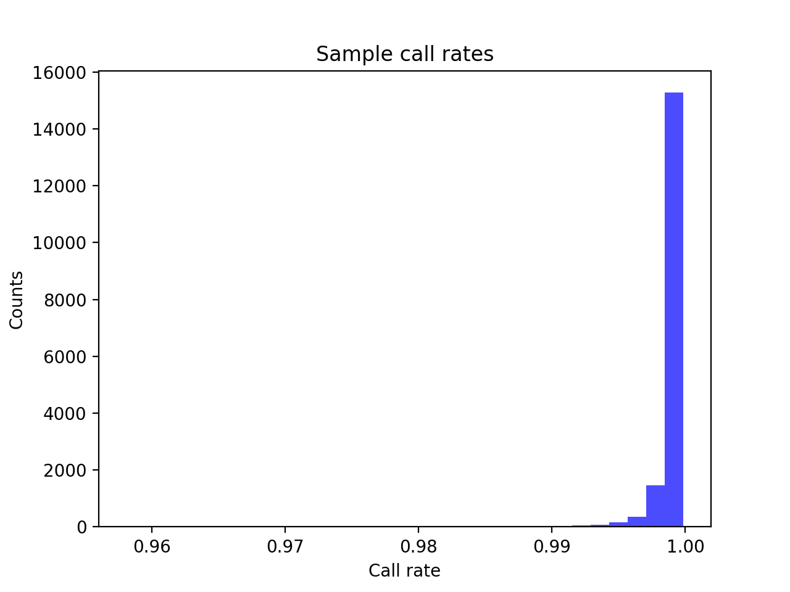
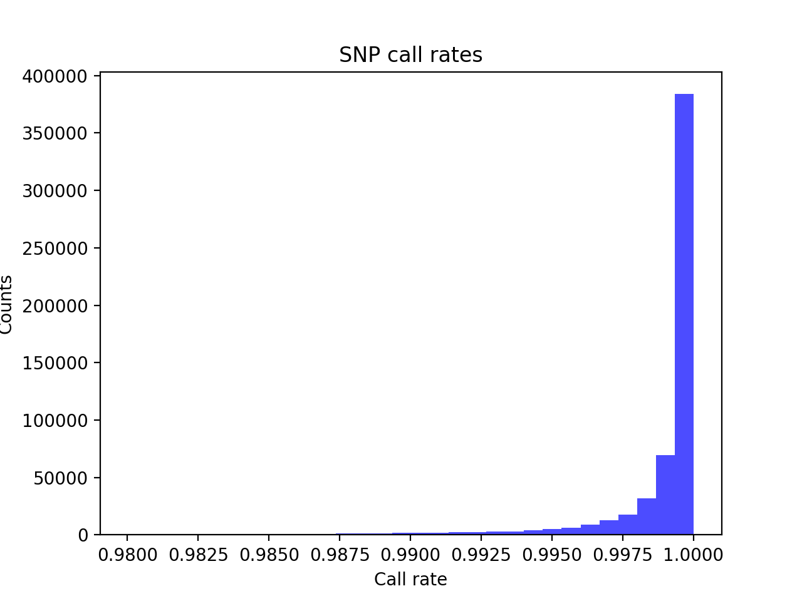
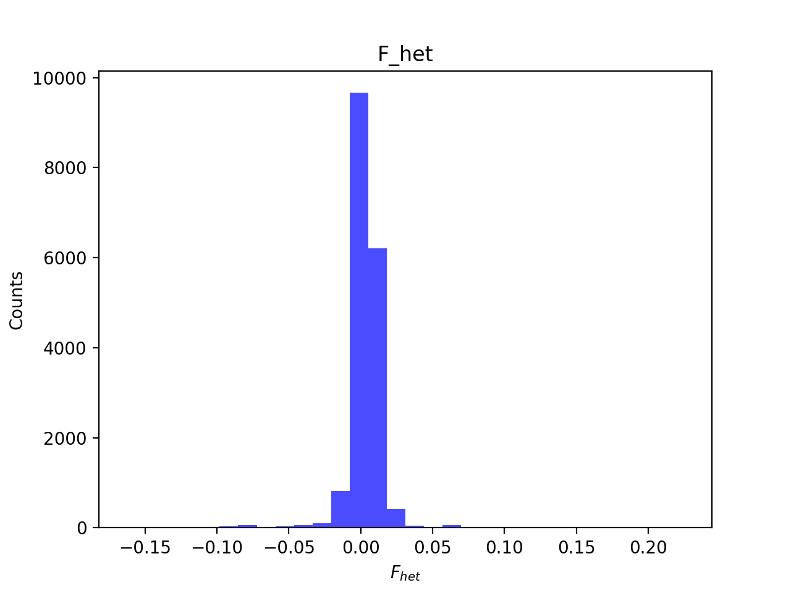
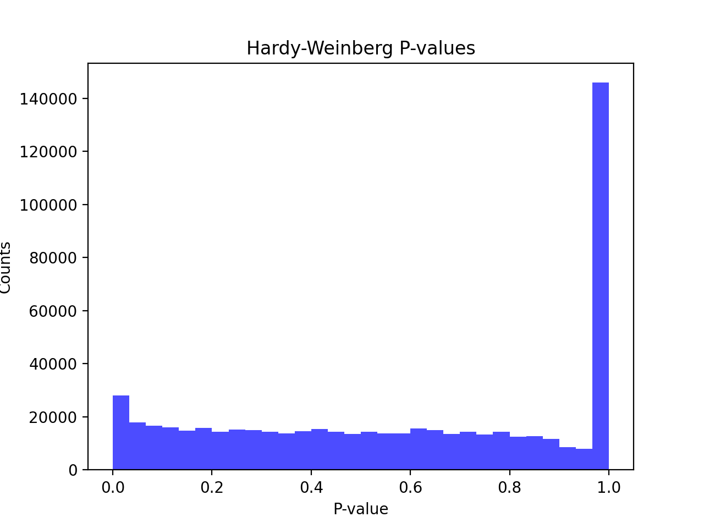
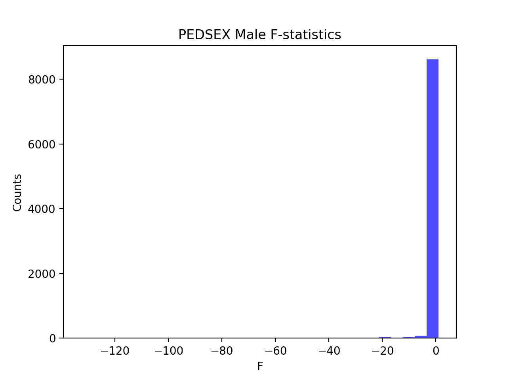

# Pre-imputation report for batch snp012
## Samples overview
17582 samples
 5996 kinship clusters
 5744 offspring with mother ID
 5737 offspring with mother in batch
 2911 mothers with offspring in batch
 7 mothers missing from batch
 5749 offspring with father ID
 5743 offspring with father in batch
 2909 fathers with offspring in batch
 6 fathers missing from batch
## Call rates
### Sample call rates
min: 0.95813
 max: 0.9998361
 median: 0.9992615
 
### SNP call rates
min: 0.98004
 max: 1.0
 median: 0.9997156
 
## F_het
min: -0.1627
 max: 0.2248
 median: 0.003212
 
## Hardy-Weinberg P-values
min: 1.027e-06
 max: 1.0
 median: 0.6039
 
## F-stats for sexcheck
8764 out of 17582 OK 
| PEDSEX | Total | SNPSEX Male | SNPSEX Female | SNPSEX Unknown | OK | Problem |
| ------ | ------ | ------ | ------ | ------ | ------ | ------ |
| Male | 8771 | 7380 | 1391 | 0 | 7380 | 1391 |
| Female | 8772 | 7388 | 1384 | 0 | 1384 | 7388 |
| Unknown | 39 | 34 | 5 | 0 | 0 | 39 |

### PEDSEX Male F-statistics
min: -132.5
 max: 1.0
 median: 1.0
 
### PEDSEX Female F-statistics
min: -130.4
 max: 1.0
 median: 1.0
 