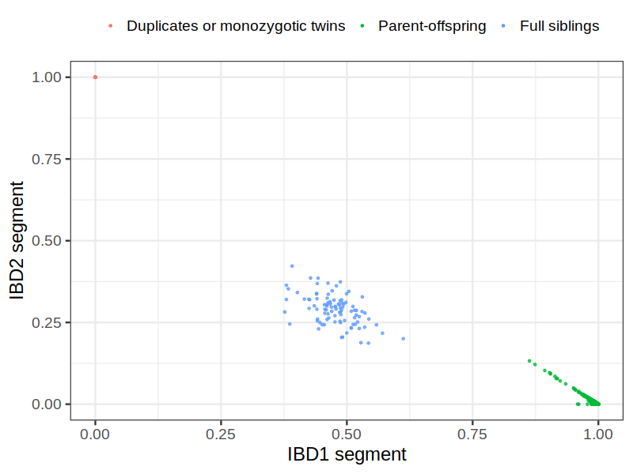
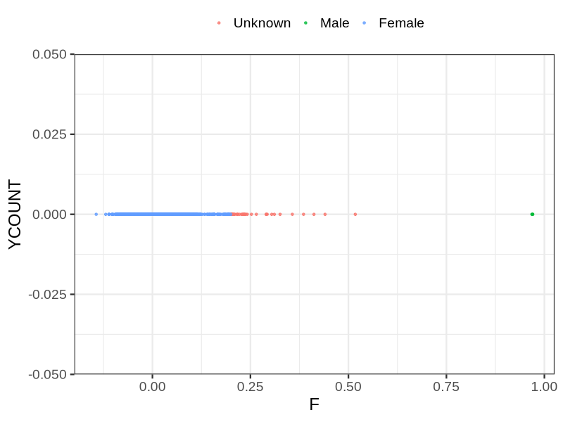

# Fam file reconstruction in snp012
## Samples not in Medical Birth Regsitry
5906 samples with missing birth year, will be assumed to be parent.
## Relationship inference
| Relationship |   |
| ------------ | - |
| Duplicates or monozygotic twins| 37 |
| Parent-offspring| 11524 |
| Full siblings| 95 |
| 2nd degree| 0 |
| 3rd degree| 0 |
| 4th degree| 0 |
| Unrelated| 0 |

## Mother sex check
| Inferred sex |   |
| ------------ | - |
| Unknown | 36 |
| Male | 3 |
| Female | 5866 |

## Father sex check
| Inferred sex |   |
| ------------ | - |
| Unknown | 0 |
| Male | 5860 |
| Female | 17 |

## Parental relationship
5904 mother-child relationships expected.
- 5870 (99.42%) recovered by genetic relationships.
- 34 (0.58%) not recovered by genetic relationships.
5961 father-child relationships expected.
- 5907 (99.09%) recovered by genetic relationships.
- 54 (0.91%) not recovered by genetic relationships.
11819 parent-offspring relationships detected
- 11777 (99.64%) match to registry.
- 42 (0.36%) do not match to registry.
## Exclusion
- Number of samples excluded: 109
