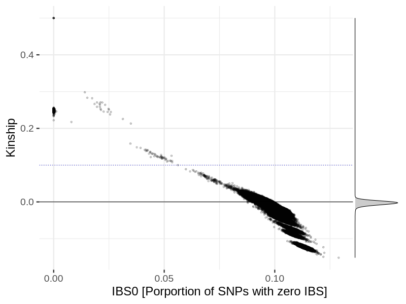
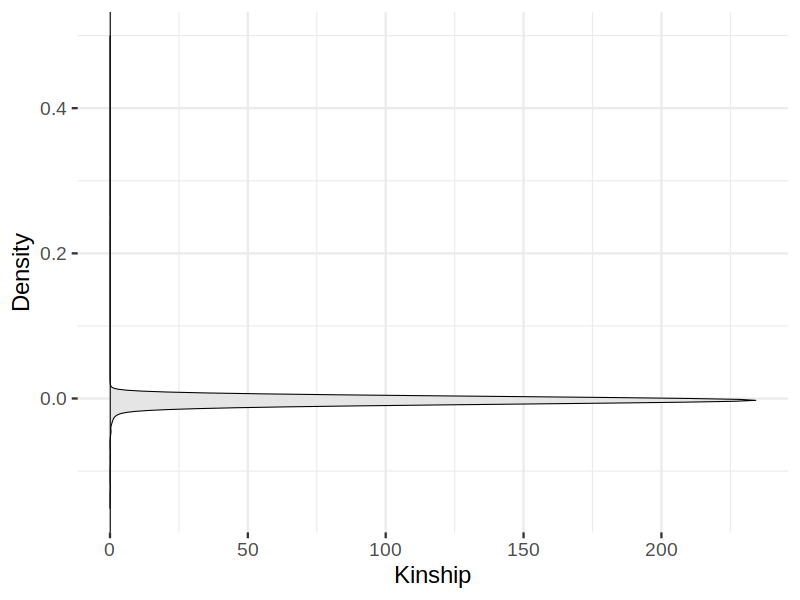
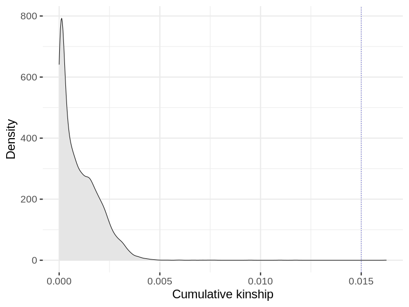
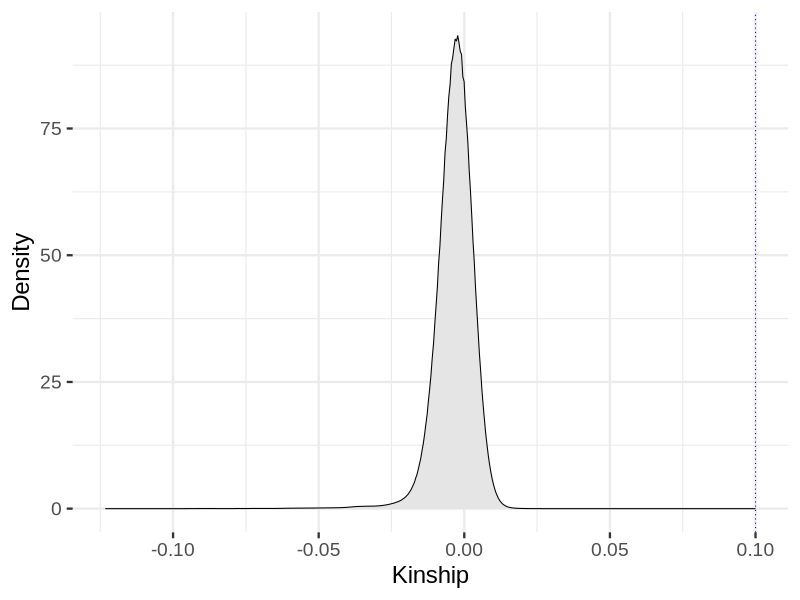
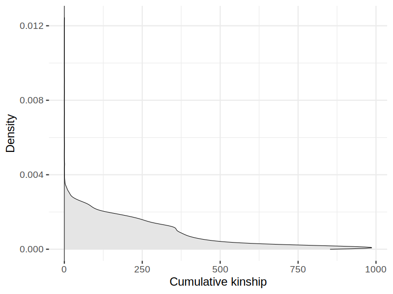

# Kinship filtering in snp012
Relatedness filtering, {length(ids)} individuals.
## Relatedness

## Relatedness
- Pairwise kinship

- Cummulative positive kinship

Percolation of the relatedness graph using a Kinship threshold of {kinship_threshold}: {length(excluded_ids)} excluded, {length(unrelated_ids)} remaining.
## Relatedness after relatedness filtering
- Pairwise kinship

- Cummulative positive kinship

Removal of samples with accumulated kinship using threshold of {accumulated_kinship_threshold}: {length(excluded_cumulative_kinship)} excluded, {length(retained_ids)} remaining.
