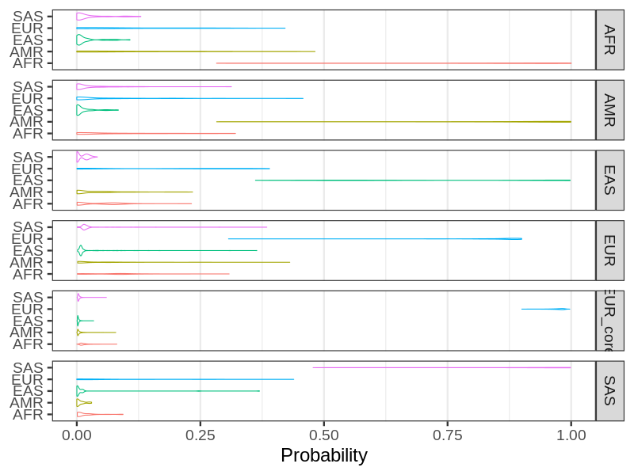

### Clustering in the 1KG
| Population | AFR | AMR | EAS | EUR | SAS |
| - | -  |  -  |  -  |  -  |  -  |
| AFR | 527 | 2 | 0 | 0 | 0 |
| AMR | 3 | 271 | 0 | 4 | 0 |
| EAS | 0 | 0 | 403 | 0 | 0 |
| EUR | 0 | 0 | 0 | 402 | 0 |
| SAS | 0 | 0 | 0 | 0 | 391 |

| Population | AFR | AMR | EAS | EUR | SAS |
| - | -  |  -  |  -  |  -  |  -  |
| MoBa  | 43 | 82 | 171 | 17347 | 39 |

