# Principal Component Analysys (PCA) in snp012 vs. 1 KG
Principal component analysis of the MoBa samples merged with the thousand genomes.
| Population code | Description |
| --------------- | ----------- |
| AFR | African |
| AMR | Admixed American |
| EAS | East Asian |
| EUR | European |
| MID | Middle Eastern |
| SAS | South Asian |

| Population | Number of samples |
| ---------- | ----------------- |
| AFR | 661 |
| AMR | 347 |
| EAS | 504 |
| EUR | 503 |
| SAS | 489 |
| MoBa | 17682 |
### pc2 vs. pc1
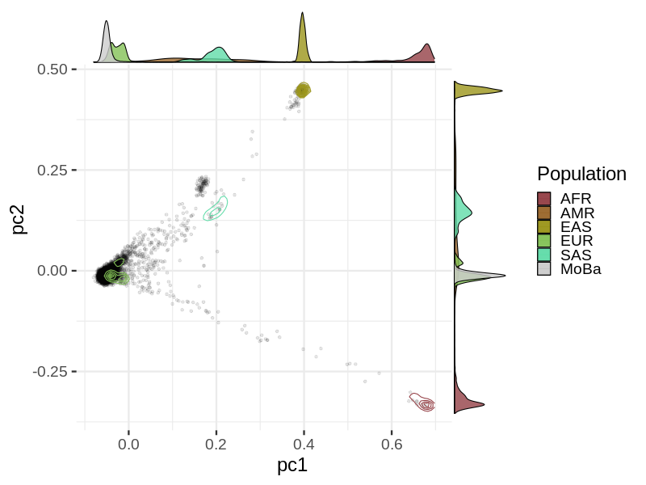
### pc3 vs. pc2
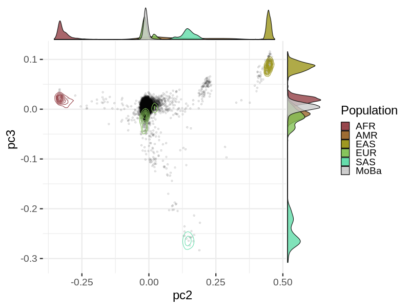
### pc4 vs. pc3
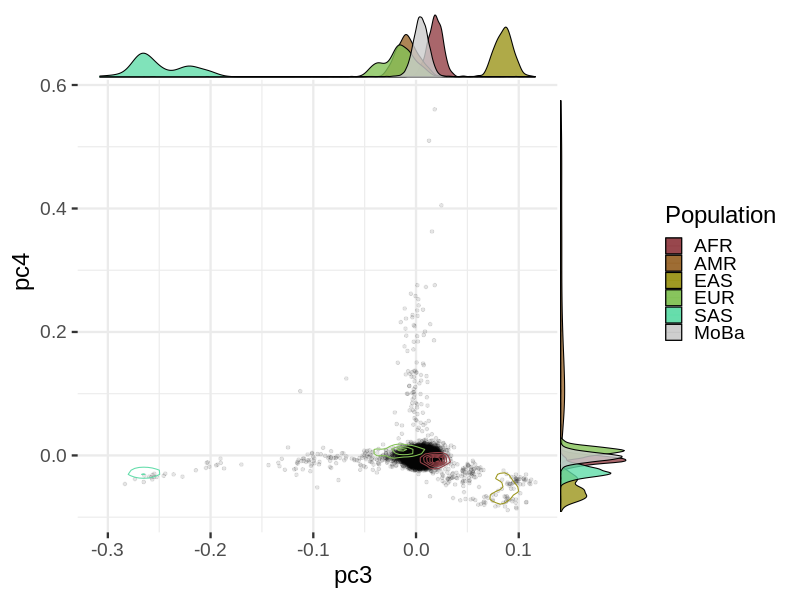
### pc5 vs. pc4
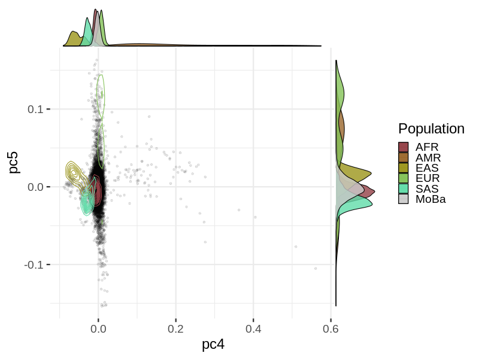
### pc6 vs. pc5
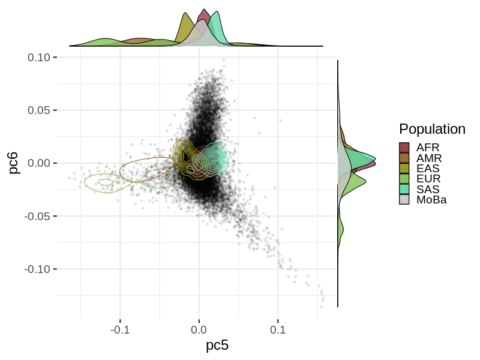
### pc7 vs. pc6
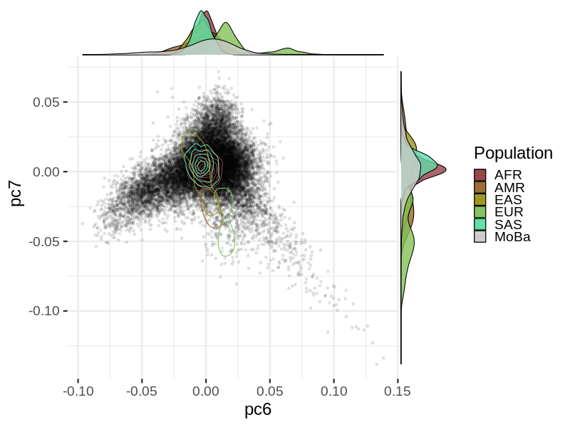
### pc8 vs. pc7
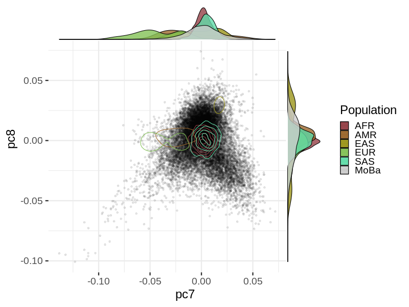
### pc9 vs. pc8
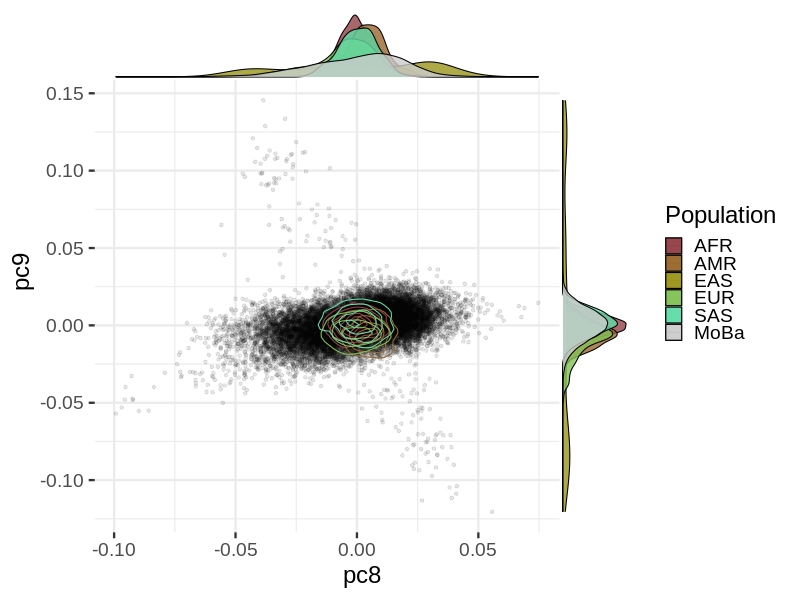
### pc10 vs. pc9
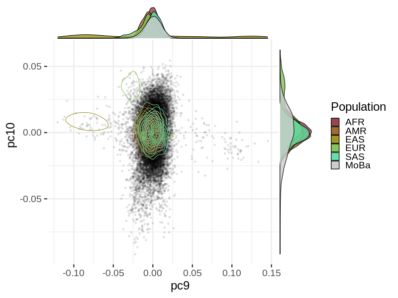
### Cluster distance in the 1KG
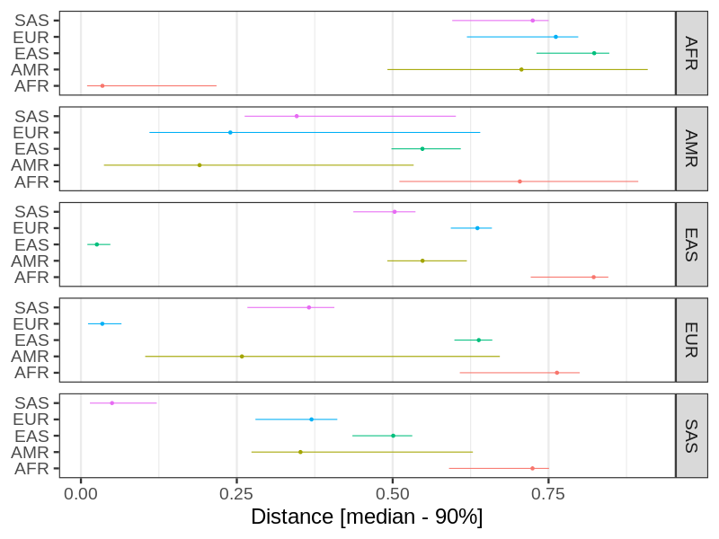
### Population clustering in MoBa
Clustering using nearest neighbors in the top 4 PCs.
### pc2 vs. pc1
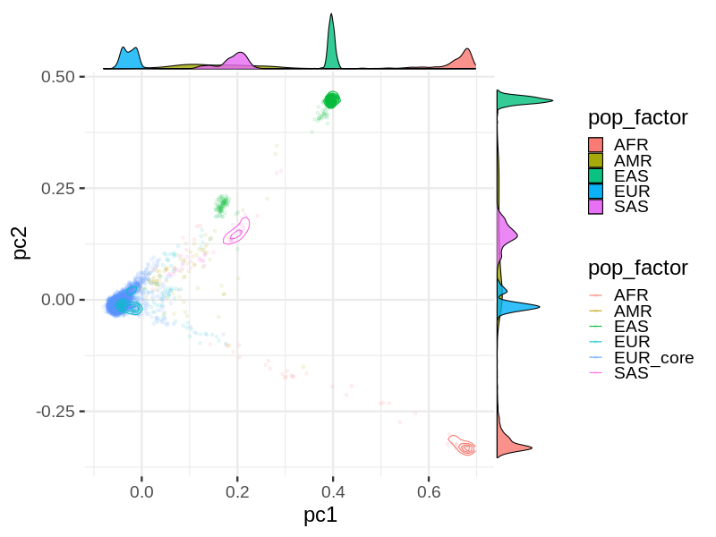
### pc3 vs. pc2
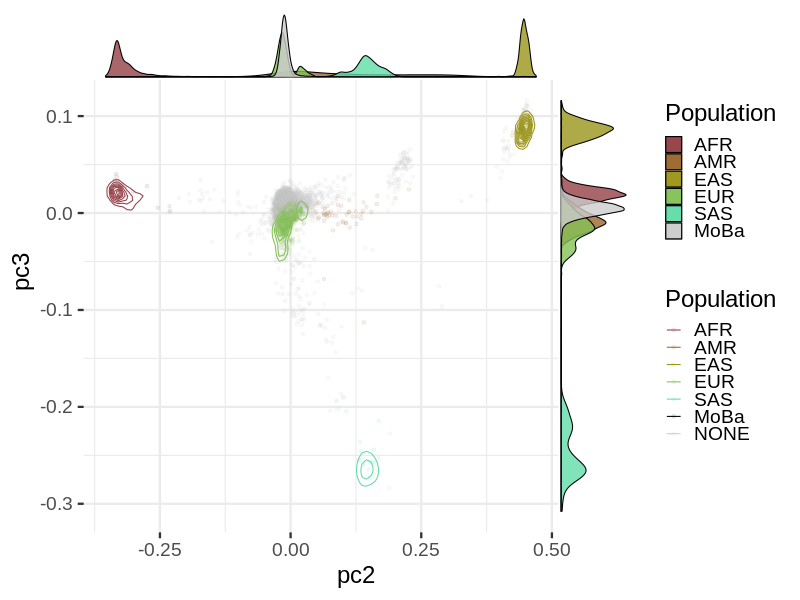
### pc4 vs. pc3
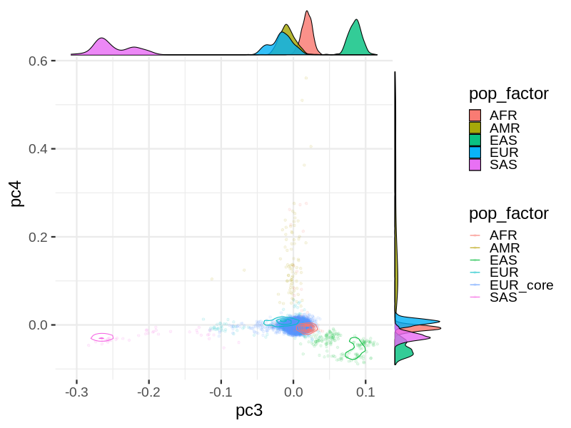
### pc5 vs. pc4

### pc6 vs. pc5
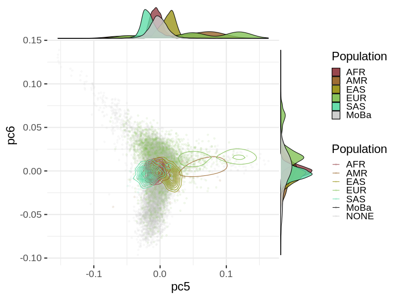
### pc7 vs. pc6
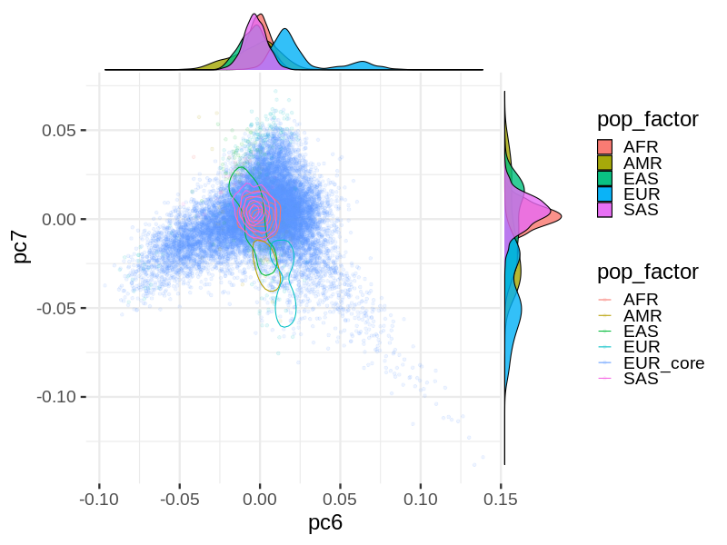
### pc8 vs. pc7
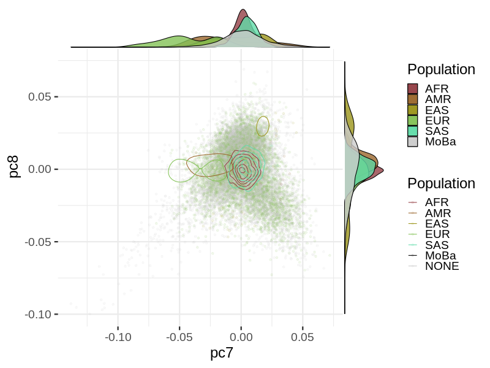
### pc9 vs. pc8
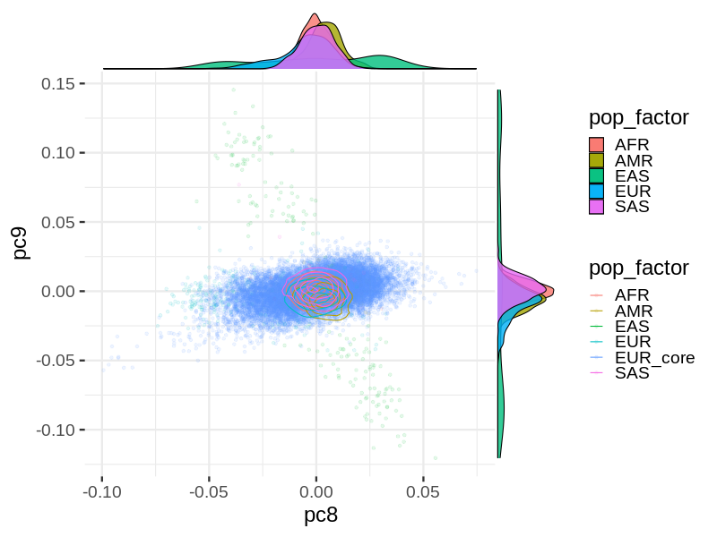
### pc10 vs. pc9
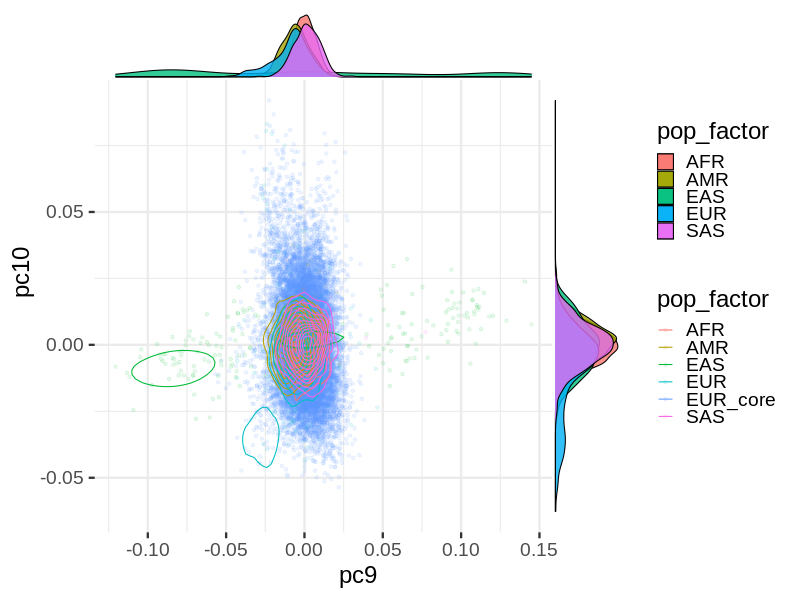
