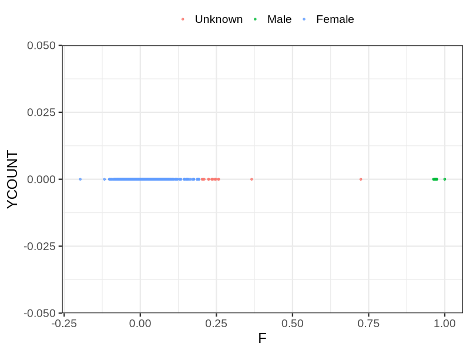
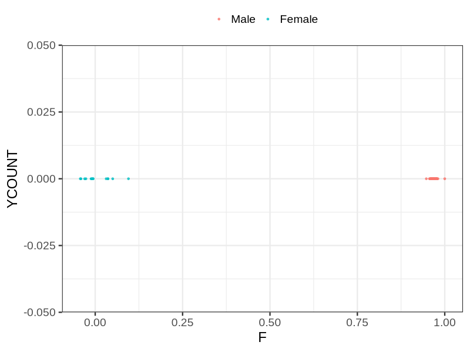

# Fam file reconstruction in snp014
## Samples not in Medical Birth Regsitry
2977 samples with missing birth year, will be assumed to be parent.
## Relationship inference
| Relationship |   |
| ------------ | - |
| Duplicates or monozygotic twins| 3 |
| Parent-offspring| 5810 |
| Full siblings| 20 |
| 2nd degree| 0 |
| 3rd degree| 0 |
| 4th degree| 0 |
| Unrelated| 0 |

## Mother sex check
| Inferred sex |   |
| ------------ | - |
| Unknown | 15 |
| Male | 13 |
| Female | 2957 |

## Father sex check
| Inferred sex |   |
| ------------ | - |
| Unknown | 0 |
| Male | 2943 |
| Female | 14 |

## Parental relationship
2930 mother-child relationships expected.
- 2884 (98.43%) recovered by genetic relationships.
- 46 (1.57%) not recovered by genetic relationships.
2971 father-child relationships expected.
- 2914 (98.08%) recovered by genetic relationships.
- 57 (1.92%) not recovered by genetic relationships.
5857 parent-offspring relationships detected
- 5798 (98.99%) match to registry.
- 59 (1.01%) do not match to registry.
## Exclusion
- Number of samples excluded: 138
