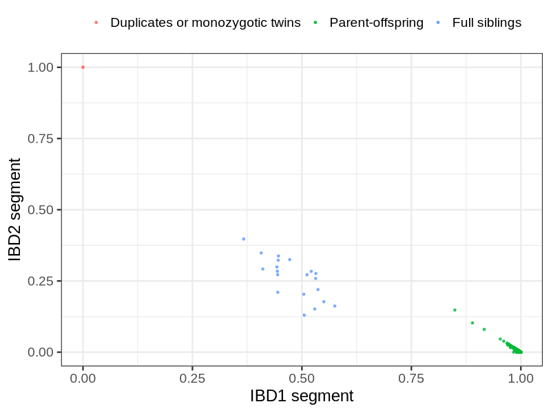

# Fam file reconstruction in snp014
| Relationship |   |
| ------------ | - |
| Duplicates or monozygotic twins| 3 |
| Parent-offspring| 5816 |
| Full siblings| 20 |
| 2nd degree| 0 |
| 3rd degree| 0 |
| 4th degree| 0 |
| Unrelated| 0 |
 

