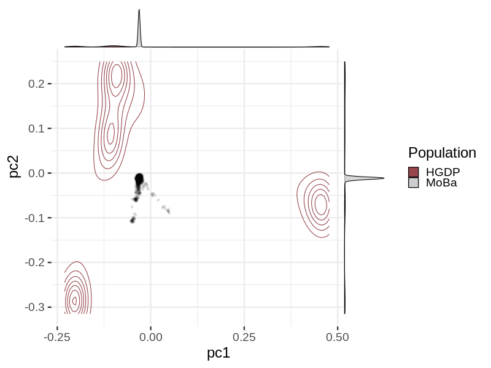
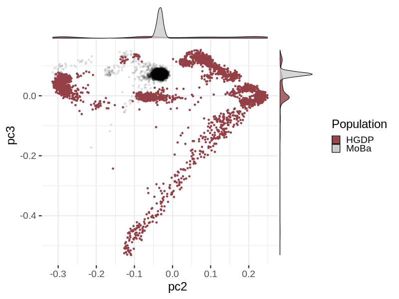
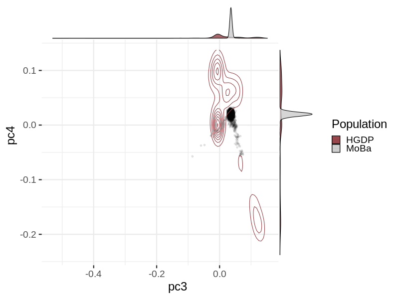
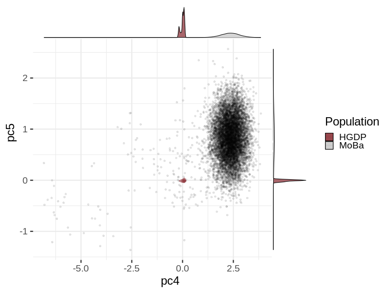
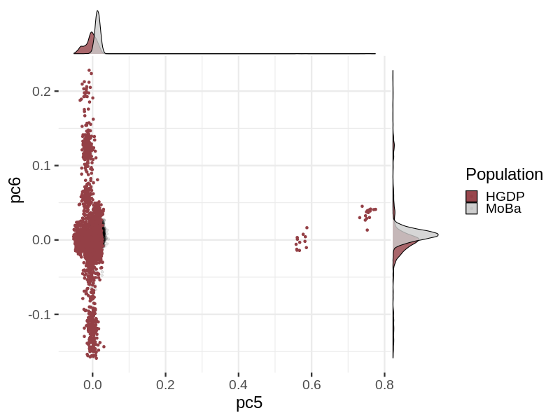
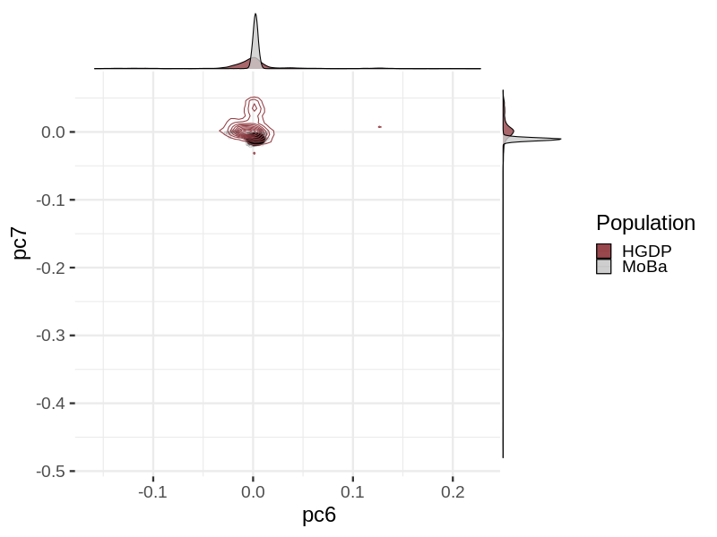
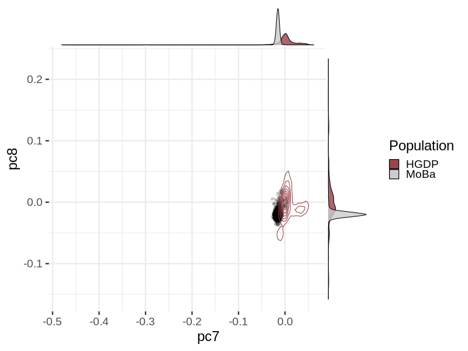
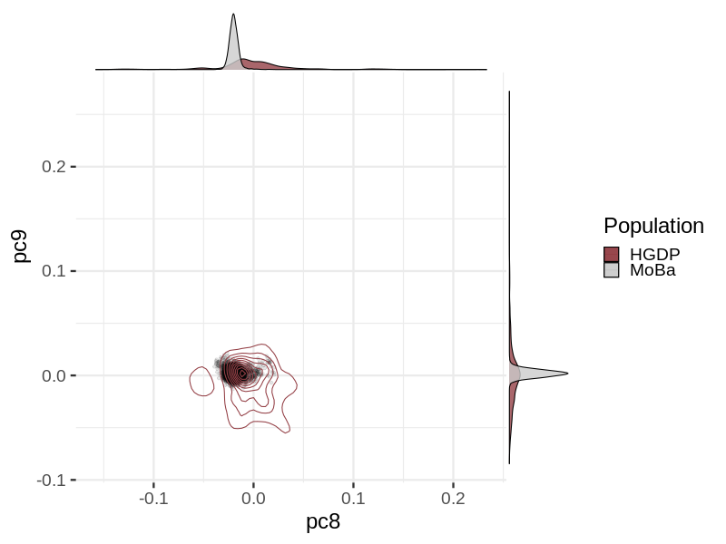
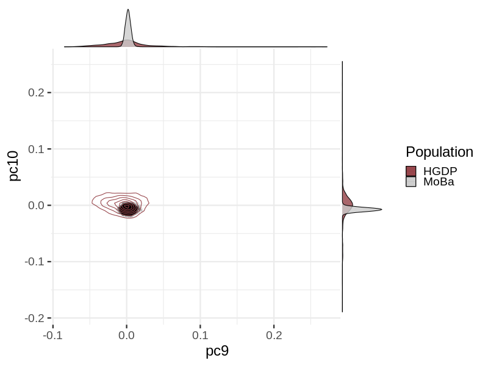

# Principal Component Analysys (PCA) in snp014 vs. HDGP
Principal component analysis of the MoBa samples projected over PCs from the Human Genome Diversity Project (HGDP). Based on the analysis protocol of the _COVID-19 Host Genetics Initiative_, see [flagship paper](doi.org/10.1101/2021.03.10.21252820), with adaptations.
| Population code | Description |
| --------------- | ----------- |
| AFR | African |
| AMR | Admixed American |
| EAS | East Asian |
| EUR | European |
| MID | Middle Eastern |
| SAS | South Asian |

| Population | Number of samples |
| ---------- | ----------------- |
| HGDP | 3327 |
| MoBa | 8907 |
### pc2 vs. pc1

### pc3 vs. pc2

### pc4 vs. pc3

### pc5 vs. pc4

### pc6 vs. pc5

### pc7 vs. pc6

### pc8 vs. pc7

### pc9 vs. pc8

### pc10 vs. pc9

