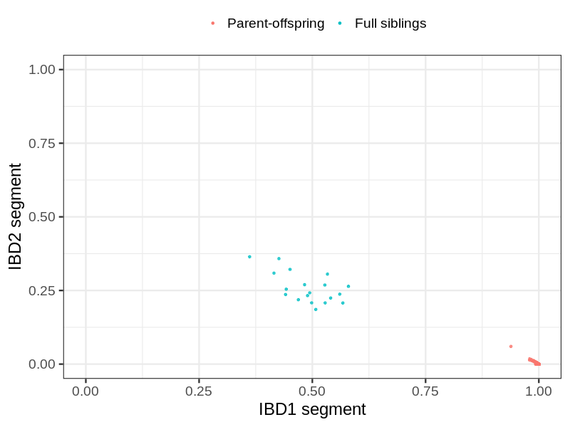
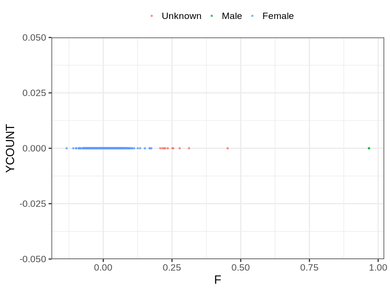
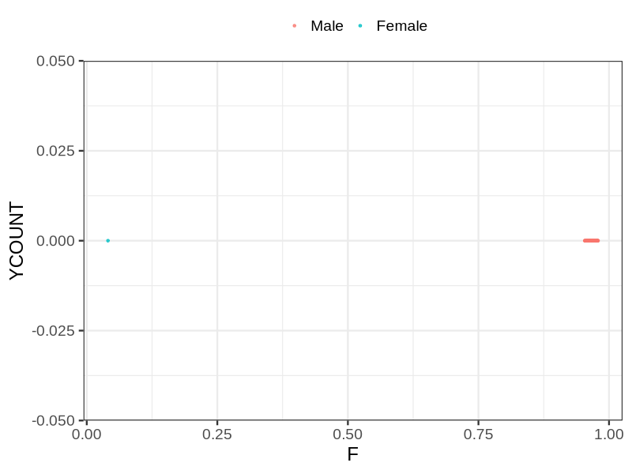

# Fam file reconstruction in snp015b
## Samples not in Medical Birth Regsitry
1885 samples with missing birth year, will be assumed to be parent.
## Relationship inference
| Relationship |   |
| ------------ | - |
| Duplicates or monozygotic twins| 0 |
| Parent-offspring| 584 |
| Full siblings| 19 |
| 2nd degree| 0 |
| 3rd degree| 0 |
| 4th degree| 0 |
| Unrelated| 0 |

## Mother sex check
| Inferred sex |   |
| ------------ | - |
| Unknown | 10 |
| Male | 2 |
| Female | 1225 |

## Father sex check
| Inferred sex |   |
| ------------ | - |
| Unknown | 0 |
| Male | 1248 |
| Female | 1 |

## Parental relationship
338 mother-child relationships expected.
- 335 (99.11%) recovered by genetic relationships.
- 3 (0.89%) not recovered by genetic relationships.
248 father-child relationships expected.
- 247 (99.6%) recovered by genetic relationships.
- 1 (0.4%) not recovered by genetic relationships.
585 parent-offspring relationships detected
- 582 (99.49%) match to registry.
- 3 (0.51%) do not match to registry.
## Exclusion
- Number of samples excluded: 10
