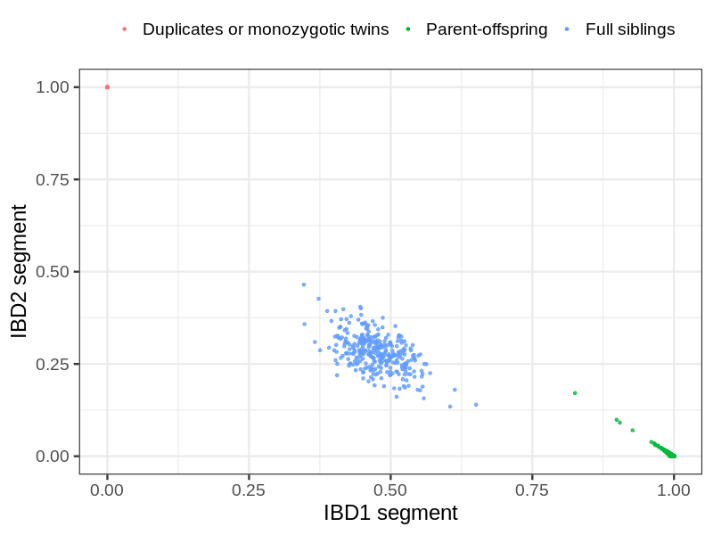
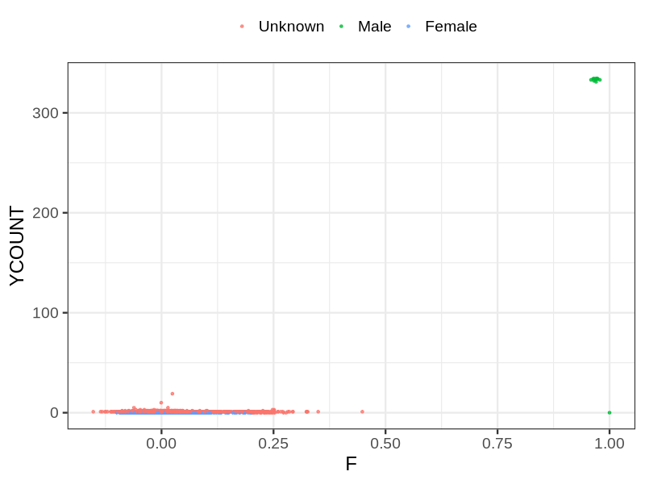
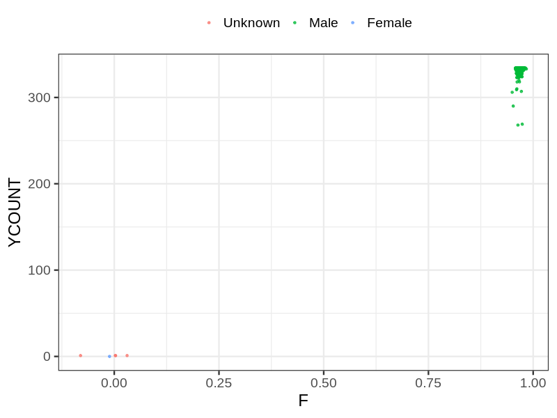

# Fam file reconstruction in snp016a
## Samples not in Medical Birth Regsitry
96 samples with missing birth year, will be assumed to be parent.
## Relationship inference
| Relationship |   |
| ------------ | - |
| Duplicates or monozygotic twins| 36 |
| Parent-offspring| 3194 |
| Full siblings| 327 |
| 2nd degree| 0 |
| 3rd degree| 0 |
| 4th degree| 0 |
| Unrelated| 0 |

## Mother sex check
| Inferred sex |   |
| ------------ | - |
| Unknown | 9480 |
| Male | 20 |
| Female | 3004 |

## Father sex check
| Inferred sex |   |
| ------------ | - |
| Unknown | 4 |
| Male | 3903 |
| Female | 1 |

## Parental relationship
2791 mother-child relationships expected.
- 2765 (99.07%) recovered by genetic relationships.
- 26 (0.93%) not recovered by genetic relationships.
378 father-child relationships expected.
- 374 (98.94%) recovered by genetic relationships.
- 4 (1.06%) not recovered by genetic relationships.
3202 parent-offspring relationships detected
- 3139 (98.03%) match to registry.
- 63 (1.97%) do not match to registry.
## Exclusion
- Number of samples excluded: 76
