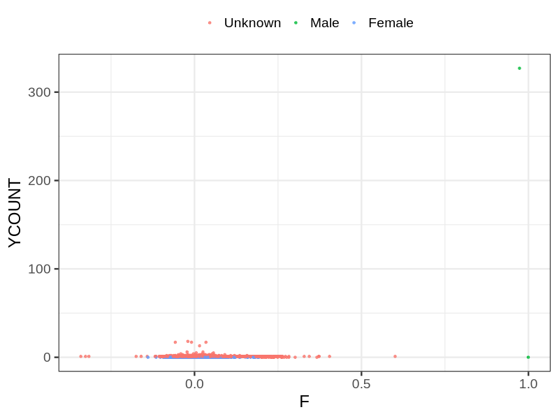
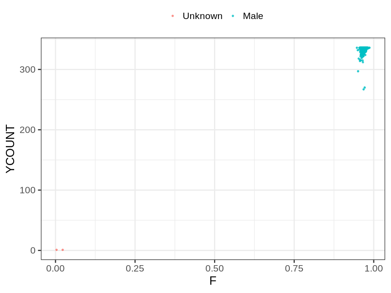

# Fam file reconstruction in snp016b
## Samples not in Medical Birth Regsitry
78 samples with missing birth year, will be assumed to be parent.
## Relationship inference
| Relationship |   |
| ------------ | - |
| Duplicates or monozygotic twins| 23 |
| Parent-offspring| 2857 |
| Full siblings| 341 |
| 2nd degree| 0 |
| 3rd degree| 0 |
| 4th degree| 0 |
| Unrelated| 0 |

## Mother sex check
| Inferred sex |   |
| ------------ | - |
| Unknown | 8207 |
| Male | 2 |
| Female | 2530 |

## Father sex check
| Inferred sex |   |
| ------------ | - |
| Unknown | 2 |
| Male | 5102 |
| Female | 0 |

## Parental relationship
2225 mother-child relationships expected.
- 2218 (99.69%) recovered by genetic relationships.
- 7 (0.31%) not recovered by genetic relationships.
606 father-child relationships expected.
- 604 (99.67%) recovered by genetic relationships.
- 2 (0.33%) not recovered by genetic relationships.
2862 parent-offspring relationships detected
- 2822 (98.6%) match to registry.
- 40 (1.4%) do not match to registry.
## Exclusion
- Number of samples excluded: 21
