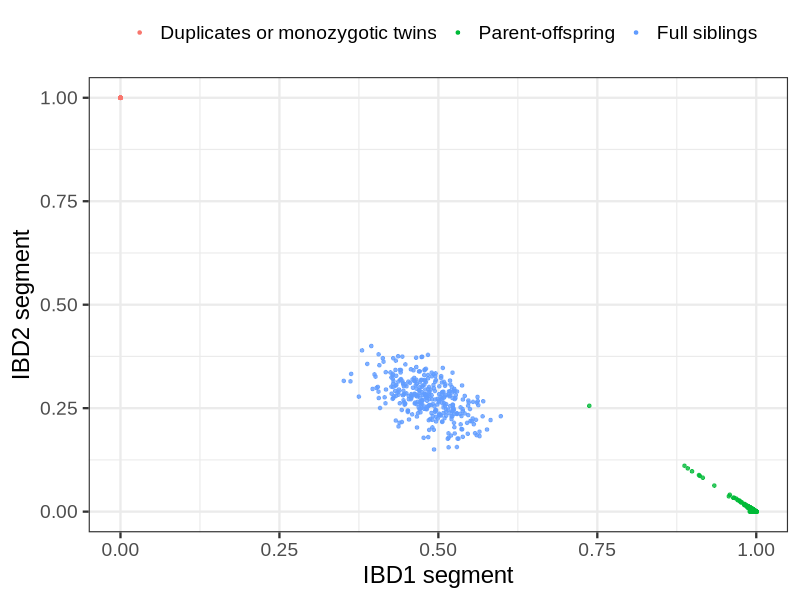

# Fam file reconstruction in snp016b
## Relationship inference
| Relationship |   |
| ------------ | - |
| Duplicates or monozygotic twins| 23 |
| Parent-offspring| 2857 |
| Full siblings| 341 |
| 2nd degree| 0 |
| 3rd degree| 0 |
| 4th degree| 0 |
| Unrelated| 0 |

## Exclusion
- Number of children with parent-offspring relationship: 2
