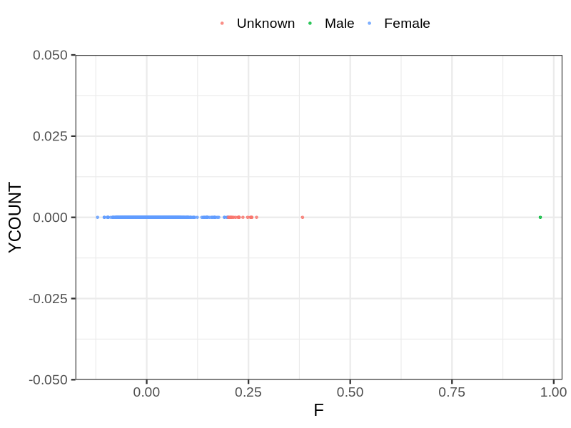
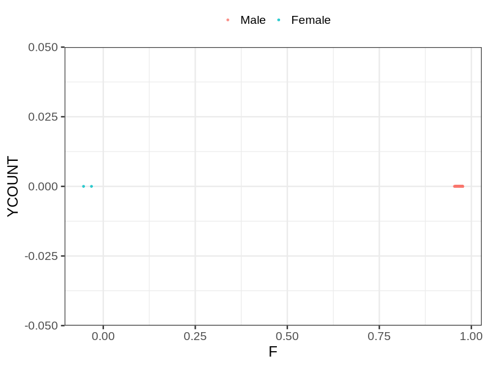

# Fam file reconstruction in snp017d
## Samples not in Medical Birth Regsitry
11 samples with missing birth year, will be assumed to be parent.
## Relationship inference
| Relationship |   |
| ------------ | - |
| Duplicates or monozygotic twins| 9 |
| Parent-offspring| 460 |
| Full siblings| 26 |
| 2nd degree| 0 |
| 3rd degree| 0 |
| 4th degree| 0 |
| Unrelated| 0 |

## Mother sex check
| Inferred sex |   |
| ------------ | - |
| Unknown | 24 |
| Male | 1 |
| Female | 2144 |

## Father sex check
| Inferred sex |   |
| ------------ | - |
| Unknown | 0 |
| Male | 1110 |
| Female | 2 |

## Parental relationship
261 mother-child relationships expected.
- 259 (99.23%) recovered by genetic relationships.
- 2 (0.77%) not recovered by genetic relationships.
200 father-child relationships expected.
- 200 (100%) recovered by genetic relationships.
- 0 (0%) not recovered by genetic relationships.
461 parent-offspring relationships detected
- 459 (99.57%) match to registry.
- 2 (0.43%) do not match to registry.
## Exclusion
- Number of samples excluded: 7
