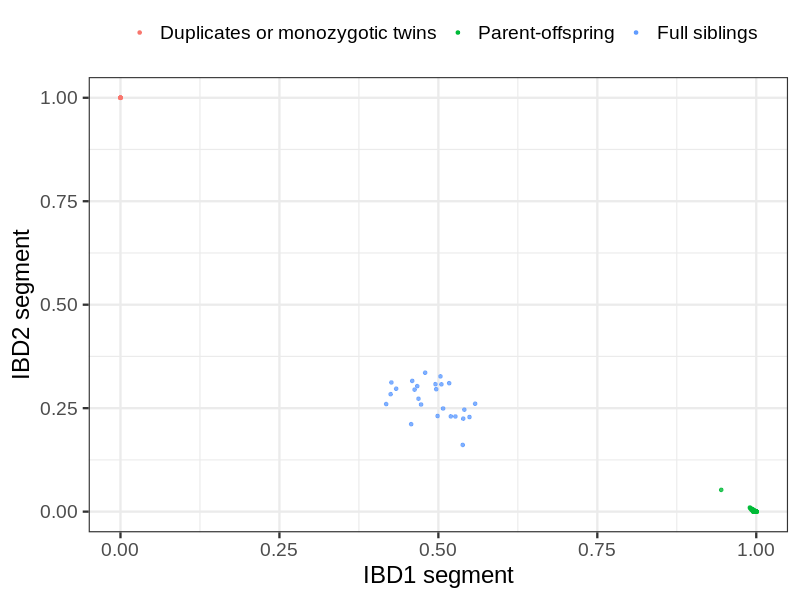
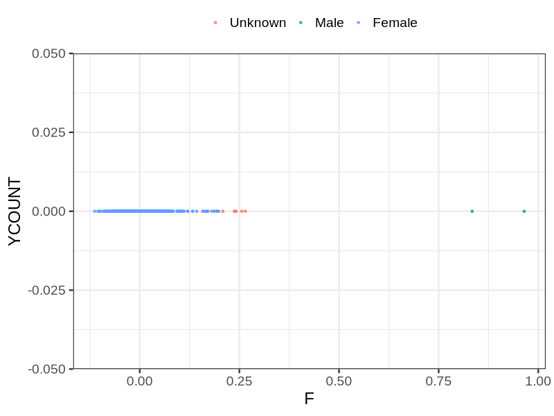
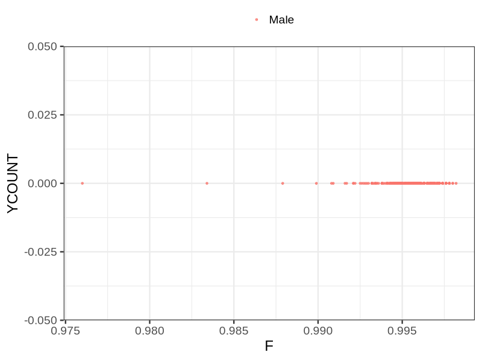

# Fam file reconstruction in snp017e
## Samples not in Medical Birth Regsitry
5 samples with missing birth year, will be assumed to be parent.
## Relationship inference
| Relationship |   |
| ------------ | - |
| Duplicates or monozygotic twins| 8 |
| Parent-offspring| 264 |
| Full siblings| 25 |
| 2nd degree| 0 |
| 3rd degree| 0 |
| 4th degree| 0 |
| Unrelated| 0 |

## Mother sex check
| Inferred sex |   |
| ------------ | - |
| Unknown | 7 |
| Male | 2 |
| Female | 1291 |

## Father sex check
| Inferred sex |   |
| ------------ | - |
| Unknown | 0 |
| Male | 1263 |
| Female | 0 |

## Parental relationship
185 mother-child relationships expected.
- 184 (99.46%) recovered by genetic relationships.
- 1 (0.54%) not recovered by genetic relationships.
80 father-child relationships expected.
- 80 (100%) recovered by genetic relationships.
- 0 (0%) not recovered by genetic relationships.
264 parent-offspring relationships detected
- 264 (100%) match to registry.
- 0 (0%) do not match to registry.
## Exclusion
- Number of samples excluded: 3
