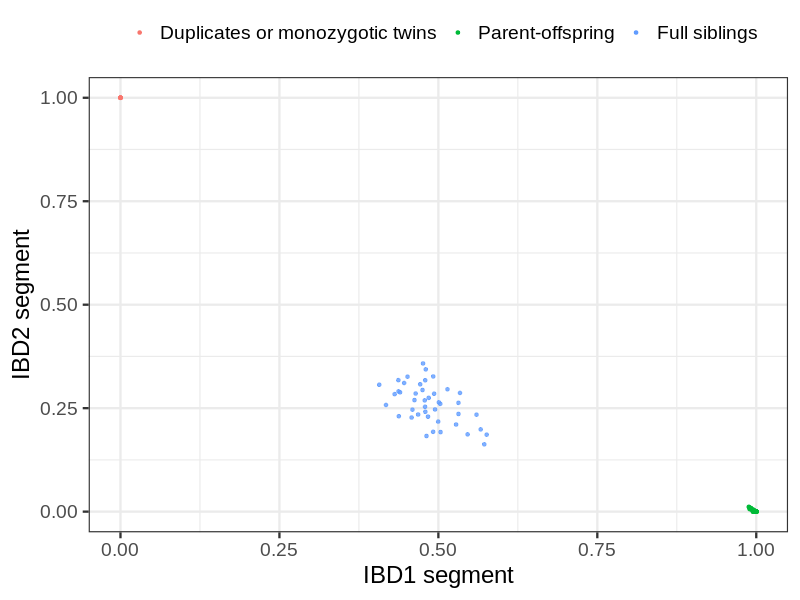
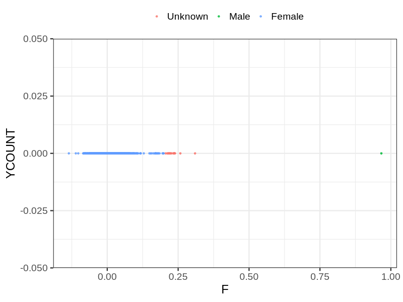
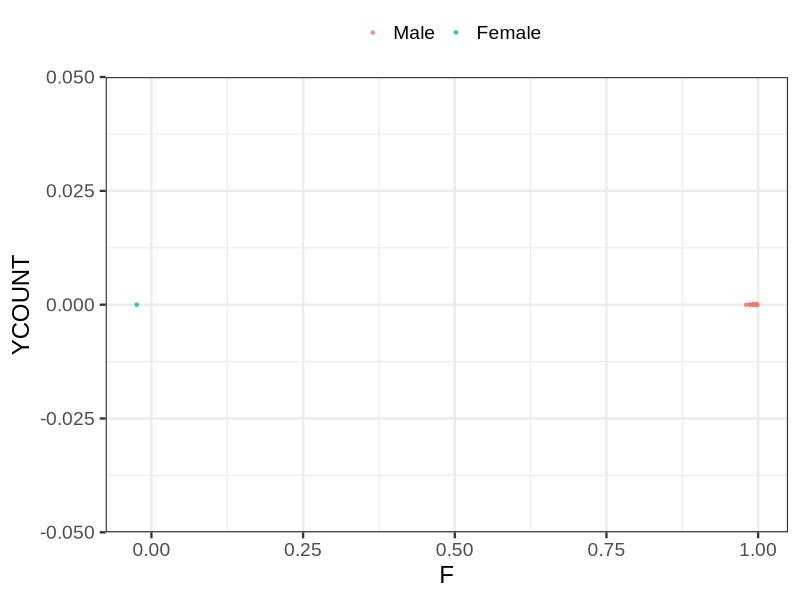

# Fam file reconstruction in snp017f
## Samples not in Medical Birth Regsitry
13 samples with missing birth year, will be assumed to be parent.
## Relationship inference
| Relationship |   |
| ------------ | - |
| Duplicates or monozygotic twins| 8 |
| Parent-offspring| 195 |
| Full siblings| 43 |
| 2nd degree| 0 |
| 3rd degree| 0 |
| 4th degree| 0 |
| Unrelated| 0 |

## Mother sex check
| Inferred sex |   |
| ------------ | - |
| Unknown | 17 |
| Male | 1 |
| Female | 1156 |

## Father sex check
| Inferred sex |   |
| ------------ | - |
| Unknown | 0 |
| Male | 1367 |
| Female | 1 |

## Parental relationship
135 mother-child relationships expected.
- 135 (100%) recovered by genetic relationships.
- 0 (0%) not recovered by genetic relationships.
58 father-child relationships expected.
- 58 (100%) recovered by genetic relationships.
- 0 (0%) not recovered by genetic relationships.
195 parent-offspring relationships detected
- 193 (98.97%) match to registry.
- 2 (1.03%) do not match to registry.
## Exclusion
- Number of samples excluded: 1
