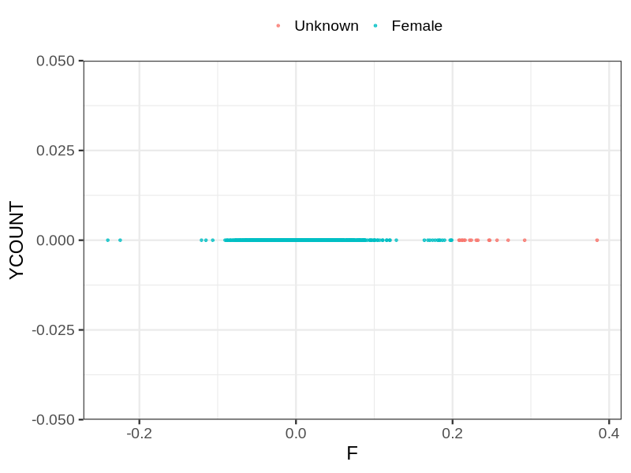
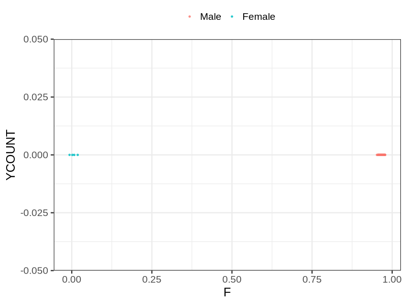

# Fam file reconstruction in snp018a
## Samples not in Medical Birth Regsitry
19 samples with missing birth year, will be assumed to be parent.
## Relationship inference
| Relationship |   |
| ------------ | - |
| Duplicates or monozygotic twins| 9 |
| Parent-offspring| 297 |
| Full siblings| 34 |
| 2nd degree| 0 |
| 3rd degree| 0 |
| 4th degree| 0 |
| Unrelated| 0 |

## Mother sex check
| Inferred sex |   |
| ------------ | - |
| Unknown | 16 |
| Male | 0 |
| Female | 1716 |

## Father sex check
| Inferred sex |   |
| ------------ | - |
| Unknown | 0 |
| Male | 1367 |
| Female | 4 |

## Parental relationship
249 mother-child relationships expected.
- 246 (98.8%) recovered by genetic relationships.
- 3 (1.2%) not recovered by genetic relationships.
48 father-child relationships expected.
- 48 (100%) recovered by genetic relationships.
- 0 (0%) not recovered by genetic relationships.
297 parent-offspring relationships detected
- 294 (98.99%) match to registry.
- 3 (1.01%) do not match to registry.
## Exclusion
- Number of samples excluded: 6
