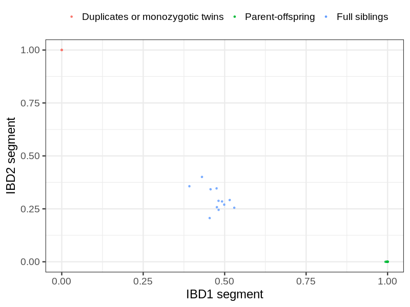
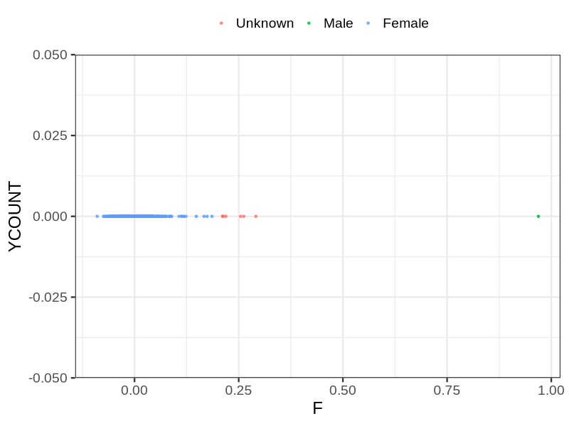
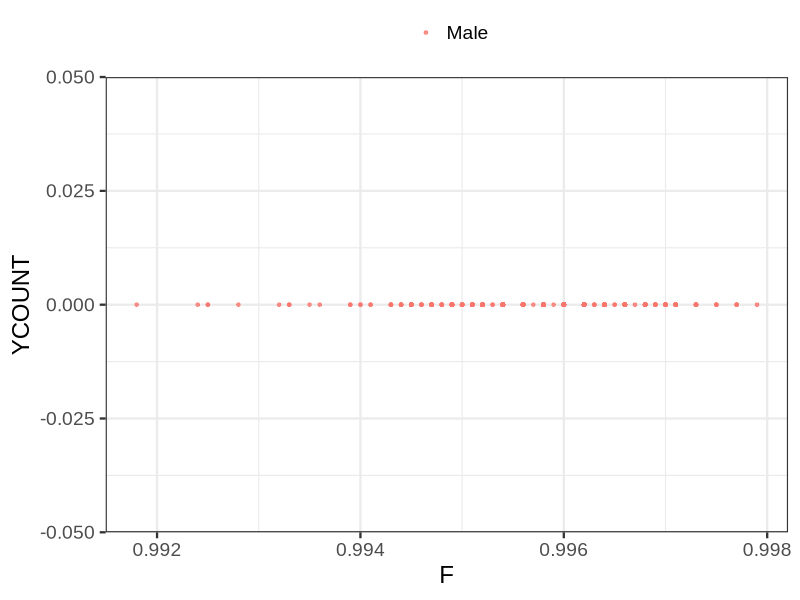

# Fam file reconstruction in snp018d
## Samples not in Medical Birth Regsitry
905 samples with missing birth year, will be assumed to be parent.
## Relationship inference
| Relationship |   |
| ------------ | - |
| Duplicates or monozygotic twins| 5 |
| Parent-offspring| 19 |
| Full siblings| 12 |
| 2nd degree| 0 |
| 3rd degree| 0 |
| 4th degree| 0 |
| Unrelated| 0 |

## Mother sex check
| Inferred sex |   |
| ------------ | - |
| Unknown | 7 |
| Male | 1 |
| Female | 435 |

## Father sex check
| Inferred sex |   |
| ------------ | - |
| Unknown | 0 |
| Male | 598 |
| Female | 0 |

## Parental relationship
12 mother-child relationships expected.
- 12 (100%) recovered by genetic relationships.
- 0 (0%) not recovered by genetic relationships.
6 father-child relationships expected.
- 6 (100%) recovered by genetic relationships.
- 0 (0%) not recovered by genetic relationships.
19 parent-offspring relationships detected
- 18 (94.74%) match to registry.
- 1 (5.26%) do not match to registry.
## Exclusion
- Number of samples excluded: 3
